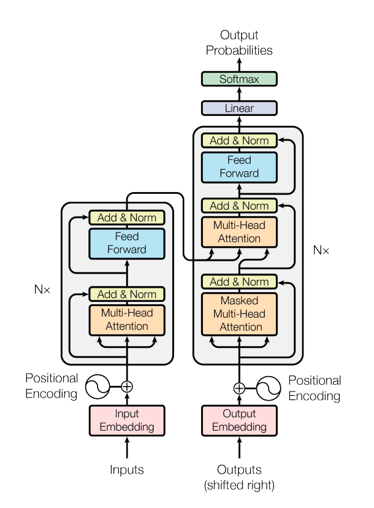

## 自然语言处理(Natural Language Processing, NLP)
自然语言处理（Natural Language Processing, NLP）是一种重要的人工智能（Artificial Intelligence, AI）技术。我们随处可以见到NLP技术的应用，比如网络搜索，广告，电子邮件，智能客服，机器翻译，智能新闻播报等等。最近几年，基于深度学习（Deep Learning, DL）的NLP技术在各项任务中取得了很好的效果，这些基于深度学习模型的NLP任务解决方案通常不使用传统的、特定任务的特征工程而是仅仅使用一个端到端（end-to-end）的神经网络模型就可以获得很好的效果。本教程将会基于最前沿的深度学习模型结构（transformers）来解决NLP里的几个经典任务。通过本教程的学习，我们将能够了解transformer相关原理、熟练使用transformer相关的深度学习模型来解决NLP里的实际问题以及在各类任务上取得很好的效果。

自然语言与深度学习的课程推荐：[CS224n: Natural Language Processing with Deep Learning](http://web.stanford.edu/class/cs224n/)
自然语言处理的书籍推荐：[Speech and Language Processing](https://web.stanford.edu/~jurafsky/slp3/)

## 常见的NLP任务
本教程将NLP任务划分为4个大类：1、文本分类， 2、序列标注，3、问答任务——抽取式问答和多选问答，4、生成任务——语言模型、机器翻译和摘要生成。

* 文本分类：对单个、两个或者多段文本进行分类。举例：“这个教程真棒！”这段文本的情感倾向是正向的，“我在学习transformer”和“如何学习transformer”这两段文本是相似的。
* 序列标注：对文本序列中的token、字或者词进行分类。举例：“我在**国家图书馆**学transformer。”这段文本中的**国家图书馆**是一个**地点**，可以被标注出来方便机器对文本的理解。
* 问答任务——抽取式问答和多选问答：1、抽取式问答根据**问题**从一段给定的文本中找到**答案**，答案必须是给定文本的一小段文字。举例：问题“小学要读多久?”和一段文本“小学教育一般是六年制。”，则答案是“六年”。2、多选式问答，从多个选项中选出一个正确答案。举例：“以下哪个模型结构在问答中效果最好？“和4个选项”A、MLP，B、cnn，C、lstm，D、transformer“，则答案选项是D。
* 生成任务——语言模型、机器翻译和摘要生成：根据已有的一段文字生成（generate）一个字通常叫做语言模型，根据一大段文字生成一小段总结性文字通常叫做摘要生成，将源语言比如中文句子翻译成目标语言比如英语通常叫做机器翻译。

虽然各种基于transformer的深度学习模型已经在多个人工构建的NLP任务中表现出色，但由于人类语言博大精深，深度学习模型依然有很长的路要走。

## Transformer的兴起

2017年，[Attention Is All You Need](https://arxiv.org/pdf/1706.03762.pdf)论文首次提出了**Transformer**模型结构并在机器翻译任务上取得了The State of the Art(SOTA, 最好)的效果。2018年，[BERT: Pre-training of Deep Bidirectional Transformers for
Language Understanding](https://arxiv.org/pdf/1810.04805.pdf)使用Transformer模型结构进行大规模语言模型（language model）预训练（Pre-train），再在多个NLP下游（downstream）任务中进行微调（Finetune）,一举刷新了各大NLP任务的榜单最高分，轰动一时。2019年-2021年，研究人员将Transformer这种模型结构和预训练+微调这种训练方式相结合，提出了一系列Transformer模型结构、训练方式的改进（比如transformer-xl，XLnet，Roberta等等）。入下图所示，各类Transformer的改进不断涌现。

图：各类Transformer改进，来源：[A Survey of Transformers](https://arxiv.org/pdf/2106.04554.pdf)

另外，由于Transformer优异的模型结构，使得其参数量可以非常庞大从而容纳更多的信息，因此Transformer模型的能力随着预训练不断提升，随着近几年计算能力的提升，越来越大的预训练模型以及效果越来越好的Transformers不断涌现，简单的统计可以从下图看出：

 图：预训练模型参数不断变大,来源[Huggingface](https://huggingface.co/course/chapter1/4?fw=pt)

尽管各类Transformer的研究非常多，总体上经典和流行的Transformer模型都可以通过[HuggingFace/Transformers, 48.9k Star](https://github.com/huggingface/transformers)获得和免费使用，为初学者、研究人员提供了巨大的帮助。

本教程也将基于[HuggingFace/Transformers, 48.9k Star](https://github.com/huggingface/transformers)进行具体的编程和任务解决方案实现。

NLP中的预训练+微调的训练方式推荐阅读：
[2021年如何科学的“微调”预训练模型？
](https://zhuanlan.zhihu.com/p/363802308)和[从Word Embedding到Bert模型—自然语言处理中的预训练技术发展史](https://zhuanlan.zhihu.com/p/49271699)

## 初识Transformer
本小节希望能用图和公式直接给出Transformer模型结构的定义，从而给读者一个宏观印象，篇章2的4个小节会进一步对该模型结构进行更形象的讲解。本节的描述会遵循总-分的思路，先描述整体，在描述子模块。

 图：transformer结构图

Transformer被提出时的结构如上图所示：

### Transformer：encoder+decoder
Transformer在论文[Attention Is All You Need](https://arxiv.org/pdf/1706.03762.pdf)中首次被提出，用于NLP中的翻译任务，因此该模型也使用了翻译任务通用的encoder-decoder模型结构，左边是encoder，右边是decoder。

encoder将输入符号（通常也叫做token）序列$(x_1,...x_n)$的每个符号映射成一个$d$维向量表示得到$\mathbf{z} = (z_1, ..., z_n), z_i \in \mathbb{R}^d$，然后decoder根据$\mathbf{z}$按时间步依次生成输出序列$(y_1,...,y_n)$：在时间步$t$，使用$t$以前的信息$(z_1,...,z_t)$生成$y_t$。

encoder和decoder结构相似，最底层的输入符号$(x_1,...x_n)$经过Embedding查表之后与Positional Embedding相加得到每个符号的向量表示，随后经过$N$个相同的神经网络(Layer)。

### Encoder
Encoder = Nx[LayerNorm(x + MHA(x)), LayerNorm(x + FFN(x))]

如上图所示，encoder每个网络由2个子网络(SubLayer)组成：multi-head self-attention(MHA)和前向全连接网络(FFN)。网络中还应用了残差结构连接各个子网络、LayerNorm归一化技巧，因此每个子网络（如上图所示，可以是Multi-Head Attention或者Feed Forward）的输出是：$LayerNorm(x + Sublayer(x))$，由于残差结构的引入，各个子网络的输出维度需要相等，因此论文中统一使用的维度为$d=512$。

### Decoder

Decoder = Nx[LayerNorm(x + MMHA(x)), LayerNorm(x + MHA(x)), LayerNorm(x + FFN(x))]

如上图所示，decoder与encoder相似，每个网络由3个自网络(SubLayer)组成：Masked Multi-Head Attention(MMHA)，Multi-Head Attention(MHA)和Feed Forward(FFN)，后面两个子网络与encoder一样。MMHA与MHA主要的区别在于：对于输出而言，我们需要保证在第$t$时间步的时候只能看到$t$以及之前的信息，将$t$时间之后的信息mask防止Label泄漏。

### MHA子网络

MHA子网络 = [Linear, Scaled Dot-Product Attention, Concat, Linear]

 图：MHA

如上图所示，MHA由Linear线性层，Scaled Dot-Product Attention(SDPA)层组成。进入MHA的输入来自于最底层的Embedding，将$n$个符号的embedding放在一起组成MHA的输入QKV(query, key, value)：$Q \in \mathbb{R}^{n \times d} = K \in \mathbb{R}^{n \times d} = V \in \mathbb{R}^{n \times d}$，MHA拿到输入后先将$n \times d$维矩阵拆分成$n \times h$个$d_k = d/h$维的子矩阵，再通过一个Linear线性层映射得到维度相同的新子矩阵$QKV$，最后将每个子矩阵经过Scaled Dot-Product Attention后再合并起来得到输出。

$$MHA(Q, K, V) = Concat(head_1, ..., head_h)W^O$$
$$head_i = SDPA(QW_i^Q, KW_i^K, VW_i^V)$$

其中：
$$W_i^Q \in \mathbb{R}^{d \times d_k}, W_i^K \in \mathbb{R}^{d \times d_k}, W_i^V \in \mathbb{R}^{d \times d_k}$$

论文中的$h=8, d_k=64$

 图：Scaled Dot-Product Attention (SDPA)

如上图所示，远论文在描述时依旧使用的$Q, K, V$作为SDPA的输入，但此时的$Q \in \mathbb{R}^{n \times d_k} = K \in \mathbb{R}^{n \times d_k} = V \in \mathbb{R}^{n \times d_k}$已经是子矩阵了，也就是经过线性层得到：
$$Q = QW_i^Q, K = KW_i^K, V = VW_i^V$$
然后attention做法是：
$$SDPA(Q, K, V) = softmax(\frac{QK^T}{\sqrt(d_k)})V$$

### FFN子网络
MHA的输出再经过一个Feed-Forward Networks(FFN)：

$$FFN(x) = max(0, xW_1 + b_1) W_2 + b_2$$

其中$x \in \mathbb{R}^{n \times d}$是mha的输出。

### Position Embedding的计算
单个token符号的embedding通过查表获得，每个符号位置对应的position embedding计算法式为：

$$PE(pos, 2i) = sin(\frac{pos}{10000^{2i/d}})$$
$$PE(pos, 2i+1) = cos(\frac{pos}{10000^{2i/d}})$$

其中pos表示第pos个位置，$i$表示第pos位置对应的$d$维embedding中第$i$维的值。

希望以上内容能给读者一个宏观的Transformer印象，具体更细节的Transformer解析将在第2章带来。

Transformer

