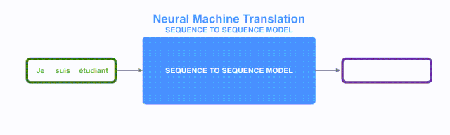
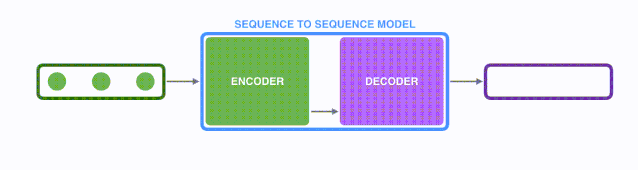
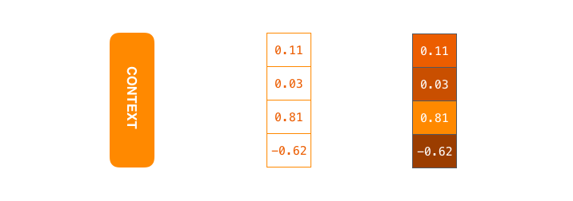
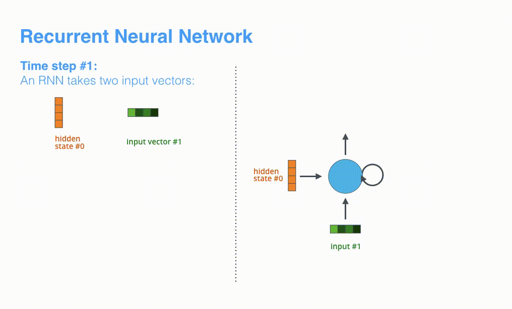
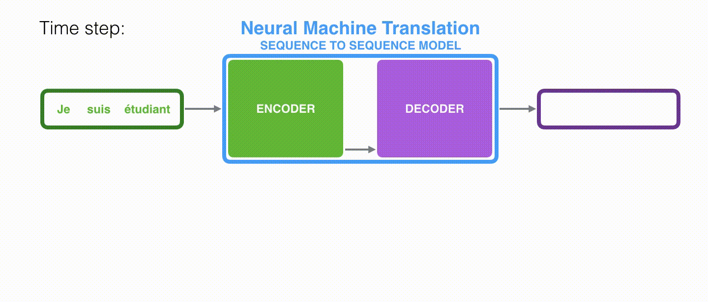
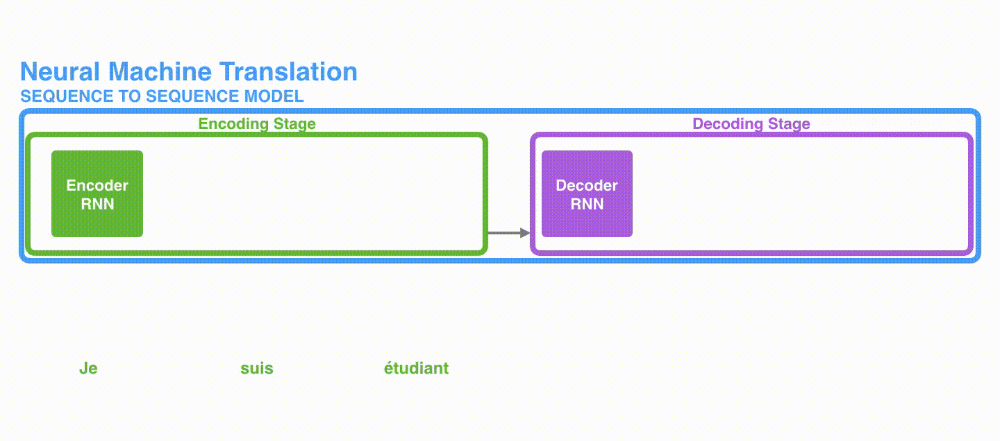
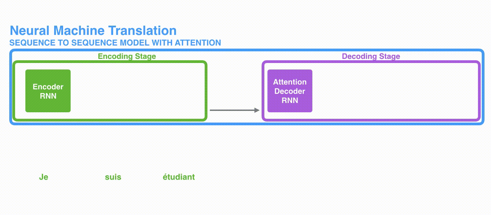
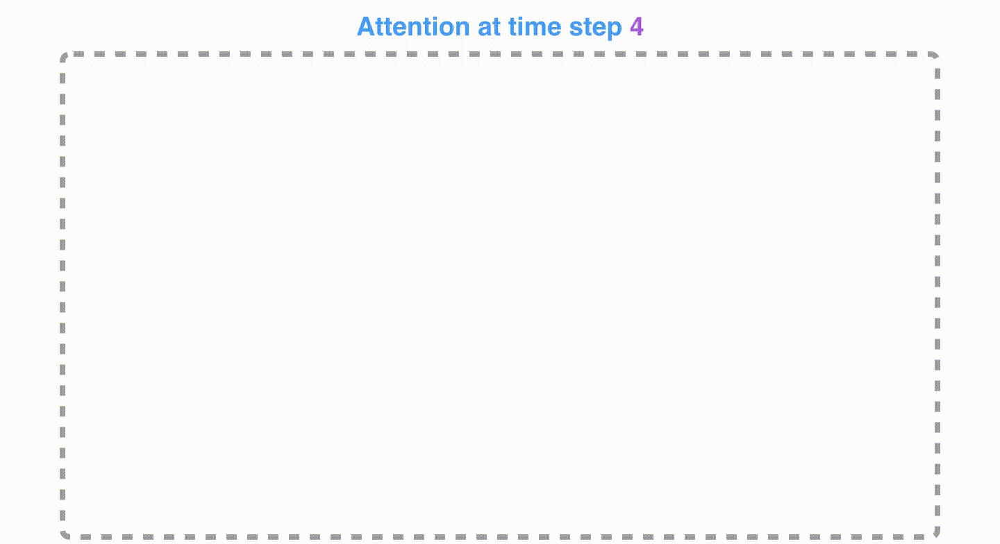
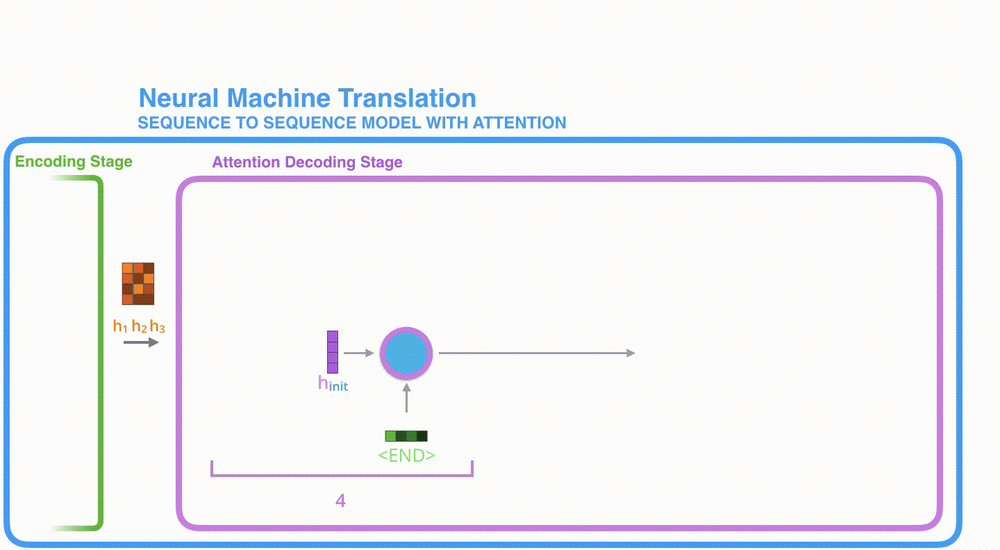
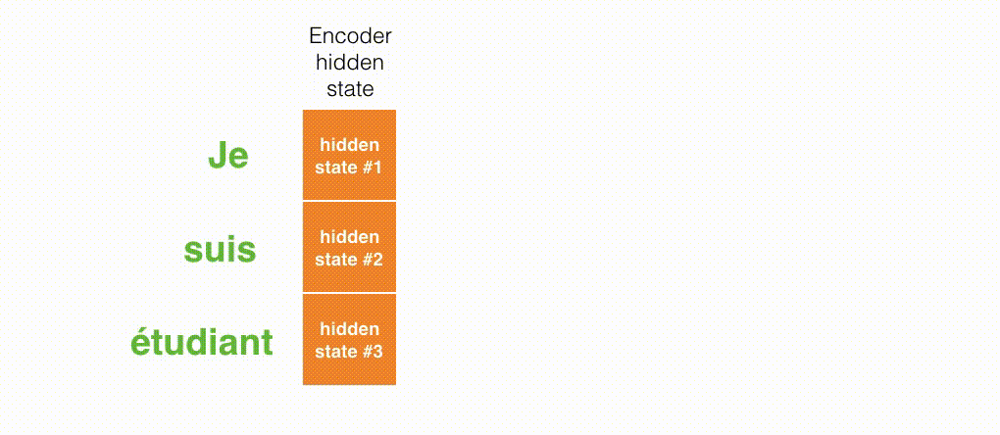

## 图解Attention
篇章1中我们对Transformers在NLP中的兴起做了概述，本篇章将从attention开始，逐步对Transformer结构所涉及的知识进行深入讲解，希望能给读者以形象生动的描述。本小节主要对attention进行解析。

## seq2seq模型
首先谈一下NLP常用于生成任务的seq2seq结构。seq2seq模型结构在很多任务上都取得了成功，如：机器翻译、文本摘要、图像描述生成。谷歌翻译在 2016 年年末开始使用这种模型。有2篇开创性的论文：[Sutskever等2014年发表的Sequence to Sequence Learning
with Neural Networks](https://papers.nips.cc/paper/5346-sequence-to-sequence-learning-with-neural-networks.pdf)和[Cho等2014年发表的Learning Phrase Representations using RNN Encoder–Decoder
for Statistical Machine Translation](http://emnlp2014.org/papers/pdf/EMNLP2014179.pdf)都对这些模型进行了解释。

然而大家可以发现，想要充分理解模型并实现它，需要拆解一系列概念，而这些概念是层层递进的。如果能够把这些概念进行可视化，会更加容易理解。这就是这篇文章的目标。读者需要先了解一些深度学习的知识，才能读完这篇文章。笔者希望这篇文章，可以帮助读者阅读上面提到的 2 篇论文并且深入理解Attention。

一个序列到序列（seq2seq）模型，接收的输入是一个（单词、字母、图像特征）序列，输出是另外一个序列。一个训练好的模型如下图所示（将鼠标放在图上，图就会动起来）：

动态图：seq2seq

在神经机器翻译中，一个序列是指一连串的单词。类似地，输出也是一连串单词。
动态图：translation

## 进一步理解细节
seq2seq模型是由编码器（Encoder）和解码器（Decoder）组成的。其中，编码器会处理输入序列中的每个元素，把这些信息转换为一个向量（称为上下文（context））。当我们处理完整个输入序列后，编码器把上下文（context）发送给解码器，解码器开始逐项生成输出序列中的元素。

动态图：encoder-decoder

动态图：encoder-decoder

这种机制，同样适用于机器翻译。

在机器翻译任务中，上下文（context）是一个向量（基本上是一个数字数组)。编码器和解码器在Transformer出现之前一般采用的是循环神经网络。关于循环神经网络，建议阅读 [Luis Serrano写的一篇关于循环神经网络](https://www.youtube.com/watch?v=UNmqTiOnRfg)的精彩介绍.

图：上下文context对应图里中间一个浮点数向量。在下文中，我们会可视化这些向量，使用更明亮的色彩来表示更高的值，如上图右边所示

你可以在编写seq2seq模型的时候设置上下文向量的长度。这个长度是基于编码器 RNN 的隐藏层神经元的数量。上图展示了长度为 4 的向量，但在实际应用中，上下文向量的长度可能是 256，512 或者 1024。

根据设计，RNN 在每个时间步接受 2 个输入：
- 输入序列中的一个元素（在解码器的例子中，输入是指句子中的一个单词，最终被转化成一个向量）
- 一个  hidden state（隐藏层状态，也对应一个向量）

如何把每个单词都转化为一个向量呢？我们使用一类称为 "word embedding" 的方法。这类方法把单词转换到一个向量空间，这种表示能够捕捉大量单词之间的语义信息（例如，king - man + woman = queen[例子来源](http://p.migdal.pl/2017/01/06/king-man-woman-queen-why.html)）。

 图：我们在处理单词之前，需要把他们转换为向量。这个转换是使用 word embedding 算法来完成的。我们可以使用预训练好的 embeddings，或者在我们的数据集上训练自己的 embedding。通常 embedding 向量大小是 200 或者 300，为了简单起见，我们这里展示的向量长度是4。上图左边每个单词对应中间一个4维的向量。

介绍完了单词向量/张量的基础知识，让我们回顾一下 RNN 的机制，并可视化这些 RNN 模型：

 动态图：RNN 在第 2 个时间步，采用第 1 个时间步的 hidden state（隐藏层状态） 和第 2 个时间步的输入向量，来得到输出。在下文，我们会使用类似这种动画，来描述神经机器翻译模型里的所有向量。

在下面的可视化图形中，编码器和解码器在每个时间步处理输入，并得到输出。由于编码器和解码器都是 RNN，RNN 会根据当前时间步的输入，和前一个时间步的 hidden state（隐藏层状态），更新当前时间步的 hidden state（隐藏层状态）。

让我们看下编码器的 hidden state（隐藏层状态）。注意，最后一个 hidden state（隐藏层状态）实际上是我们传给解码器的上下文（context）。
 动态图：编码器相关

解码器也持有 hidden state（隐藏层状态），而且也需要把 hidden state（隐藏层状态）从一个时间步传递到下一个时间步。我们没有在上图中可视化解码器的 hidden state，是因为这个过程和解码器是类似的，我们现在关注的是 RNN 的主要处理过程。
现在让我们用另一种方式来可视化序列到序列（seq2seq）模型。下面的动画会让我们更加容易理解模型。这种方法称为展开视图。其中，我们不只是显示一个解码器，而是在时间上展开，每个时间步都显示一个解码器。通过这种方式，我们可以看到每个时间步的输入和输出。

 动态图：解码器相关
##   循环神经网络的不足：
循环神经网络的处理此类任务存在一些不足：（下图中BOS表示句子起始位置） 

&#8195;&#8195; 1.机器翻译中，此类模型的encoder只输出最后时刻的上下文信息context，存在长距离衰减问题，使得context的描述能力有限。当编码句子较长时，句子靠前部分对context的影响会降低； 
&#8195;&#8195; 2.解码阶段，随着序列的推移，编码信息context对翻译的影响越来越弱。因此，越靠后的内容，翻译效果越差。（其实也是因为长距离衰减问题） 
&#8195;&#8195; 3.解码阶段缺乏对编码阶段各个词的直接利用。简单说就是：机器翻译领域，解码阶段的词和编码阶段的词有很强的映射关系，比如“爱”和“love”。但是seq2seq模型无法再译“love”时直接使用“爱”这个词的信息，因为在编码阶段只能使用全局信息context。 
&#8195;&#8195;可以看出，上下文context向量是这类模型的瓶颈，在处理长文本时面临非常大的挑战。为了解决这些问题，attention应运而出。

## Attention 讲解

在 Bahdanau等2014发布的[Neural Machine Translation by Jointly Learning to Align and Translate](https://arxiv.org/abs/1409.0473) 和 Luong等2015年发布的[Effective Approaches to Attention-based Neural Machine Translation
](https://arxiv.org/abs/1508.04025)两篇论文中，提出了一种解决方法。这 2 篇论文提出并改进了一种叫做注意力**attetion**的技术，它极大地提高了机器翻译的质量。注意力使得模型可以根据需要，关注到输入序列的相关部分。

 图：在第 7 个时间步，注意力机制使得解码器在产生英语翻译之前，可以将注意力集中在 "student" 这个词（在法语里，是 "student" 的意思）。这种从输入序列放大相关信号的能力，使得注意力模型，比没有注意力的模型，产生更好的结果。

让我们继续从高层次来理解注意力模型。一个注意力模型不同于经典的序列到序列（seq2seq）模型，主要体现在 2 个方面：

首先，编码器会把更多的数据传递给解码器。编码器把所有时间步的 hidden state（隐藏层状态）传递给解码器，而不是只传递最后一个 hidden state（隐藏层状态）:
 动态图: 更多的信息传递给decoder

第二，注意力模型的解码器在产生输出之前，做了一个额外的处理。为了把注意力集中在与该时间步相关的输入部分。解码器做了如下的处理：

1. 查看所有接收到的编码器的 hidden state（隐藏层状态）。其中，编码器中每个 hidden state（隐藏层状态）都对应到输入句子中一个单词。
2. 给每个 hidden state（隐藏层状态）一个分数（我们先忽略这个分数的计算过程）。
3. 将每个 hidden state（隐藏层状态）乘以经过 softmax 的对应的分数，从而，高分对应的  hidden state（隐藏层状态）会被放大，而低分对应的  hidden state（隐藏层状态）会被缩小。

 动态图：解决码器attention

这个加权平均的步骤是在解码器的每个时间步做的。
现在，让我们把所有内容都融合到下面的图中，来看看注意力模型的整个过程：

1. 注意力模型的解码器 RNN 的输入包括：一个embedding 向量，和一个初始化好的解码器 hidden state（隐藏层状态）。
2. RNN 处理上述的 2 个输入，产生一个输出和一个新的 hidden state（隐藏层状态 h4 向量），其中输出会被忽略。
3. 注意力的步骤：我们使用编码器的 hidden state（隐藏层状态）和 h4 向量来计算这个时间步的上下文向量（C4）。
4. 我们把 h4 和 C4 拼接起来，得到一个向量。
5. 我们把这个向量输入一个前馈神经网络（这个网络是和整个模型一起训练的）。
6. 前馈神经网络的输出表示这个时间步输出的单词。
7. 在下一个时间步重复1-6步骤。
 动态图：attention过程

下图，我们使用另一种方式来可视化注意力，看看在每个解码的时间步中关注输入句子的哪些部分：
 动态图：attention关注的词

请注意，注意力模型不是无意识地把输出的第一个单词对应到输入的第一个单词。实际上，它从训练阶段学习到了如何在两种语言中对应单词的关系（在我们的例子中，是法语和英语）。下图展示了注意力机制的准确程度（图片来自于上面提到的论文）：

## 从另一个角度看attention 
本节内容选自苏剑林的文章[《Attention is All You Need》浅读（简介+代码）](https://spaces.ac.cn/archives/4765)

&#8195;&#8195;深度学习做NLP的方法，基本上都是先将句子分词，然后每个词转化为对应的词向量序列。这样一来，每个句子都对应的是一个矩阵$X=(x_{1},x_{2},…,x_{t})$，其中$x_{i}$都代表着第i个词的词向量（行向量），维度为d维，故$X\in \mathbb{R}^{n\times d}$。这样的话，问题就变成了编码这些序列了。

&#8195;&#8195;第一个基本的思路是RNN层，RNN的方案很简单，递归式进行：
$$y_{t}=f(y_{t−1},x_{t})(1)$$

&#8195;&#8195;不管是已经被广泛使用的LSTM、GRU还是SRU，都并未脱离这个递归框架。RNN结构本身比较简单，也很适合序列建模，但RNN的明显缺点之一就是无法并行，因此速度较慢，这是递归的天然缺陷。另外RNN无法很好地学习到全局的结构信息，因为它本质是一个马尔科夫决策过程。 
&#8195;&#8195;第二个思路是CNN层，其实CNN的方案也是很自然的，窗口式遍历，比如尺寸为3的卷积，就是
$$y_{t}=f(x_{t−1},x_{t},x_{t+1})(2)$$

&#8195;&#8195;在FaceBook的论文中，纯粹使用卷积也完成了Seq2Seq的学习，是卷积的一个精致且极致的使用案例。CNN方便并行，而且容易捕捉到一些全局的结构信息.

&#8195;&#8195;Google的大作提供了第三个思路：纯Attention！单靠注意力就可以！RNN要逐步递归才能获得全局信息，因此一般要双向RNN才比较好；CNN事实上只能获取局部信息，是通过层叠来增大感受野；Attention的思路最为粗暴，它一步到位获取了全局信息！它的解决方案是：
$$y_{t}=f(x_{t},A,B)(3)$$

&#8195;&#8195;其中A,B是另外一个序列（矩阵）。如果都取A=B=X，那么就称为Self Attention，它的意思是直接将x_{t}与原来的每个词进行比较，最后算出y_{t}！

## Self Attention

&#8195;&#8195;而在Google的论文中，大部分的Attention都是Self Attention，即“自注意力”，或者叫内部注意力。 
&#8195;&#8195;所谓Self Attention，其实就是Attention(X,X,X)，X就是前面说的输入序列。也就是说，在序列内部做Attention，寻找序列内部的联系（所以才叫自注意力））。Google论文的主要贡献之一是它表明了内部注意力在机器翻译（甚至是一般的Seq2Seq任务）的**序列编码**上是相当重要的，而之前关于Seq2Seq的研究基本都只是把注意力机制用在**解码端**。 
&#8195;&#8195;当然，更准确来说，Google所用的是多头自注意力Self Multi-Head Attention：
$$Y=MultiHead(X,X,X)$$

&#8195;&#8195;然而，只要稍微思考一下就会发现，这样的模型并不能捕捉序列的顺序。换句话说，如果将句子中的词序打乱，那么Attention的结果还是一样的。这就表明了，到目前为止，Attention模型顶多是一个非常精妙的“词袋模型”而已。 
&#8195;&#8195;这问题就比较严重了，对于NLP中的任务来说，顺序是很重要的信息,于是Google再祭出了一招——Position Embedding，也就是“位置向量”。(关于多头注意力和位置向量的概念下一章节会具体的讲）

如果你觉得你准备好了学习注意力机制的代码实现，一定要看看基于 TensorFlow 的 神经机器翻译 (seq2seq) [指南](https://github.com/tensorflow/nmt)。

## 致谢
主要由哈尔滨工业大学张贤同学翻译（经原作者 [@JayAlammmar](https://twitter.com/JayAlammar) 授权）撰写，由本项目同学组织和整理。最后，期待您的阅读反馈和star哦，谢谢。

