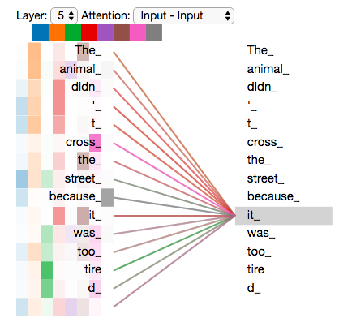
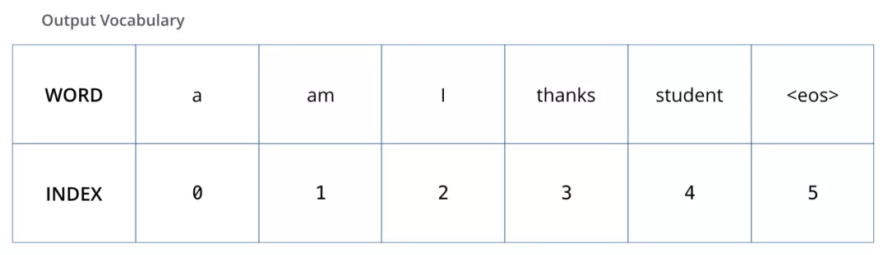
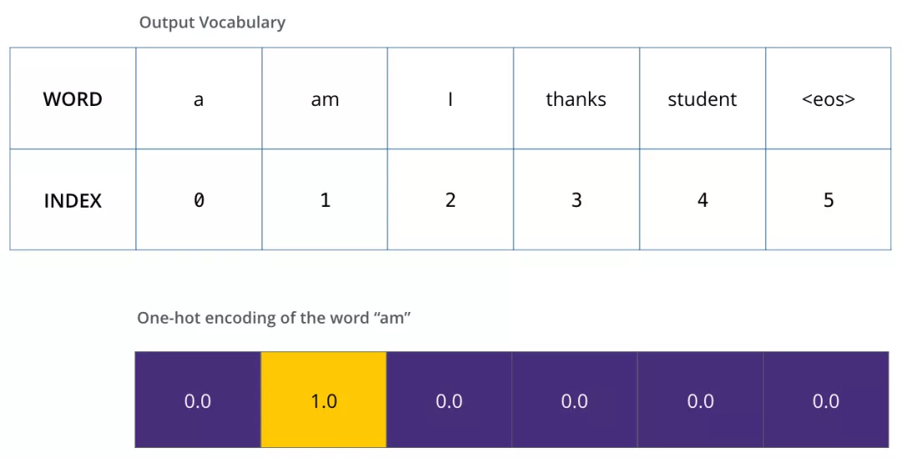

## 图解transformer
在学习完Attention之后，我们将在本小节对Transformer所涉及的细节进行深入探讨，相比于篇章1中的初识Transformer更细致和形象。

图：总体结构

## 前言

本文翻译自[illustrated-transformer](http://jalammar.github.io/illustrated-transformer)，是笔者看过Transformer 讲解得最好的文章。这篇文章从输入开始，一步一步演示了数据在 Transformer 中的流动过程。由于看过一些中文翻译的文章，感觉不够好，所以我自己翻译了一个版本，在一些难以直译的地方，笔者加入了一些原文没有的文字说明，来更好地解释概念。另外，我添加了一些简单的代码，实现了一个基本的 Self Attention 以及 multi-head attention 的矩阵运算。

Transformer 依赖于 Self Attention 的知识。Attention 是一种在深度学习中广泛使用的方法，Attention的思想提升了机器翻译的效果。如果你还没学习 Attention，请查看2.1章节[2.1-图解attention](./篇章2-Transformer相关原理/2.1-图解attention.md)。

2017 年，Google 提出了 Transformer 模型，用 Self Attention 的结构，取代了以往 NLP 任务中的 RNN 网络结构，在 WMT 2014 Englishto-German 和 WMT 2014 English-to-French两个机器翻译任务上都取得了当时 SOTA 的效果。

这个模型的其中一个优点，就是使得模型训练过程能够并行计算。在 RNN 中，每一个 time step 的计算都依赖于上一个 time step 的输出，这就使得所有的 time step 必须串行化，无法并行计算，如下图所示。


图：机器翻译示意图

而在 Transformer 中，所有 time step 的数据，都是经过 Self Attention 计算，使得整个运算过程可以并行化计算。

这篇文章的目的是从上到下，一步一步拆解 Transformer 的各种概念，希望有助于初学者更加容易地理解 Transformer 到底是什么。

Transformer 使用了 Seq2Seq任务中常用的结构——包括两个部分：Encoder 和 Decoder。一般的结构图，都是像下面这样。


图：transformer

如果你看到上图不知所措，不要担心，下面我们来一步步拆解 Transformer。

## 从整体宏观来理解 Transformer

首先，我们将整个模型视为黑盒。在机器翻译任务中，接收一种语言的句子作为输入，然后将其翻译成其他语言输出。


图：input-output

中间部分的 Transformer 可以拆分为 2 部分：左边是编码部分(encoding component)，右边是解码部分(decoding component)。

图：encoder-decoder

其中编码部分是多层的编码器(Encoder)组成（Transformer 的论文中使用了 6 层编码器，这里的层数 6 并不是固定的，你也可以根据实验效果来修改层数）。同理，解码部分也是由多层的解码器(Decoder)组成（论文里也使用了 6 层的解码器）。


图：翻译例子

encoder由多层编码器组成，每层编码器在结构上都是一样的，但不同层编码器的权重参数是不同的。每层编码器里面，主要由以下两部分组成
- Self-Attention Layer
- Feed Forward Neural Network（前馈神经网络，缩写为 FFNN）


图：单层transformer encoder

输入编码器的文本数据，首先会经过一个 Self Attention 层，这个层处理一个词的时候，不仅会使用这个词本身的信息，也会使用句子中其他词的信息（你可以类比为：当我们翻译一个词的时候，不仅会只关注当前的词，也会关注这个词的上下文的其他词的信息）。本文后面将会详细介绍 Self Attention 的内部结构。

接下来，Self Attention 层的输出会经过前馈神经网络。

同理，解码器也具有这两层，但是这两层中间还插入了一个 Encoder-Decoder Attention 层，这个层能帮助解码器聚焦于输入句子的相关部分（类似于 seq2seq 模型 中的 Attention）。


图：decoder
以上便是在机器翻译任务里，宏观上的的transformer啦。

## 从细节来理解 Transformer

上面，我们从宏观理解了 Transformer 的主要部分。下面，我们来看输入的张量数据，在 Transformer 中运算最终得到输出的过程。
### Transformer 的输入
和通常的 NLP 任务一样，我们首先会使用词嵌入算法（embedding algorithm），将每个词转换为一个词向量。实际中向量一般是 256 或者 512 维。为了简化起见，这里将每个词的转换为一个 4 维的词向量。

那么整个输入的句子是一个向量列表，其中有 3 个词向量。在实际中，每个句子的长度不一样，我们会取一个适当的值，作为向量列表的长度。如果一个句子达不到这个长度，那么就填充全为 0 的词向量；如果句子超出这个长度，则做截断。句子长度是一个超参数，通常是训练集中的句子的最大长度，你可以尝试不同长度的效果。


图：个词向量

### Encoder(编码器)
编码器（Encoder）接收的输入都是一个向量列表，输出也是大小同样的向量列表，然后接着输入下一个编码器。

第一 个/层 编码器的输入是词向量，*而后面的编码器的输入是上一个编码器的输出*。

下面，我们来看这个向量列表在编码器里面是如何流动的。


图：输入encoder


每个单词转换成一个向量之后，进入self-attention层，每个位置的单词得到新向量，然后再输入FFN神经网络。

下面再看一个2个单词的例子：

图：一层传一层

每个位置的词都经过 Self Attention 层，得到的每个输出向量都单独经过前馈神经网络层，每个向量经过的前馈神经网络都是一样的

###  Self-Attention 整体理解

别被“Self-Attention”这么高大上的词给唬住了，乍一听好像每个人都应该对这个词熟悉一样。但我在读论文《Attention is All You Need》 之前就没有听过这个词。下面来分析 Self-Attention 的具体机制。

假设我们想要翻译的句子是：
```
The animal didn't cross the street because it was too tired
```
这个句子中的 *it* 是一个指代词，那么 *it* 指的是什么呢？它是指 *animal* 还是*street*？这个问题对人来说，是很简单的，但是对算法来说并不是那么容易。

当模型在处理（翻译）it 的时候，*Self Attention*机制能够让模型把it和animal关联起来。

同理，当模型处理句子中的每个词时，*Self Attentio*n机制使得模型不仅能够关注这个位置的词，而且能够关注句子中其他位置的词，作为辅助线索，进而可以更好地编码当前位置的词。

如果你熟悉 RNN，回忆一下：RNN 在处理一个词时，会考虑前面传过来的*hidden state*，而*hidden state*就包含了前面的词的信息。而 Transformer 使用*Self Attention*机制，会把其他单词的理解融入处理当前的单词。


图：一个词和其他词的attention

如上图可视化图所示，当我们在第五层编码器中（编码部分中的最后一层编码器）编码“it”时，有一部分注意力集中在“The animal”上，并且把这两个词的信息融合到了"it"这个单词中。


## Self-Attention 的细节
### 计算Query 向量，Key 向量，Value 向量

下面我们先看下如何使用向量来计算 Self Attention，然后再看下如何使用矩阵来实现 Self Attention。（矩阵运算的方式，使得 Self Attention 的计算能够并行化，这也是 Self Attention 最终的实现方式）。

计算 Self Attention 的第 1 步是：对输入编码器的每个词向量，都创建 3 个向量，分别是：Query 向量，Key 向量，Value 向量。这 3 个向量是词向量分别和 3 个矩阵相乘得到的，而这个矩阵是我们要学习的参数。

注意，这 3 个新得到的向量一般比原来的词向量的长度更小。假设这 3 个向量的长度是$d_{key}$，而原始的词向量或者最终输出的向量的长度是 512（这 3 个向量的长度，和最终输出的向量长度，是有倍数关系的）。关于 Multi-head Attention，后面会给出实际代码。这里为了简化，假设只有一个 head 的 Self-Attention。

图：Q,K,V

上图中，有两个词向量：Thinking 的词向量 x1 和 Machines 的词向量 x2。以 x1 为例，X1 乘以 WQ 得到 q1，q1 就是 X1 对应的 Query 向量。同理，X1 乘以 WK 得到 k1，k1 是 X1 对应的 Key 向量；X1 乘以 WV 得到 v1，v1 是 X1 对应的 Value 向量。

Query 向量，Key 向量，Value 向量是什么含义呢？

其实它们就是 3 个向量，给它们加上一个名称，可以让我们更好地理解 Self-Attention 的计算过程和逻辑含义。继续往下读，你会知道 attention 是如何计算出来的，Query 向量，Key 向量，Value 向量又分别扮演了什么角色。

### 计算 Attention Score（注意力分数）

第 2 步，是计算 Attention Score（注意力分数）。假设我们现在计算第一个词 *Thinking* 的 Attention Score（注意力分数），需要根据 *Thinking* 这个词，对句子中的其他每个词都计算一个分数。这些分数决定了我们在编码*Thinking*这个词时，需要对句子中其他位置的每个词放置多少的注意力。

这些分数，是通过计算 "*Thinking*" 对应的 Query 向量和其他位置的每个词的 Key 向量的点积，而得到的。如果我们计算句子中第一个位置单词的 Attention Score（注意力分数），那么第一个分数就是 q1 和 k1 的内积，第二个分数就是 q1 和 k2 的点积。


图：Thinking计算

第 3 步就是把每个分数除以 $\sqrt(d_{key})$ （$d_{key}$是 Key 向量的长度）。你也可以除以其他数，除以一个数是为了在反向传播时，求取梯度更加稳定。

第 4 步，接着把这些分数经过一个 Softmax 层，Softmax可以将分数归一化，这样使得分数都是正数并且加起来等于 1。


图：Thinking计算

这些分数决定了在编码当前位置（这里的例子是第一个位置）的词时，对所有位置的词分别有多少的注意力。很明显，在上图的例子中，当前位置（这里的例子是第一个位置）的词会有最高的分数，但有时，关注到其他位置上相关的词也很有用。

第 5 步，得到每个位置的分数后，将每个分数分别与每个 Value 向量相乘。这种做法背后的直觉理解就是：对于分数高的位置，相乘后的值就越大，我们把更多的注意力放到了它们身上；对于分数低的位置，相乘后的值就越小，这些位置的词可能是相关性不大的，这样我们就忽略了这些位置的词。

第 6 步是把上一步得到的向量相加，就得到了 Self Attention 层在这个位置（这里的例子是第一个位置）的输出。


图：Think计算


上面这张图，包含了 Self Attention 的全过程，最终得到的当前位置（这里的例子是第一个位置）的向量会输入到前馈神经网络。但这样每次只能计算一个位置的输出向量，在实际的代码实现中，Self Attention 的计算过程是使用矩阵来实现的，这样可以加速计算，一次就得到所有位置的输出向量。下面让我们来看，如何使用矩阵来计算所有位置的输出向量。

## 使用矩阵计算 Self-Attention

第一步是计算 Query，Key，Value 的矩阵。首先，我们把所有词向量放到一个矩阵 X 中，然后分别和3 个权重矩阵$W^Q, W^K W^V$ 相乘，得到 Q，K，V 矩阵。

图：QKV矩阵乘法

矩阵 X 中的每一行，表示句子中的每一个词的词向量，长度是 512。Q，K，V 矩阵中的每一行表示 Query 向量，Key 向量，Value 向量，向量长度是 64。

接着，由于我们使用了矩阵来计算，我们可以把上面的第 2 步到第 6 步压缩为一步，直接得到 Self Attention 的输出。


图：输出

## 多头注意力机制（multi-head attention）

Transformer 的论文通过增加多头注意力机制（一组注意力称为一个 attention head），进一步完善了 Self Attention 层。这种机制从如下两个方面增强了 attention 层的能力：

- 它扩展了模型关注不同位置的能力。在上面的例子中，第一个位置的输出 z1 包含了句子中其他每个位置的很小一部分信息，但 z1 可能主要是由第一个位置的信息决定的。当我们翻译句子：`The animal didn’t cross the street because it was too tired`时，我们想让机器知道其中的it指代的是什么。这时，多头注意力机制会有帮助。
- 多头注意力机制赋予 attention 层多个“子表示空间”。下面我们会看到，多头注意力机制会有多组$W^Q, W^K W^V$ 的权重矩阵（在 Transformer 的论文中，使用了 8 组注意力（attention heads）。因此，接下来我也是用 8 组注意力头 （attention heads））。每一组注意力的 的权重矩阵都是随机初始化的。经过训练之后，每一组注意力$W^Q, W^K W^V$ 可以看作是把输入的向量映射到一个”子表示空间“。


图：多头注意力机制

在多头注意力机制中，我们为每组注意力维护单独的 WQ, WK, WV 权重矩阵。将输入 X 和每组注意力的WQ, WK, WV 相乘，得到 8 组 Q, K, V 矩阵。

接着，我们把每组 K, Q, V 计算得到每组的 Z 矩阵，就得到 8 个 Z 矩阵。


图：8 个 Z 矩阵

接下来就有点麻烦了，因为前馈神经网络层接收的是 1 个矩阵（其中每行的向量表示一个词），而不是 8 个矩阵。所以我们需要一种方法，把 8 个矩阵整合为一个矩阵。

怎么才能做到呢？我们把矩阵拼接起来，然后和另一个权重矩阵$W^O$相乘。


图：整合矩阵

1. 把 8 个矩阵 {Z0,Z1...,Z7} 拼接起来
2. 把拼接后的矩阵和 WO 权重矩阵相乘
3. 得到最终的矩阵 Z，这个矩阵包含了所有 attention heads（注意力头） 的信息。这个矩阵会输入到 FFNN (Feed Forward Neural Network)层。

这就是多头注意力的全部内容。我知道，在上面的讲解中，出现了相当多的矩阵。下面我把所有的内容都放到一张图中，这样你可以总揽全局，在这张图中看到所有的内容。


图：放在一起

既然我们已经谈到了多头注意力，现在让我们重新回顾之前的翻译例子，看下当我们编码单词it时，不同的 attention heads （注意力头）关注的是什么部分。


图：`it`的attention

当我们编码单词"it"时，其中一个 attention head （注意力头）最关注的是"the animal"，另外一个 attention head 关注的是"tired"。因此在某种意义上，"it"在模型中的表示，融合了"animal"和"tire"的部分表达。

然而，当我们把所有 attention heads（注意力头） 都在图上画出来时，多头注意力又变得难以解释了。


图：所有注意力heads

## 代码实现矩阵计算 Attention
下面我们是用代码来演示，如何使用矩阵计算 attention。首先使用 PyTorch 库提供的函数实现，然后自己再实现。

PyTorch 提供了 MultiheadAttention 来实现 attention 的计算。
```
torch.nn.MultiheadAttention(embed_dim, num_heads, dropout=0.0, bias=True, add_bias_kv=False, add_zero_attn=False, kdim=None, vdim=None)
```
参数说明如下：

- embed_dim：最终输出的 K、Q、V 矩阵的维度，这个维度需要和词向量的维度一样

- num_heads：设置多头注意力的数量。如果设置为 1，那么只使用一组注意力。如果设置为其他数值，那么 - - num_heads 的值需要能够被 embed_dim 整除

- dropout：这个 dropout 加在 attention score 后面

现在来解释一下，为什么  num_heads 的值需要能够被 embed_dim 整除。这是为了把词的隐向量长度平分到每一组，这样多组注意力也能够放到一个矩阵里，从而并行计算多头注意力。

例如，我们前面说到，8 组注意力可以得到 8 组 Z 矩阵，然后把这些矩阵拼接起来，得到最终的输出。如果最终输出的每个词的向量维度是 512，那么每组注意力的向量维度应该是 。

如果不能够整除，那么这些向量的长度就无法平均分配。

下面的会有代码示例，如何使用矩阵实现多组注意力的并行计算。

定义 `MultiheadAttention` 的对象后，调用时传入的参数如下。
```
forward(query, key, value, key_padding_mask=None, need_weights=True, attn_mask=None)
```

- query：对应于 Key 矩阵，形状是 (L,N,E) 。其中 L 是输出序列长度，N 是 batch size，E 是词向量的维度

- key：对应于 Key 矩阵，形状是 (S,N,E) 。其中 S 是输入序列长度，N 是 batch size，E 是词向量的维度

- value：对应于 Value 矩阵，形状是 (S,N,E) 。其中 S 是输入序列长度，N 是 batch size，E 是词向量的维度

- key_padding_mask：如果提供了这个参数，那么计算 attention score 时，忽略 Key 矩阵中某些 padding 元素，不参与计算 attention。形状是 (N,S)。其中 N 是 batch size，S 是输入序列长度。

- - 如果 key_padding_mask 是 ByteTensor，那么非 0 元素对应的位置会被忽略
- - 如果 key_padding_mask 是 BoolTensor，那么  True 对应的位置会被忽略
- attn_mask：计算输出时，忽略某些位置。形状可以是 2D  (L,S)，或者 3D (N∗numheads,L,S)。其中 L 是输出序列长度，S 是输入序列长度，N 是 batch size。

- - 如果 attn_mask 是 ByteTensor，那么非 0 元素对应的位置会被忽略
- - 如果 attn_mask 是 BoolTensor，那么  True 对应的位置会被忽略

需要注意的是：在前面的讲解中，我们的 K、Q、V 矩阵的序列长度都是一样的。但是在实际中，K、V 矩阵的序列长度是一样的，而 Q 矩阵的序列长度可以不一样。

这种情况发生在：在解码器部分的Encoder-Decoder Attention层中，Q 矩阵是来自解码器下层，而 K、V 矩阵则是来自编码器的输出。


动态图：encoder-decoder动态图


在完成了编码（encoding）阶段之后，我们开始解码（decoding）阶段。解码（decoding ）阶段的每一个时间步都输出一个翻译后的单词（这里的例子是英语翻译）。

输出是：

- attn_output：形状是 (L,N,E)
- attn_output_weights：形状是 (N,L,S)
代码示例如下：

```
## nn.MultiheadAttention 输入第0维为length
# batch_size 为 64，有 12 个词，每个词的 Query 向量是 300 维
query = torch.rand(12,64,300)
# batch_size 为 64，有 10 个词，每个词的 Key 向量是 300 维
key = torch.rand(10,64,300)
# batch_size 为 64，有 10 个词，每个词的 Value 向量是 300 维
value= torch.rand(10,64,300)

embed_dim = 299
num_heads = 1
# 输出是 (attn_output, attn_output_weights)
multihead_attn = nn.MultiheadAttention(embed_dim, num_heads)
attn_output = multihead_attn(query, key, value)[0]
# output: torch.Size([12, 64, 300])
# batch_size 为 64，有 12 个词，每个词的向量是 300 维
print(attn_output.shape)
```
### 手动实现计算 Attention

在 PyTorch 提供的 MultiheadAttention  中，第 1 维是句子长度，第 2 维是 batch size。这里我们的代码实现中，第 1 维是 batch size，第 2 维是句子长度。代码里也包括：如何用矩阵实现多组注意力的并行计算。代码中已经有详细注释和说明。

```
class MultiheadAttention(nn.Module):
    # n_heads：多头注意力的数量
    # hid_dim：每个词输出的向量维度
    def __init__(self, hid_dim, n_heads, dropout):
        super(MultiheadAttention, self).__init__()
        self.hid_dim = hid_dim
        self.n_heads = n_heads

        # 强制 hid_dim 必须整除 h
        assert hid_dim % n_heads == 0
        # 定义 W_q 矩阵
        self.w_q = nn.Linear(hid_dim, hid_dim)
        # 定义 W_k 矩阵
        self.w_k = nn.Linear(hid_dim, hid_dim)
        # 定义 W_v 矩阵
        self.w_v = nn.Linear(hid_dim, hid_dim)
        self.fc = nn.Linear(hid_dim, hid_dim)
        self.do = nn.Dropout(dropout)
        # 缩放
        self.scale = torch.sqrt(torch.FloatTensor([hid_dim // n_heads]))

    def forward(self, query, key, value, mask=None):
        # K: [64,10,300], batch_size 为 64，有 12 个词，每个词的 Query 向量是 300 维
        # V: [64,10,300], batch_size 为 64，有 10 个词，每个词的 Query 向量是 300 维
        # Q: [64,12,300], batch_size 为 64，有 10 个词，每个词的 Query 向量是 300 维
        bsz = query.shape[0]
        Q = self.w_q(query)
        K = self.w_k(key)
        V = self.w_v(value)
        # 这里把 K Q V 矩阵拆分为多组注意力，变成了一个 4 维的矩阵
        # 最后一维就是是用 self.hid_dim // self.n_heads 来得到的，表示每组注意力的向量长度, 每个 head 的向量长度是：300/6=50
        # 64 表示 batch size，6 表示有 6组注意力，10 表示有 10 词，50 表示每组注意力的词的向量长度
        # K: [64,10,300] 拆分多组注意力 -> [64,10,6,50] 转置得到 -> [64,6,10,50]
        # V: [64,10,300] 拆分多组注意力 -> [64,10,6,50] 转置得到 -> [64,6,10,50]
        # Q: [64,12,300] 拆分多组注意力 -> [64,12,6,50] 转置得到 -> [64,6,12,50]
        # 转置是为了把注意力的数量 6 放到前面，把 10 和 50 放到后面，方便下面计算
        Q = Q.view(bsz, -1, self.n_heads, self.hid_dim //
                   self.n_heads).permute(0, 2, 1, 3)
        K = K.view(bsz, -1, self.n_heads, self.hid_dim //
                   self.n_heads).permute(0, 2, 1, 3)
        V = V.view(bsz, -1, self.n_heads, self.hid_dim //
                   self.n_heads).permute(0, 2, 1, 3)

        # 第 1 步：Q 乘以 K的转置，除以scale
        # [64,6,12,50] * [64,6,50,10] = [64,6,12,10]
        # attention：[64,6,12,10]
        attention = torch.matmul(Q, K.permute(0, 1, 3, 2)) / self.scale

        # 把 mask 不为空，那么就把 mask 为 0 的位置的 attention 分数设置为 -1e10
        if mask isnotNone:
            attention = attention.masked_fill(mask == 0, -1e10)

        # 第 2 步：计算上一步结果的 softmax，再经过 dropout，得到 attention。
        # 注意，这里是对最后一维做 softmax，也就是在输入序列的维度做 softmax
        # attention: [64,6,12,10]
        attention = self.do(torch.softmax(attention, dim=-1))

        # 第三步，attention结果与V相乘，得到多头注意力的结果
        # [64,6,12,10] * [64,6,10,50] = [64,6,12,50]
        # x: [64,6,12,50]
        x = torch.matmul(attention, V)

        # 因为 query 有 12 个词，所以把 12 放到前面，把 5 和 60 放到后面，方便下面拼接多组的结果
        # x: [64,6,12,50] 转置-> [64,12,6,50]
        x = x.permute(0, 2, 1, 3).contiguous()
        # 这里的矩阵转换就是：把多组注意力的结果拼接起来
        # 最终结果就是 [64,12,300]
        # x: [64,12,6,50] -> [64,12,300]
        x = x.view(bsz, -1, self.n_heads * (self.hid_dim // self.n_heads))
        x = self.fc(x)
        return x


# batch_size 为 64，有 12 个词，每个词的 Query 向量是 300 维
query = torch.rand(64, 12, 300)
# batch_size 为 64，有 12 个词，每个词的 Key 向量是 300 维
key = torch.rand(64, 10, 300)
# batch_size 为 64，有 10 个词，每个词的 Value 向量是 300 维
value = torch.rand(64, 10, 300)
attention = MultiheadAttention(hid_dim=300, n_heads=6, dropout=0.1)
output = attention(query, key, value)
## output: torch.Size([64, 12, 300])
print(output.shape)

```
### 关键代码

其中用矩阵实现多头注意力的关键代码如下所示， K、Q、V 矩阵拆分为多组注意力，变成了一个 4 维的矩阵。

```
# 这里把 K Q V 矩阵拆分为多组注意力，变成了一个 4 维的矩阵
        # 最后一维就是是用 self.hid_dim // self.n_heads 来得到的，表示每组注意力的向量长度, 每个 head 的向量长度是：300/6=50
        # 64 表示 batch size，6 表示有 6组注意力，10 表示有 10 个词，50 表示每组注意力的词的向量长度
        # K: [64,10,300] 拆分多组注意力 -> [64,10,6,50] 转置得到 -> [64,6,10,50]
        # V: [64,10,300] 拆分多组注意力 -> [64,10,6,50] 转置得到 -> [64,6,10,50]
        # Q: [64,12,300] 拆分多组注意力 -> [64,12,6,50] 转置得到 -> [64,6,12,50]
        # 转置是为了把注意力的数量 6 放到前面，把 10 和 50 放到后面，方便下面计算
        Q = Q.view(bsz, -1, self.n_heads, self.hid_dim //
                   self.n_heads).permute(0, 2, 1, 3)
        K = K.view(bsz, -1, self.n_heads, self.hid_dim //
                   self.n_heads).permute(0, 2, 1, 3)
        V = V.view(bsz, -1, self.n_heads, self.hid_dim //
                   self.n_heads).permute(0, 2, 1, 3)
经过 attention 计算得到 x 的形状是 `[64,12,6,50]`，64 表示 batch size，6 表示有 6组注意力，10 表示有 10 个词，50 表示每组注意力的词的向量长度。把这个矩阵转换为 `[64,12,300]`的矩阵，就是相当于把多组注意力的结果拼接起来。
e e e e e e e e e e e e e e e e e e e e e e e e e e e e e e e ee

这里的矩阵转换就是：把多组注意力的结果拼接起来，最终结果就是 [64,12,300]，x: [64,12,6,50] -> [64,12,300]
x = x.view(bsz, -1, self.n_heads * (self.hid_dim // self.n_heads))
```

## 使用位置编码来表示序列的顺序

到目前为止，我们阐述的模型中缺失了一个东西，那就是表示序列中单词顺序的方法。

为了解决这个问题，Transformer 模型对每个输入的向量都添加了一个向量。这些向量遵循模型学习到的特定模式，有助于确定每个单词的位置，或者句子中不同单词之间的距离。这种做法背后的直觉是：将这些表示位置的向量添加到词向量中，得到了新的向量，这些新向量映射到 Q/K/V，然后计算点积得到 attention 时，可以提供有意义的信息。


图：位置编码

为了让模型了解单词的顺序，我们添加了带有位置编码的向量--这些向量的值遵循特定的模式。
如果我们假设词向量的维度是 4，那么带有位置编码的向量可能如下所示：


图：位置编码

上图为带有位置编码的向量长度为 4 的例子。
那么带有位置编码的向量到底遵循什么模式？

在下图中，每一行表示一个带有位置编码的向量。所以，第一行对应于序列中第一个单词的位置编码向量。每一行都包含 512 个值，每个值的范围在 -1 和 1 之间。我对这些向量进行了涂色可视化，你可以从中看到向量遵循的模式。

图：位置编码图示

这是一个真实的例子，包含了 20 个词，每个词向量的维度是 512。你可以看到，它看起来像从中间一分为二。这是因为左半部分的值是由 sine 函数产生的，而右半部分的值是由 cosine 函数产生的，然后将他们拼接起来，得到每个位置编码向量。

你可以在get_timing_signal_1d()上查看生成位置编码的代码。这种方法来自于`Tranformer2Transformer` 的实现。

而论文中的方法和上面图中的稍有不同，它不是直接拼接两个向量，而是将两个向量交织在一起。如下图所示。


图：位置编码交织

此为生成位置编码的公式，在 Transformer 论文的 3.5 节中有详细说明。


这不是唯一一种生成位置编码的方法。但这种方法的优点是：可以扩展到未知的序列长度。例如：当我们的模型需要翻译一个句子，而这个句子的长度大于训练集中所有句子的长度，这时，这种位置编码的方法也可以生成一样长的位置编码向量。

## 残差连接

在我们继续讲解之前，编码器结构中有一个需要注意的细节是：编码器的每个子层（Self Attention 层和 FFNN）都有一个残差连接和层标准化（layer-normalization）。


图：残差连接
将 Self-Attention 层的层标准化（layer-normalization）和向量都进行可视化，如下所示：


图：标准化

在解码器的子层里面也有层标准化（layer-normalization）。假设一个 Transformer 是由 2 层编码器和两层解码器组成的，如下图所示。


图：2层示意图

## Decoder（解码器）

现在我们已经介绍了解码器中的大部分概念，我们也基本知道了解码器的原理。现在让我们来看下， 编码器和解码器是如何协同工作的。

上面说了，编码器一般有多层，第一个编码器的输入是一个序列，最后一个编码器输出是一组注意力向量 K 和 V。这些注意力向量将会输入到每个解码器的Encoder-Decoder Attention层，这有助于解码器把注意力集中中输入序列的合适位置。

在完成了编码（encoding）阶段之后，我们开始解码（decoding）阶段。解码（decoding ）阶段的每一个时间步都输出一个翻译后的单词（这里的例子是英语翻译）。

接下来会重复这个过程，直到输出一个结束符，Transformer 就完成了所有的输出。每一步的输出都会在下一个时间步输入到下面的第一个解码器。Decoder 就像 Encoder 那样，从下往上一层一层地输出结果。正对如编码器的输入所做的处理，我们把解码器的输入向量，也加上位置编码向量，来指示每个词的位置。


动态图：decoder动态图

解码器中的 Self Attention 层，和编码器中的 Self Attention 层不太一样：在解码器里，Self Attention 层只允许关注到输出序列中早于当前位置之前的单词。具体做法是：在 Self Attention 分数经过 Softmax 层之前，屏蔽当前位置之后的那些位置。

Encoder-Decoder Attention层的原理和多头注意力（multiheaded Self Attention）机制类似，不同之处是：Encoder-Decoder Attention层是使用前一层的输出来构造 Query 矩阵，而 Key 矩阵和 Value 矩阵来自于编码器最终的输出。

## 最后的线性层和 Softmax 层

Decoder 最终的输出是一个向量，其中每个元素是浮点数。我们怎么把这个向量转换为单词呢？这是由 Softmax 层后面的线性层来完成的。

线性层就是一个普通的全连接神经网络，可以把解码器输出的向量，映射到一个更长的向量，这个向量称为 logits 向量。

现在假设我们的模型有 10000 个英语单词（模型的输出词汇表），这些单词是从训练集中学到的。因此 logits 向量有 10000 个数字，每个数表示一个单词的分数。我们就是这样去理解线性层的输出。

然后，Softmax 层会把这些分数转换为概率（把所有的分数转换为正数，并且加起来等于 1）。然后选择最高概率的那个数字对应的词，就是这个时间步的输出单词。


图：线性层

在上图中，最下面的向量，就是编码器的输出，这个向量输入到线性层和 Softmax 层，最终得到输出的词。

## Transformer 的训练过程

现在我们已经了解了 Transformer 的前向传播过程，下面讲讲 Transformer 的训练过程，这也是非常有用的知识。

在训练过程中，模型会经过上面讲的所有前向传播的步骤。但是，当我们在一个标注好的数据集上训练这个模型的时候，我们可以对比模型的输出和真实的标签。

为了可视化这个对比，让我们假设输出词汇表只包含 6 个单词（“a”, “am”, “i”, “thanks”, “student”, and “\<eos>”（“\<eos>”表示句子末尾））。


图：6个词

我们模型的输出词汇表，是在训练之前的数据预处理阶段构造的。当我们确定了输出词汇表，我们可以用向量来表示词汇表中的每个单词。这个表示方法也称为  one-hot encoding。例如，我们可以把单词 “am” 用下面的向量来表示：



图：am向量

介绍了训练过程，我们接着讨论模型的损失函数，这我们在训练时需要优化的目标，通过优化这个目标来得到一个训练好的、非常精确的模型。

## 损失函数

用一个简单的例子来说明训练过程，比如：把“merci”翻译为“thanks”。

这意味着我们希望模型最终输出的概率分布，会指向单词 ”thanks“（在“thanks”这个词的概率最高）。但模型还没训练好，它输出的概率分布可能和我们希望的概率分布相差甚远。


图：概率分布

由于模型的参数都是随机初始化的。模型在每个词输出的概率都是随机的。我们可以把这个概率和正确的输出概率做对比，然后使用反向传播来调整模型的权重，使得输出的概率分布更加接近震数输出。

那我们要怎么比较两个概率分布呢？我们可以简单地用一个概率分布减去另一个概率分布。关于更多细节，你可以查看交叉熵(cross-entropy)]和KL 散度(Kullback–Leibler divergence)的相关概念。

但上面的例子是经过简化的，因为我们的句子只有一个单词。在实际中，我们使用的句子不只有一个单词。例如--输入是：“je suis étudiant” ，输出是：“i am a student”。这意味着，我们的模型需要输出多个概率分布，满足如下条件：

- 每个概率分布都是一个向量，长度是 vocab_size（我们的例子中，向量长度是 6，但实际中更可能是 30000 或者 50000）
- 第一个概率分布中，最高概率对应的单词是 “i”
- 第二个概率分布中，最高概率对应的单词是 “am”
- 以此类推，直到第 5 个概率分布中，最高概率对应的单词是 “<eos>”，表示没有下一个单词了


图：概率分布

我们用例子中的句子训练模型，希望产生图中所示的概率分布
我们的模型在一个足够大的数据集上，经过足够长时间的训练后，希望输出的概率分布如下图所示：


图：训练后概率分布

希望经过训练，模型会输出我们希望的正确翻译。当然，如果你要翻译的句子是训练集中的一部分，那输出的结果并不能说明什么。我们希望的是模型在没见过的句子上也能够准确翻译。需要注意的是：概率分布向量中，每个位置都会有一点概率，即使这个位置不是输出对应的单词--这是 Softmax 中一个很有用的特性，有助于帮助训练过程。

现在，由于模型每个时间步只产生一个输出，我们可以认为：模型是从概率分布中选择概率最大的词，并且丢弃其他词。这种方法叫做贪婪解码（greedy decoding）。另一种方法是每个时间步保留两个最高概率的输出词，然后在下一个时间步，重复执行这个过程：假设第一个位置概率最高的两个输出的词是”I“和”a“，这两个词都保留，然后根据第一个词计算第二个位置的词的概率分布，再取出 2 个概率最高的词，对于第二个位置和第三个位置，我们也重复这个过程。这种方法称为集束搜索(beam search)，在我们的例子中，beam_size 的值是 2（含义是：在所有时间步，我们保留两个最高概率），top_beams 的值也是 2（表示我们最终会返回两个翻译的结果）。beam_size  和 top_beams 都是你可以在实验中尝试的超参数。

## 更进一步理解

我希望上面讲的内容，可以帮助你理解 Transformer 中的主要概念。如果你想更深一步地理解，我建议你可以参考下面这些：

- 阅读 Transformer 的论文：
《Attention Is All You Need》
链接地址：https://arxiv.org/abs/1706.03762
- 阅读Transformer 的博客文章：
《Transformer: A Novel Neural Network Architecture for Language Understanding》
链接地址：https://ai.googleblog.com/2017/08/transformer-novel-neural-network.html
阅读《Tensor2Tensor announcement》
- 链接地址：https://ai.googleblog.com/2017/06/accelerating-deep-learning-research.html
- 观看视频 【Łukasz Kaiser’s talk】来理解模型和其中的细节
链接地址：https://www.youtube.com/watch?v=rBCqOTEfxvg
运行这份代码：【Jupyter Notebook provided as part of the Tensor2Tensor repo】
- 链接地址：https://colab.research.google.com/github/tensorflow/tensor2tensor/blob/master/tensor2tensor/notebooks/hello_t2t.ipynb。
- 查看这个项目：【Tensor2Tensor repo】
链接地址：https://github.com/tensorflow/tensor2tensor

## 致谢
主要由哈尔滨工业大学张贤同学翻译撰写，由本项目同学组织和整理。最后，期待您的阅读反馈和star哦，谢谢。


