# 图解BERT

内容组织；
- 图解BERT
  - BERT句子分类
  - 模型结构
  - 模型输入
  - 模型输出
  - 预训练任务：Masked Language Model
  - 预训练任务：相邻句子判断
  - BERT的应用
  - BERT特征提取
  - 拓展阅读
    - 对比CNN
    - 词嵌入（Embedding）进展
      - 回顾词嵌入
      - 语境问题
      - Transformer：超越LSTM
      - OpenAI Transformer：预训练一个Transformer Decoder进行语言建模
      - BERT：Decoder到Encoder
  - 致谢

在学习完2.2章节的Transformer之后，我们来学习一下将Transformer模型结构发扬光大的一个经典模型：BERT。

站在2021年来看，2018年是自然语言处理技术的一个转折点，运用深度学习技术处理文本的能力通过预训练模型被极大的发挥了出来。同时，伴随着NLP开源社区的贡献，很多强大的模型被封装成组件，让NLP初学者也有机会在各种NLP任务上取得非常好的效果。在众多NLP预训练模型里，最经典的基本就是BERT和GPT了，因此本文将开始对BERT（单篇文章的citation已经接近2万）的学习。

BERT在2018年被提出，BERT模型一出现就打破了多个自然语言处理任务的最好记录。BERT的论文发布不久后，BERT团队公开了模型的代码，并提供了基于大规模新书数据集预训练完成的模型下载。BERT的模型代码和模型参数的开源，使得任何一个NLP从业者，都可以基于这个强大的模型组件搭建自己的NLP系统，也节省了从零开始训练语言处理模型所需要的时间、精力、知识和资源。

那么BERT具体干了一件什么事情呢？如下图所示，BERT首先在大规模无监督语料上进行预训练，然后在预训练好的参数基础上增加一个与任务相关的神经网络层，并在该任务的数据上进行微调训，最终取得很好的效果。BERT的这个训练过程可以简述为：预训练+微调（finetune），已经成为最近几年最流行的NLP解决方案的范式。

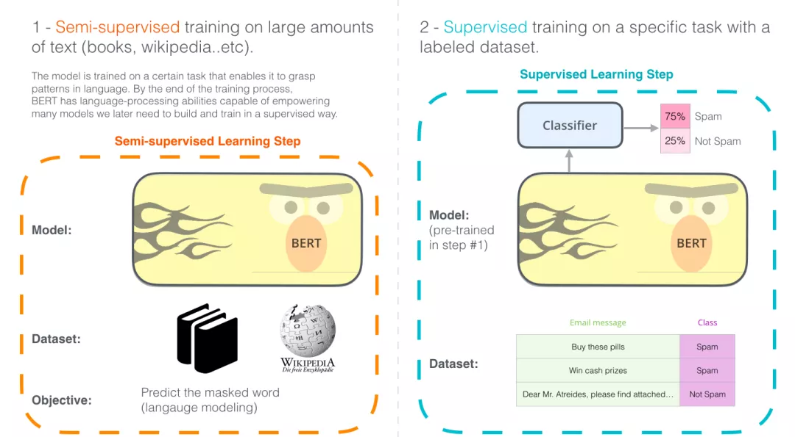图：BERT训练和微调

## BERT句子分类
要想很好的理解BERT，最好先理解一下BERT的使用场景，明确一下输入和输出，最后再详细学习BERT的内在模型结构和训练方法。因此，在介绍模型本身涉及的BERT相关概念之前，让我们先看看如何直接应用BERT。
- 下载在无监督语料上预训练好的BERT模型，一般来说对应了3个文件：BERT模型配置文件（用来确定Transformer的层数，隐藏层大小等），BERT模型参数，BERT词表（BERT所能处理的所有token）。
- 针对特定任务需要，在BERT模型上增加一个任务相关的神经网络，比如一个简单的分类器，然后在特定任务监督数据上进行微调训练。（微调的一种理解：学习率较小，训练epoch数量较少，对模型整体参数进行轻微调整）

先来看一下如何使用BERT进行句子分类，
假设我们的句子分类任务是：判断一个邮件是“垃圾邮件”或者“非垃圾邮件”，如下图所示。当然除了垃圾邮件判断，也可以是其他NLP任务，比如：

- 输入：电影或者产品的评价。输出：判断这个评价是正面的还是负面的。
- 输入：两句话。输出：两句话是否是同一个意思。

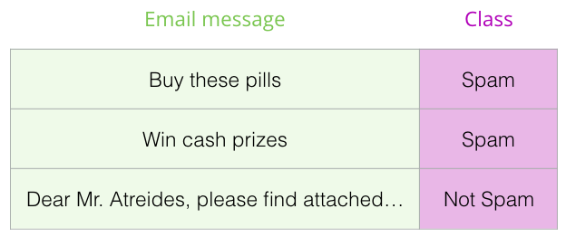

图：垃圾邮件分类

如下图所示，为了能够使用BERT进行句子分类，我们在BERT模型上增加一个简单的classifier层，由于这一层神经网络参数是新添加的，一开始只能随机初始化它的参数，所以需要用对应的监督数据来训练这个classifier。由于classifier是连接在BERT模型之上的，训练的时候也可以更新BERT的参数。

图：BERT句子分类

## 模型结构

通过上面的例子，了解了如何使用BERT，接下来让我们更深入地了解一下它的工作原理。BERT原始论文提出了BERT-base和BERT—large两个模型，base的参数量比large少一些，可以形象的表示为下图的样子。

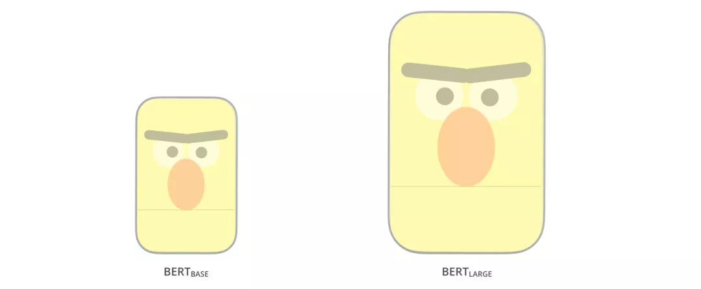图：BERT base和large

回顾一下篇章2.2的Transformer，BERT模型结构基本上就是Transformer的encoder部分，BERT-base对应的是12层encoder，BERT-large对应的是24层encoder。

图：BERT-base为12层的encoder

## 模型输入

接着看一下模型的输入和输出：BERT模型输入有一点特殊的地方是在一句话最开始拼接了一个[CLS] token，如下图所示。这个特殊的[CLS] token经过BERT得到的向量表示通常被用作当前的句子表示。除了这个特殊的[CLS] token，其余输入的单词类似篇章2.2的Transformer。BERT将一串单词作为输入，这些单词在多层encoder中不断向上流动，每一层都会经过 Self-Attention和前馈神经网络。

图：模型输入

## 模型输出

BERT输入的所有token经过BERT编码后，会在每个位置输出一个大小为 hidden_size（在 BERT-base中是 768）的向量。

图：BERT output

对于上面提到的句子分类的例子，我们直接使用第1个位置的向量输出（对应的是[CLS]）传入classifier网络，然后进行分类任务，如下图所示。

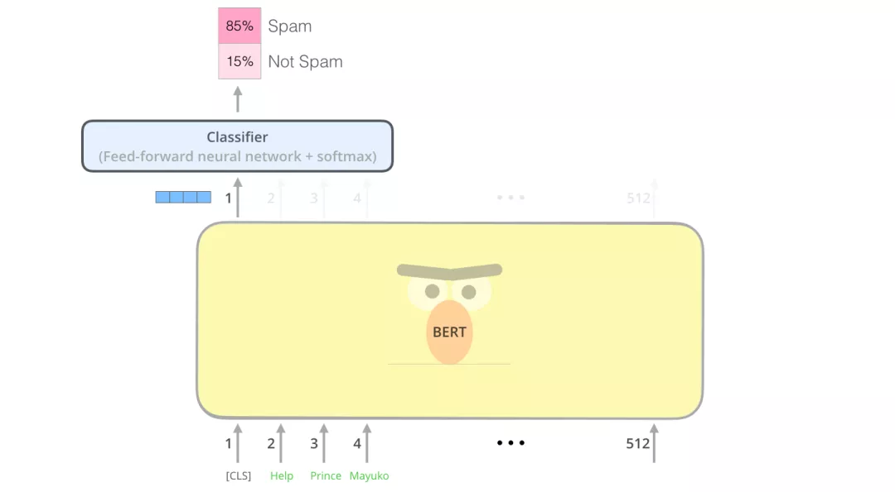图：BERT 接分类器

## 预训练任务：Masked Language Model

知道了模型输入、输出、Transformer结构，那么BERT是如何无监督进行训练的呢？如何得到有效的词、句子表示信息呢？以往的NLP预训练通常是基于语言模型进行的，比如给定语言模型的前3个词，让模型预测第4个词。但是，BERT是基于Masked language model进行预训练的：将输入文本序列的部分（15%）单词随机Mask掉，让BERT来预测这些被Mask的词语。如下图所示：
图： BERT mask

这种训练方式最早可以追溯到Word2Vec时代，典型的Word2Vec算法便是：基于词C两边的A、B和D、E词来预测出词C。
## 预训练任务：相邻句子判断

除了masked language model，BERT在预训练时，还引入了一个新的任务：判断两个句子是否是相邻句子。如下图所示：输入是sentence A和sentence B，经过BERT编码之后，使用[CLS] token的向量表示来预测两个句子是否是相邻句子。

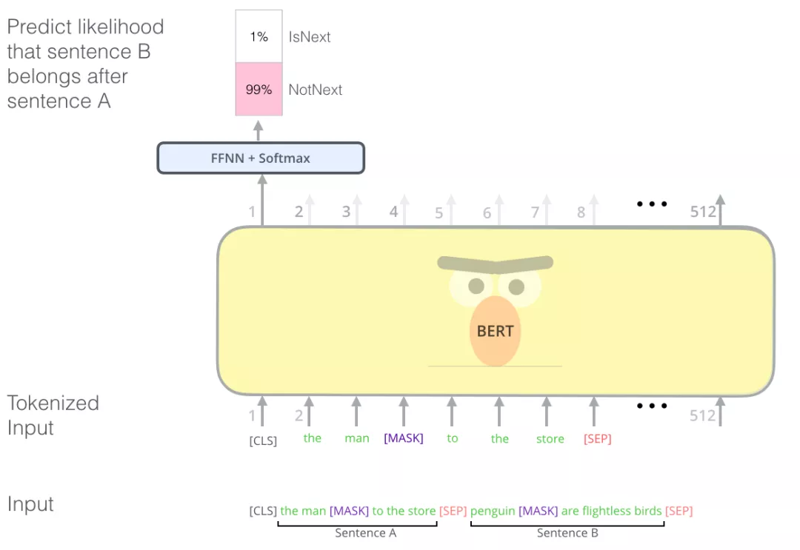图： 2个句子任务

注意事项：为了本文的描述方便，在前面的叙述中，均省略了BERT tokenize的过程，但读者朋友需要注意BERT实际上使用的是WordPieces作为最小的处理单元（采用的是wordpiece算法分词）：token，而不是使用单词本身。在 WordPiece中，有些词会被拆分成更小的部分。关于WordPiece分词，本文不过多展开，感兴趣的读者可以阅读和学习[subword tokenizer](https://towardsdatascience.com/a-comprehensive-guide-to-subword-tokenisers-4bbd3bad9a7c)。另外，判断两个句子是否相邻这个任务在后来的研究中逐渐被淡化了，比如roberta模型在被提出的时候就不再使用该任务进行预训练了。

##  BERT的应用

BERT论文展示了BERT在多种任务上的应用，如下图所示。可以用来判断两个句子是否相似，判断单个句子的情感，用来做抽取式问答，用来做序列标注。

图： BERT应用

## BERT特征提取

由于BERT模型可以得到输入序列所对应的所有token的向量表示，因此不仅可以使用最后一层BERT的输出连接上任务网络进行微调，还可以直接使用这些token的向量当作特征。比如，可以直接提取每一层encoder的token表示当作特征，输入现有的特定任务神经网络中进行训练。

图： BERT特征提取

那么我们是使用最后一层的向量表示，还是前几层的，还是都使用呢？下图给出了一种试验结果：

图： BERT特征选择

## 拓展阅读

### 对比CNN

对于那些有计算机视觉背景的人来说，根据BERT的编码过程，会联想到计算机视觉中使用VGGNet等网络的卷积神经网络+全连接网络做分类任务，如下图所示，基本训练方法和过程是类似的。

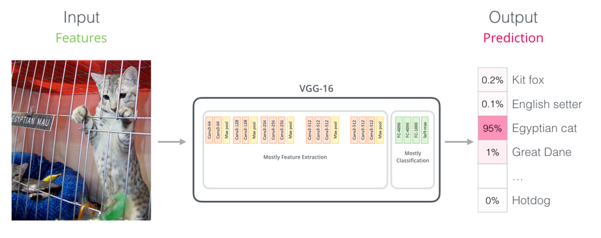图：CNN

### 词嵌入（Embedding）进展

#### 回顾词嵌入

单词不能直接输入机器学习模型，而需要某种数值表示形式，以便模型能够在计算中使用。通过Word2Vec，我们可以使用一个向量（一组数字）来恰当地表示单词，并捕捉单词的语义以及单词和单词之间的关系（例如，判断单词是否相似或者相反，或者像 "Stockholm" 和 "Sweden" 这样的一对词，与 "Cairo" 和 "Egypt"这一对词，是否有同样的关系）以及句法、语法关系（例如，"had" 和 "has" 之间的关系与 "was" 和 "is" 之间的关系相同）。

人们很快意识到，相比于在小规模数据集上和模型一起训练词嵌入，更好的一种做法是，在大规模文本数据上预训练好词嵌入，然后拿来使用。因此，我们可以下载由 Word2Vec 和 GloVe 预训练好的单词列表，及其词嵌入。下面是单词 "stick" 的 Glove 词嵌入向量的例子（词嵌入向量长度是 200）。

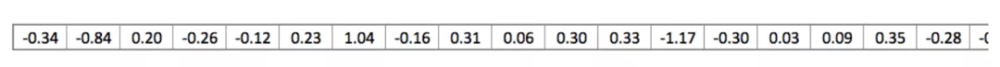图： wrod vector

单词 "stick" 的 Glove 词嵌入embedding向量表示：一个由200个浮点数组成的向量（四舍五入到小数点后两位）。

由于这些向量都很长，且全部是数字，所以在文章中我使用以下基本形状来表示向量：

图：vector

#### 语境问题

如果我们使用 Glove 的词嵌入表示方法，那么不管上下文是什么，单词 "stick" 都只表示为一个向量。一些研究人员指出，像 "stick" 这样的词有多种含义。为什么不能根据它使用的上下文来学习对应的词嵌入呢？这样既能捕捉单词的语义信息，又能捕捉上下文的语义信息。于是，语境化的词嵌入模型应运而生：ELMo。

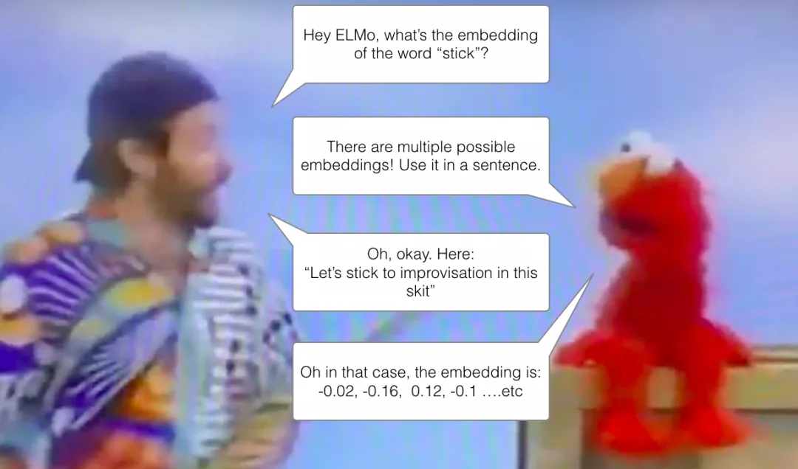图：ELMo

语境化的词嵌入，可以根据单词在句子语境中的含义，赋予不同的词嵌入。

ELMo没有对每个单词使用固定的词嵌入，而是在为每个词分配词嵌入之前，查看整个句子，融合上下文信息。它使用在特定任务上经过训练的双向LSTM来创建这些词嵌入。

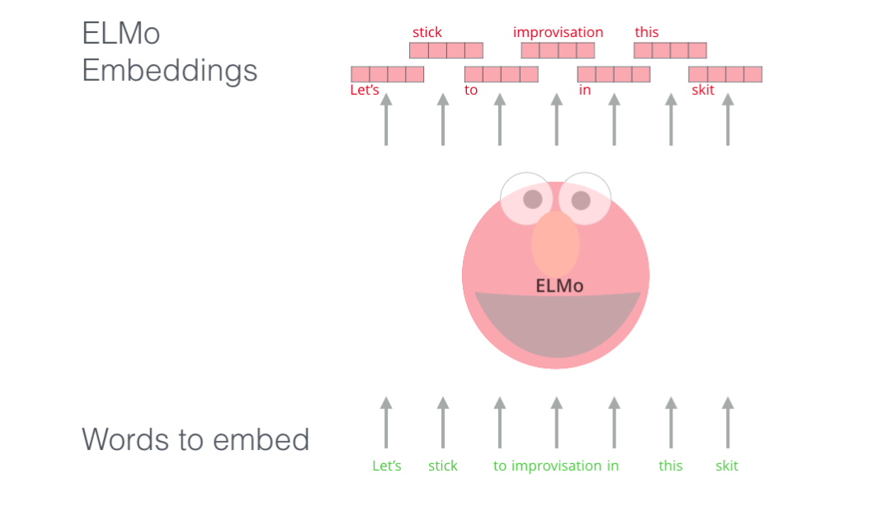图： ELMo embedding

ELMo 在语境化的预训练这条道路上迈出了重要的一步。ELMo LSTM 会在一个大规模的数据集上进行训练，然后我们可以将它作为其他语言处理模型的一个部分，来处理自然语言任务。

那么 ELMo 的秘密是什么呢？

ELMo 通过训练，预测单词序列中的下一个词，从而获得了语言理解能力，这项任务被称为语言建模。要实现 ELMo 很方便，因为我们有大量文本数据，模型可以从这些数据中学习，而不需要额外的标签。

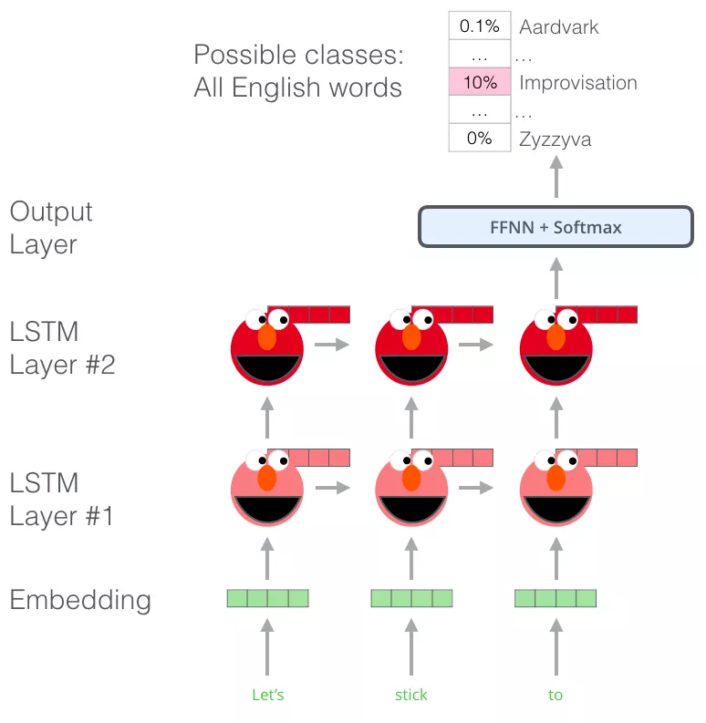图： ELMo 训练

ELMo预训练过程是一个典型的语言模型：以 "Let’s stick to" 作为输入，预测下一个最有可能的单词。当我们在大规模数据集上训练时，模型开始学习语言的模式。例如，在 "hang" 这样的词之后，模型将会赋予 "out" 更高的概率（因为 "hang out" 是一个词组），而不是输出 "camera"。

在上图中，我们可以看到 ELMo 头部上方展示了 LSTM 的每一步的隐藏层状态向量。在这个预训练过程完成后，这些隐藏层状态在词嵌入过程中派上用场。

图：ELMo 训练

ELMo 通过将LSTM模型的隐藏层表示向量（以及初始化的词嵌入）以某种方式（向量拼接之后加权求和）结合在一起，实现了带有语境化的词嵌入。

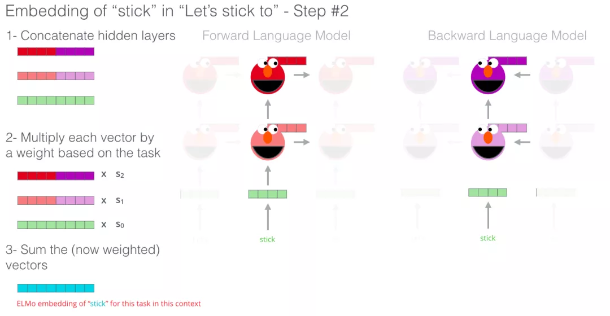图：ELMO 训练

#### Transformer：超越LSTM

随着Transformer论文和代码的发布，以及它在机器翻译等任务上取得的成果，开始让人们认为它是LSTM的替代品。一部分原因是：1. 因为 Transformer 可以比 LSTM 更好地处理长期依赖，2. Transformer可以对输入进行并行运算。

2017年，基于Transformer的Encoder-Decoder展示了它在机器翻译上的威力。但怎么才能用它来做文本分类呢？你怎么才能使用它来预训练一个语言模型，并能够在其他任务上进行微调（下游任务是指那些能够利用预训练模型的监督学习任务）？

#### OpenAI Transformer：预训练一个Transformer Decoder进行语言建模

沿着LSTM语言模型预训练的路子，将LSTM替换成Transformer结构后（相当于），直接语言模型预训练的参数给予下游任务监督数据进行微调，与最开始用于翻译seq2seq的Transformer对比来看，相当于只使用了Decoder部分。有了Transformer结构和语言模型任务设计，直接使用大规模未标记的数据不断得预测下一个词：只需要把 7000 本书的文字依次扔给模型 ，然后让它不断学习生成下一个词即可。

图： open ai模型预测下一个词

现在，OpenAI Transformer 已经经过了预训练，它的网络层藏书经过很多次调整，可以很好地用向量表示文本了，我们开始使用它来处理下游任务。让我们先看下句子分类任务（把电子邮件分类为 ”垃圾邮件“ 或者 ”非垃圾邮件“）：

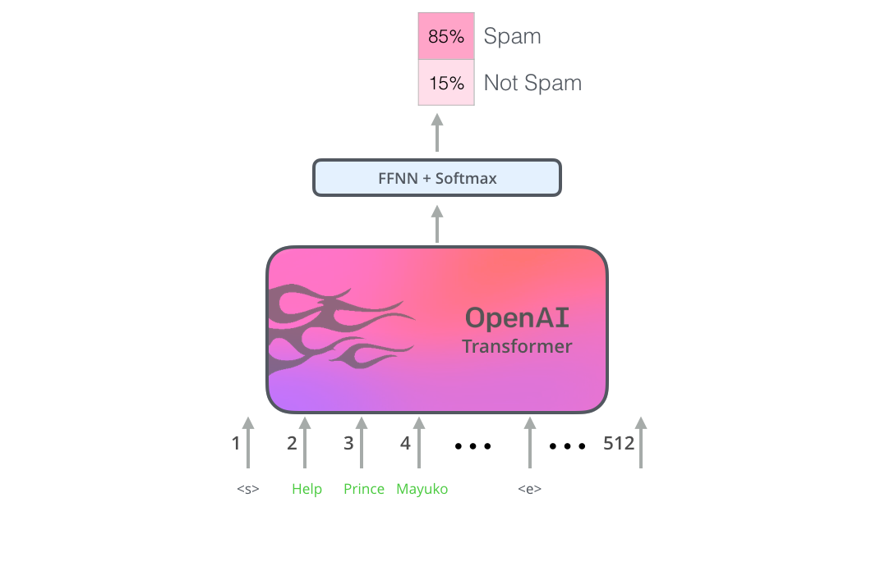图： open ai模型做句子分类

对于形形色色的NLP任务，OpenAI 的论文列出了一些列输入变换方法，可以处理不同任务类型的输入。下面这张图片来源于论文，展示了处理不同任务的模型结构和对应输入变换。

图： open ai微调

#### BERT：Decoder到Encoder

OpenAI Transformer为我们提供了一个基于Transformer的预训练网络。但是在把LSTM换成Transformer 的过程中，有些东西丢失了。比如之前的ELMo的语言模型是双向的，但 OpenAI Transformer 只训练了一个前向的语言模型。我们是否可以构建一个基于 Transformer 的语言模型，它既向前看，又向后看（用技术术语来说 - 融合上文和下文的信息）？答案就是BERT：基于双向Transformer的encoder，在Masked language model上进行预训练，最终在多项NLP下游任务中取得了SOTA效果。

## 致谢
主要由哈尔滨工业大学张贤同学翻译（经过原作者授权）撰写，由多多重新组织和整理。感谢Jacob Devlin、Matt Gardner、Kenton Lee、Mark Neumann 和 [Matthew Peters](https://twitter.com/mattthemathman) 为这篇文章的早期版本提供了反馈。

