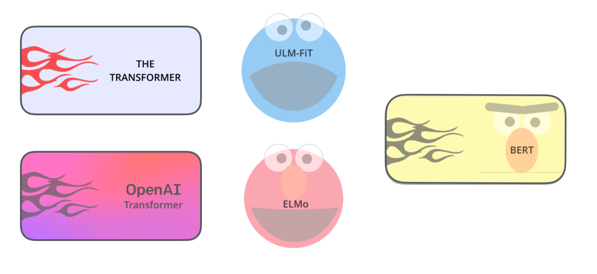

## 图解BERT
在学习完Transformer之后，我们来学习一下将Transformer模型结构发扬光大的一个经典模型：BERT。

图：结构总览

## 前言
BERT在2018年出现。其全称是“Bidirectional Encoder Representation from Transformers“，即双向Transformer解码器。BERT用来提取各类任务的基础特征，作为预训练模型为下游NLP任务提供帮助。2018 年是机器学习模型处理文本（或者更准确地说，自然语言处理或 NLP）的转折点。我们对这些方面的理解正在迅速发展：如何最好地表示单词和句子，从而最好地捕捉基本语义和关系？此外，NLP 社区已经发布了非常强大的组件，你可以免费下载，并在自己的模型和 pipeline 中使用（今年可以说是 NLP 的 ImageNet 时刻，这句话指的是多年前类似的发展也加速了 机器学习在计算机视觉任务中的应用）。

图：BERT-ELMo-ULM-FIT

ULM-FiT 与 Cookie Monster（饼干怪兽）无关。但我想不出别的了...

BERT的发布是这个领域发展的最新的里程碑之一，这个事件标志着NLP 新时代的开始。BERT模型打破了基于语言处理的任务的几个记录。在 BERT 的论文发布后不久，这个团队还公开了模型的代码，并提供了模型的下载版本，这些模型已经在大规模数据集上进行了预训练。这是一个重大的发展，因为它使得任何一个构建构建机器学习模型来处理语言的人，都可以将这个强大的功能作为一个现成的组件来使用，从而节省了从零开始训练语言处理模型所需要的时间、精力、知识和资源。
## Bert训练中的关键点
&#8195;&#8195;<font color='red'>BERT模型有四大关键词: Pre-trained, Deep, Bidirectional Transformer, Language Understanding</font><br>
a. Pre-trained: <br>
&#8195;&#8195;首先明确这是个预训练的语言模型，使用了Masked LM和Next Sentence Prediction两种方法分别捕捉词语和句子级别的representation。

b. Deep
&#8195;&#8195;Google开源了Base和Large两个版本的BERT模型，供所有人使用<br>
Base:版本Layer = 12, Hidden = 768, Head = 12, Total Parameters = 110M<br>
Large版本:Layer = 24, Hidden = 1024, Head = 16, Total Parameters = 340M<br>
对比于原始论文的Transformer: Layer = 6, Hidden = 2048, Head = 8，可以看出Bert是一个深而窄的模型，效果更好。

C. Bidirectional Transformer: <br>
&#8195;&#8195;Bert的创新点，BERT的模型架构基于多层双向转换解码。Bert直接引用了Transformer架构中的Encoder模块，并舍弃了Decoder模块, 这样便自动拥有了双向编码能力和强大的特征提取能力。“双向”表示模型在处理某一个词时，它能同时利用前面的词和后面的词两部分信息。

D. Language Understanding: 更加侧重语言的理解，而不仅仅是生成(Language Generation)

### 1.3为什么要进行预训练？
&#8195;&#8195;随着深度学习的发展，模型参数的数量迅速增加。需要更大的数据集来完全训练模型参数并防止过度拟合。但是，由于注释成本极其昂贵，因此对于大多数NLP任务而言，构建大规模的标记数据集是一项巨大的挑战，尤其是对于语法和语义相关的任务。<br>
&#8195;&#8195;相反，大规模的未标记语料库相对容易构建。为了利用巨大的未标记文本数据，我们可以首先从它们中学习良好的表示形式（通用语法规则），然后将这些表示形式用于其他任务。最近的研究表明，借助从大型无注释语料库中的PTMs提取的表示形式，可以在许多NLP任务上显着提高性能。<br>

&#8195;&#8195;预训练的优势可以进一步归纳如下：<br>
1.<font color='red'>学习通用语言表示形式</font >：在庞大的文本语料库上进行预训练，可以学习通用的语言表示形式，帮助完成下游任务。<br>
2.<font color='red'>提供了更好的模型初始化</font>：可以看做给后续模型的提供良好初始化，通常可以带来更好的泛化性能并加快目标任务的收敛速度。<br>
3.<font color='red'>可以将预训练视为一种正则化，以避免对小数据过度拟合</font><br>
4.可以将的Bert模型作当做一个特征提取器，从而节省了从零开始训练语言处理模型所需要的时间、精力、知识和资源。<br>
### Pre-trained阶段两大核心任务：
<font color='red'>a. 引入Masked LM(带mask的单词级别语言模型训练)</font><br>

&#8195;&#8195;MASK机制是BERT模型最大的亮点之一。据作者说，MASK的思想来源于「完形填空」的任务，其实就是在模仿我们学语言的过程。具体来说，在一句话中随机选择 15% 的词汇抹去用于预测。对于在原句中被抹去的词汇， 80% 情况下采用一个特殊符号 [MASK] 替换， 10% 情况下采用一个任意词替换，剩余 10% 情况下保持原词汇不变。

**为何引入mask机制**<br>
&#8195;&#8195;这么做的主要原因是：BERT只使用了 Encoder 结构。Encoder 的 Self Attention 层，每个 token 会把大部分注意力集中到自己身上，那么这样将容易预测到每个 token，模型学不到有用的信息。所以BERT 提出使用 mask，把需要预测的词屏蔽掉，可以在不泄露 label 的情况下融合双向语义信息。

**为什么不把15%的词全部 [MASK] 替换？**<br>
&#8195;&#8195;如果我们 100% 地使用 [MASK]，非屏蔽词仍然用于上下文，但该模型已针对预测屏蔽词进行了优化。模型只需要保证输出层的分类准确，对于输出层的向量表征并不关心，模型不一定会为非屏蔽词生成良好的标记表示，因此可能会导致最终的向量输出效果并不好 。<br>
&#8195;&#8195;而且在下游的自然语言处理任务中，语句中并不会出现 [MASK] 标记，[MASK]仅仅只是为了训练。为了和后续任务保持一致，不应该全部替换。

**为什么要随机替换？**<br>
&#8195;&#8195;模型不知道哪个 token 位是被随机替换的，就迫使模型尽量在每一个词上都学习到一个全局语境下的表征，因而也能够让 BERT 获得更好的语境相关的词向量（这正是解决一词多义的最重要特性）；

**为什么要保留部分不变？**<br>
&#8195;&#8195;保持不变，也就是真的有 10% 的情况下是泄密的（占所有词的比例为15% * 10% = 1.5%），这样能够给模型一定的 bias ，相当于是额外的奖励，将模型对于词的表征能够拉向词的真实表征。（此时输入层是待预测词的真实 embedding，在输出层中的该词位置得到的embedding，是经过层层 Self-attention 后得到的，这部分 embedding 里多少依然保留有部分输入 embedding 的信息，而这部分就是通过输入一定比例的真实词所带来的额外奖励，最终会使得模型的输出向量朝输入层的真实 embedding 有一个偏移）。

**为何既有10%概率[MASK]又有10%概率保持不变**<br>
&#8195;&#8195;如果我们 90% 的时间使用 [MASK]，10% 的时间使用随机单词，这将告诉模型观察到的单词永远不会正确。如果我们 90% 的时间使用 [MASK]，10% 的时间保持相同的单词，那么模型可以简单地复制非上下文嵌入。（这一段应该是作者的原话，可参考[原文链接](https://blog.csdn.net/c9Yv2cf9I06K2A9E/article/details/109475187%EF%BC%89)

&#8195;&#8195;<font color='red'>而且在这一种高度不确定的情况下, 反倒逼着模型快速学习该token的分布式上下文的语义, </font>更多地依赖于上下文信息去预测词汇，尽最大努力学习原始语言说话的样子!!! 同时因为原始文本中只有15%的token参与了MASK操作, 所以并不会破坏原语言的表达能力和语言规则!!!并且赋予了模型一定的纠错能力（ BERT 模型 [Mask] 标记可以看做是引入了噪音）

<font color='red'>b 引入Next Sentence Prediction (句子级别的连续性预测任务)</font><br>
&#8195;&#8195;BERT考虑到问答系统，智能聊天机器人之类的任务场景，所以增加了第二个任务，即预测输入 BERT 的两段文本是否为连续的文本。引入这个任务可以更好地让模型学到连续的文本片段之间的关系。<br>
&#8195;&#8195;这个类似于「段落重排序」的任务，即：将一篇文章的各段打乱，让我们通过重新排序把原文还原出来，这其实需要我们对全文大意有充分、准确的理解。<br>
&#8195;&#8195;Next Sentence Prediction 任务实际上就是段落重排序的简化版：只考虑两句话，判断是否是一篇文章中的前后句。在实际预训练过程中，文章作者从文本语料库中随机选择 50% 正确语句对和 50% 错误语句对进行训练（所以第二个句子有50%的几率是第一个句子的下一句），与 Masked LM 任务相结合，让模型能够更准确地刻画语句乃至篇章层面的语义信息。

&#8195;&#8195;BERT 模型通过对 Masked LM 任务和 Next Sentence Prediction 任务进行联合训练，使模型输出的每个字 / 词的向量表示都能尽可能全面、准确地刻画输入文本（单句或语句对）的整体信息，为后续的微调任务提供更好的模型参数初始值。

## 句子分类

使用 BERT 最直接的方法就是对一个句子进行分类。这个模型如下所示：

图：BERT句子分类

为了训练这样一个模型，你主要需要训练分类器（上图中的 Classifier），在训练过程中 几乎不用改动BERT模型。这个训练过程称为微调，它起源于Semi-supervised Sequence Learning 和 ULMFiT。

由于我们在讨论分类器，这属于机器学习的监督学习领域。这意味着我们需要一个带有标签的数据集来训练这样一个模型。例如，在下面这个垃圾邮件分类器的例子中，带有标签的数据集包括一个邮件内容列表和对应的标签（每个邮件是“垃圾邮件”或者“非垃圾邮件”）。

图：垃圾邮件分类

其他一些例子包括：

1） 语义分析

- - 输入：电影或者产品的评价。输出：判断这个评价是正面的还是负面的。
数据集示例：SST （https://nlp.stanford.edu/sentiment）
2）Fact-checking

- 输入：一个句子。输出：这个句子是不是一个断言
- 参考视频：https://www.youtube.com/watch?v=ddf0lgPCoSo

## 模型架构

现在你已经通过上面的例子，了解了如何使用 BERT，接下来让我们更深入地了解一下它的工作原理。

图：BERT base和large

论文里介绍了两种不同模型大小的 BERT：

- BERT BASE - 与 OpenAI 的 Transformer 大小相当，以便比较性能
- BERT LARGE - 一个非常巨大的模型，它取得了最先进的结果

BERT 基本上是一个训练好的 Transformer 的 encoder 的栈。关于 Transformer 的介绍，可以阅读之前的文章[《 图解Transformer（完整版）！》](https://github.com/datawhalechina/transformers-quick-start-zh/blob/main/transformer%E5%9F%BA%E6%9C%AC%E5%8E%9F%E7%90%86%E8%AE%B2%E8%A7%A3/2-%E5%9B%BE%E8%A7%A3transformer.md)，这里主要介绍 Transformer 模型，这是 BERT 中的一个基本概念。此外，我们还会介绍其他一些概念。


## 模型输入

图：模型输入

第一个输入的 token 是特殊的 [CLS]，它 的含义是分类（class的缩写）。

就像 Transformer 中普通的 Encoder 一样，BERT 将一串单词作为输入，这些单词在 Encoder 的栈中不断向上流动。每一层都会经过 Self Attention 层，并通过一个前馈神经网络，然后将结果传给下一个 Encoder。

图：BERT encoder

在模型架构方面，到目前为止，和 Transformer 是相同的（除了模型大小，因为这是我们可以改变的参数）。我们会在下面看到，BERT 和 Transformer 在模型的输出上有一些不同。

## 模型输出

每个位置输出一个大小为 hidden_size（在 BERT Base 中是 768）的向量。对于上面提到的句子分类的例子，我们只关注第一个位置的输出（输入是 [CLS] 的那个位置）。

图：BERT output

这个输出的向量现在可以作为后面分类器的输入。论文里用单层神经网络作为分类器，取得了很好的效果。

图：BERT 接分类器

如果你有更多标签（例如你是一个电子邮件服务，需要将邮件标记为 “垃圾邮件”、“非垃圾邮件”、“社交”、“推广”），你只需要调整分类器的神经网络，增加输出的神经元个数，然后经过 softmax 即可。


## 与卷积神经网络进行对比

对于那些有计算机视觉背景的人来说，这个向量传递过程，会让人联想到 VGGNet 等网络的卷积部分，和网络最后的全连接分类部分之间的过程。

图：CNN

## 词嵌入（Embedding）的新时代

上面提到的这些新发展带来了文本编码方式的新转变。到目前为止，词嵌入一直是 NLP 模型处理语言的主要表示方法。像 Word2Vec 和 Glove 这样的方法已经被广泛应用于此类任务。在我们讨论新的方法之前，让我们回顾一下它们是如何应用的。

### 回顾词嵌入

单词不能直接输入机器学习模型，而需要某种数值表示形式，以便模型能够在计算中使用。通过 Word2Vec，我们可以使用一个向量（一组数字）来恰当地表示单词，并捕捉单词的语义以及单词和单词之间的关系（例如，判断单词是否相似或者相反，或者像 "Stockholm" 和 "Sweden" 这样的一对词，与 "Cairo" 和 "Egypt"这一对词，是否有同样的关系）以及句法、语法关系（例如，"had" 和 "has" 之间的关系与 "was" 和 "is" 之间的关系相同）。

人们很快意识到，相比于在小规模数据集上和模型一起训练词嵌入，更好的一种做法是，在大规模文本数据上预训练好词嵌入，然后拿来使用。因此，我们可以下载由 Word2Vec 和 GloVe 预训练好的单词列表，及其词嵌入。下面是单词 "stick" 的 Glove 词嵌入向量的例子（词嵌入向量长度是 200）。

图： wrod vector


单词 "stick" 的 Glove 词嵌入 - 一个由200个浮点数组成的向量（四舍五入到小数点后两位）。

由于这些向量都很长，且全部是数字，所以在文章中我使用以下基本形状来表示向量：

图：vector

### 语境问题

如果我们使用 Glove 的词嵌入表示方法，那么不管上下文是什么，单词 "stick" 都只表示为同一个向量。一些研究人员指出，像 "stick" 这样的词有多种含义。为什么不能根据它使用的上下文来学习对应的词嵌入呢？这样既能捕捉单词的语义信息，又能捕捉上下文的语义信息。于是，语境化的词嵌入模型应运而生。

图：ELMO

语境化的词嵌入，可以根据单词在句子语境中的含义，赋予不同的词嵌入。你可以查看这个视频 RIP Robin Williams（https://zhuanlan.zhihu.com/RIP Robin Williams）

ELMo 没有对每个单词使用固定的词嵌入，而是在为每个词分配词嵌入之前，查看整个句子，融合上下文信息。它使用在特定任务上经过训练的双向 LSTM 来创建这些词嵌入。

图： ELMO embedding

ELMo 在语境化的预训练这条道路上迈出了重要的一步。ELMo LSTM 会在一个大规模的数据集上进行训练，然后我们可以将它作为其他语言处理模型的一个部分，来处理自然语言任务。

那么 ELMo 的秘密是什么呢？

ELMo 通过训练，预测单词序列中的下一个词，从而获得了语言理解能力，这项任务被称为语言建模。要实现 ELMo 很方便，因为我们有大量文本数据，模型可以从这些数据中学习，而不需要额外的标签。


图： ELMO 训练

ELMo 预训练过程的其中一个步骤：以 "Let’s stick to" 作为输入，预测下一个最有可能的单词。这是一个语言建模任务。当我们在大规模数据集上训练时，模型开始学习语言的模式。例如，在 "hang" 这样的词之后，模型将会赋予 "out" 更高的概率（因为 "hang out" 是一个词组），而不是 "camera"。

在上图中，我们可以看到 ELMo 头部上方展示了 LSTM 的每一步的隐藏层状态向量。在这个预训练过程完成后，这些隐藏层状态在词嵌入过程中派上用场。

图：ELMO 训练

ELMo 通过将隐藏层状态（以及初始化的词嵌入）以某种方式（向量拼接之后加权求和）结合在一起，实现了带有语境化的词嵌入。

图：ELMO 训练

### ULM-FiT：NLP 领域的迁移学习

ULM-FiT 提出了一些方法来有效地利用模型在预训练期间学习到的东西 - 这些东西不仅仅是词嵌入，还有语境化的词嵌入。ULM-FiT 提出了一个语言模型和一套流程，可以有效地为各种任务微调这个语言模型。

现在，NLP 可能终于找到了好的方法，可以像计算机视觉那样进行迁移学习了。

### Transformer：超越 LSTM

Transformer 论文和代码的发布，以及它在机器翻译等任务上取得的成果，开始让人们认为它是 LSTM 的替代品。这是因为 Transformer 可以比 LSTM 更好地处理长期依赖。

Transformer 的 Encoder-Decoder 结构使得它非常适合机器翻译。但你怎么才能用它来做文本分类呢？你怎么才能使用它来预训练一个语言模型，并能够在其他任务上进行微调（下游任务是指那些能够利用预训练模型的监督学习任务）？

### OpenAI Transformer：预训练一个 Transformer Decoder 来进行语言建模

事实证明，我们不需要一个完整的 Transformer 来进行迁移学习和微调。我们只需要 Transformer 的 Decoder 就可以了。Decoder 是一个很好的选择，用它来做语言建模（预测下一个词）是很自然的，因为它可以屏蔽后来的词 。当你使用它进行逐词翻译时，这是个很有用的特性。

图： open ai模型

OpenAI Transformer 是由 Transformer 的 Decoder 堆叠而成的

这个模型包括 12 个 Decoder 层。因为在这种设计中没有 Encoder，这些 Decoder 层不会像普通的 Transformer 中的 Decoder 层那样有 Encoder-Decoder Attention 子层。不过，它仍然会有 Self Attention 层（这些层使用了 mask，因此不会看到句子后来的 token）。

有了这个结构，我们可以继续在同样的语言建模任务上训练这个模型：使用大规模未标记的数据来预测下一个词。只需要把 7000 本书的文字扔给模型 ，然后让它学习。书籍非常适合这种任务，因为书籍的数据可以使得模型学习到相关联的信息。如果你使用 tweets 或者文章来训练，模型是得不到这些信息的。

图： open ai模型预测下一个词

上图表示：OpenAI Transformer 在 7000 本书的组成的数据集中预测下一个单词。

### 下游任务的迁移学习

现在，OpenAI Transformer 已经经过了预训练，它的网络层经过调整，可以很好地处理文本语言，我们可以开始使用它来处理下游任务。让我们先看下句子分类任务（把电子邮件分类为 ”垃圾邮件“ 或者 ”非垃圾邮件“）：

图： open ai模型下游任务

OpenAI 的论文列出了一些列输入变换方法，来处理不同任务类型的输入。下面这张图片来源于论文，展示了执行不同任务的模型结构和对应输入变换。这些都是非常很巧妙的做法。

图： open ai微调

## BERT：从 Decoder 到 Encoder

OpenAI Transformer 为我们提供了一个基于 Transformer 的可以微调的预训练网络。但是在把 LSTM 换成 Transformer 的过程中，有些东西丢失了。ELMo 的语言模型是双向的，但 OpenAI Transformer 只训练了一个前向的语言模型。我们是否可以构建一个基于 Transformer 的语言模型，它既向前看，又向后看（用技术术语来说 - 融合上文和下文的信息）。


### Masked Language Model（MLM 语言模型）

那么如何才能像 LSTM 那样，融合上文和下文的双向信息呢？

一种直观的想法是使用 Transformer 的 Encoder。但是 Encoder 的 Self Attention 层，每个 token 会把大部分注意力集中到自己身上，那么这样将容易预测到每个 token，模型学不到有用的信息。BERT 提出使用 mask，把需要预测的词屏蔽掉。

下面这段风趣的对话是博客原文的。


```
BERT 说，“我们要用 Transformer 的 Encoder”。

Ernie 说，”这没什么用，因为每个 token 都会在多层的双向上下文中看到自己“。

BERT 自信地说，”我们会使用 mask“。
```
图： BERT mask

BERT 在语言建模任务中，巧妙地屏蔽了输入中 15% 的单词，并让模型预测这些屏蔽位置的单词。

找到合适的任务来训练一个 Transformer 的 Encoder 是一个复杂的问题，BERT 通过使用早期文献中的 "masked language model" 概念（在这里被称为完形填空）来解决这个问题。

除了屏蔽输入中 15% 的单词外， BERT 还混合使用了其他的一些技巧，来改进模型的微调方式。例如，有时它会随机地用一个词替换另一个词，然后让模型预测这个位置原来的实际单词。


### 两个句子的任务

如果你回顾 OpenAI Transformer 在处理不同任务时所做的输入变换，你会注意到有些任务需要模型对两个句子的信息做一些处理（例如，判断它们是不是同一句话的不同解释。将一个维基百科条目作为输入，再将一个相关的问题作为另一个输入，模型判断是否可以回答这个问题）。

为了让 BERT 更好地处理多个句子之间的关系，预训练过程还包括一个额外的任务：给出两个句子（A 和 B），判断 B 是否是 A 后面的相邻句子。

图： 2个句子任务

BERT 预训练的第 2 个任务是两个句子的分类任务。在上图中，tokenization 这一步被简化了，因为 BERT 实际上使用了 WordPieces 作为 token，而不是使用单词本身。在 WordPiece 中，有些词会被拆分成更小的部分。


###  BERT 在不同任务上的应用

BERT 的论文展示了 BERT 在多种任务上的应用。


图： BERT应用

### 将 BERT 用于特征提取

使用 BERT 并不是只有微调这一种方法。就像 ELMo 一样，你可以使用预训练的 BERT 来创建语境化的词嵌入。然后你可以把这些词嵌入用到你现有的模型中。论文里也提到，这种方法在命名实体识别任务中的效果，接近于微调 BERT 模型的效果。


图： BERT特征提取

那么哪种向量最适合作为上下文词嵌入？我认为这取决于任务。论文里验证了 6 种选择（与微调后的 96.4 分的模型相比）：

图： BERT特征选择


### 如何使用 BERT

将在篇章3中进行更为详细的讲解。

尝试 BERT 的最佳方式是通过托管在 Google Colab 上的 BERT FineTuning with Cloud TPUs。如果你之前从来没有使用过 Cloud TPU，那这也是一个很好的尝试开端，因为 BERT 代码可以运行在 TPU、CPU 和 GPU。

下一步是查看 BERT 仓库 中的代码：

- 模型是在 modeling.py（class BertModel）中定义的，和普通的 Transformer encoder 完全相同。
- run_classifier.py 是微调网络的一个示例。它还构建了监督模型分类层。如果你想构建自己的- 分类器，请查看这个文件中的 create_model() 方法。
- 可以下载一些预训练好的模型。这些模型包括 BERT Base、BERT Large，以及英语、中文和包括 102 种语言的多语言模型，这些模型都是在维基百科的数据上进行训练的。
- BERT 不会将单词作为 token。相反，它关注的是 WordPiece。tokenization.py 就是 tokenizer，它会将你的单词转换为适合 BERT 的 wordPiece。

## 致谢
主要由哈尔滨工业大学张贤同学翻译（经过原作者授权）撰写，由本项目同学组织和整理。感谢Jacob Devlin、Matt Gardner、Kenton Lee、Mark Neumann 和 [Matthew Peters](https://twitter.com/mattthemathman) 为这篇文章的早期版本提供了反馈

