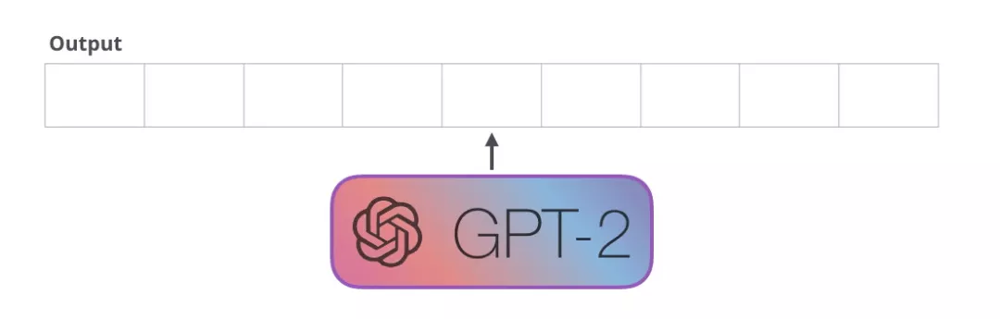
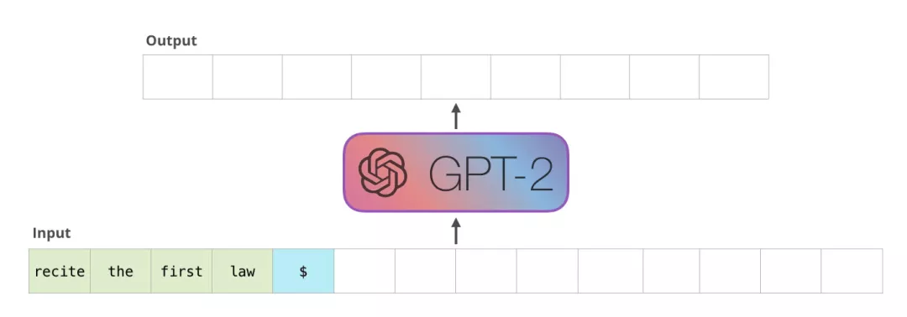

## 图解GPT
除了BERT以外，另一个预训练模型GPT也给NLP领域带来了不少轰动，本节也对GPT做一个详细的讲解，感兴趣的读者可以选择性阅读。

图： 结构总览

## 前言

这篇文章翻译自http://jalammar.github.io/illustrated-gpt2/。多图详细解释当今最为强大的人工智能 GPT-2(截至 2019 年 8 月 12 日)。

今年，我们看到了机器学习在许多场景的广泛应用。OpenAI GPT-2(https://openai.com/blog/better-language-models/)表现出了令人印象深刻的能力，它能够写出连贯而充满激情的文章，这超出了我们当前对语言模型的预期效果。GPT-2 不是一个特别新颖的架构，而是一种与 Transformer 解码器非常类似的架构。不过 GPT-2 是一个巨大的、基于 Transformer 的语言模型，它是在一个巨大的数据集上训练的。在这篇文章，我们会分析它的结构，以及这种结构产生的作用。我们会深入了解 Self Attention 层的细节。然后我们会再了解一下这种只有 Decoder 的 Transformer 在语言建模之外的应用。

这篇文章可以看作是之前文章[《图解Transformer（完整版）！》](https://github.com/datawhalechina/transformers-quick-start-zh/blob/main/transformer%E5%9F%BA%E6%9C%AC%E5%8E%9F%E7%90%86%E8%AE%B2%E8%A7%A3/2-%E5%9B%BE%E8%A7%A3transformer.md)的补充。图解 Transformer 的文章使用了更多的图来解释 Transformer 的内部工作原理，以及它们是如何从原始论文一步一步进化的。我希望这种可视化的方式能够更加容易解释基于 Transformer 的模型内部原理和进化。

## GPT2 和语言模型

首先，我们来看看什么是语言模型。

### 什么是语言模型

在 图解 Word2Vec(https://jalammar.github.io/illustrated-word2vec/) 中，我们了解到语言模型基本上是一个机器学习模型，它可以根据句子的一部分预测下一个词。最著名的语言模型就是手机键盘，它可以根据你输入的内容，提示下一个单词。

图：词之间的关系

从这个意义上讲，GPT-2 基本上就是键盘应用程序中预测下一个词的功能，但 GPT-2 比你手机上的键盘 app 更大更复杂。GPT-2 是在一个 40 GB 的名为 WebText 的数据集上训练的，OpenAI 的研究人员从互联网上爬取了这个数据集，作为研究工作的一部分。从存储空间大小方面来比较，我使用的键盘应用程序 SwiftKey，占用了 78 MB 的空间。而最小的 GPT-2 变种，需要 500 MB 的空间来存储它的所有参数。最大的 GPT-2 模型变种是其大小的 13 倍，因此占用的空间可能超过 6.5 GB。
图：GPT发展

对 GPT-2 进行实验的一个很好的方法是使用 AllenAI GPT-2 Explorer(https://gpt2.apps.allenai.org/?text=Joel is)。它使用 GPT-2 来显示下一个单词的 10 种预测（包括每种预测的分数）。你可以选择一个单词，然后就能看到下一个单词的预测列表，从而生成一篇文章。

### 语言模型的 Transformer

正如我们在图解 Transformer中看到的，原始的 Transformer 模型是由 Encoder 和 Decoder 组成的，它们都是由 Transformer 堆叠而成的。这种架构是合适的，因为这个模型是用于处理机器翻译的。在机器翻译问题中，Encoder-Decoder 的架构已经在过去成功应用了。

图：transformer

在随后的许多研究工作中，只使用 Transformer 中的一部分，要么去掉 Encoder，要么去掉 Decoder，并且将它们堆得尽可能高。使用大量的训练文本，并投入大量的计算（数十万美元用于训练这些模型，在 AlphaStar 的例子中可能是数百万美元）。
图：gpt-bert


我们可以将这些模块堆得多高呢？事实证明，这是区分不同的 GPT-2 的主要因素之一。

图：gpt区分

### 与 BERT 的一个不同之处

```
机器人第一定律：

机器人不得伤害人类，也不能因不作为而使人类受到伤害。
```

GPT-2 是使用 Transformer 的 Decoder 模块构建的。另一方面，BERT 是使用 Transformer 的 Encoder 模块构建的。我们将在下一节中研究这种差异。但它们之间的一个重要差异是，GPT-2 和传统的语言模型一样，一次输出一个  token。例如，让一个训练好的 GPT-2 背诵机器人第一定律：

图： gpt2 output

这些模型的实际工作方式是，在产生每个 token 之后，将这个 token 添加到输入的序列中，形成一个新序列。然后这个新序列成为模型在下一个时间步的输入。这是一种叫“自回归（auto-regression）”的思想。这种做法可以使得 RNN 非常有效。

图： gpt2 output

GPT-2，和后来的一些模型如 TransformerXL 和 XLNet，本质上都是自回归的模型。但 BERT 不是自回归模型。这是一种权衡。去掉了自回归后，BERT 能够整合左右两边的上下文，从而获得更好的结果。XLNet 重新使用了 自回归，同时也找到一种方法能够结合两边的上下文。


### Transformer 模块的进化

Transformer 原始论文(https://arxiv.org/abs/1706.03762) 介绍了两种模块：

Encoder 模块

首先是 Encoder 模块。


图： encoder

原始的 Transformer 论文中的 Encoder 模块接受特定长度的输入（如 512 个 token）。如果一个输入序列比这个限制短，我们可以填充序列的其余部分。

Decoder 模块

其次是 Decoder。与 Encoder 相比，它在结构上有一个很小的差异：它有一个层，使得它可以关注来自 Encoder 特定的段。

图： decoder

这里的 Self Attention 层的一个关注差异是，它会屏蔽未来的 token。具体来说，它不像 BERT 那样将单词改为mask，而是通过改变 Self Attention 的计算，阻止来自被计算位置右边的 token。

例如，我们想要计算位置 4，我们可以看到只允许处理以前和现在的 token。

图： decoder只能看到以前和现在的token

很重要的一点是，（BERT 使用的）Self Attention 和 （GPT-2 使用的）masked Self Attention 有明确的区别。一个正常的 Self Attention 模块允许一个位置关注到它右边的部分。而 masked Self Attention 阻止了这种情况的发生：

图： mask attention

只有 Decoder 的模块

在 Transformer 原始论文发布之后，Generating Wikipedia by Summarizing Long Sequences(https://arxiv.org/pdf/1801.10198.pdf) 提出了另一种能够进行语言建模的 Transformer 模块的布局。这个模型丢弃了 Transformer 的 Encoder。因此，我们可以把这个模型称为 Transformer-Decoder。这种早期的基于 Transformer 的语言模型由 6 个 Decoder 模块组成。

图： transformer-decoder

这些 Decoder 模块都是相同的。我已经展开了第一个 Decoder，因此你可以看到它的 Self Attention 层是 masked 的。注意，现在这个模型可以处理多达 4000 个 token--是对原始论文中 512 个 token 的一个大升级。

这些模块和原始的 Decoder 模块非常类似，只是它们去掉了第二个 Self Attention 层。在 Character-Level Language Modeling with Deeper Self-Attention(https://arxiv.org/pdf/1808.04444.pdf) 中使用了类似的结构，来创建一次一个字母/字符的语言模型。

OpenAI 的 GPT-2 使用了这些 Decoder 模块。

### 语言模型入门：了解 GPT2

让我们拆解一个训练好的 GPT-2，看看它是如何工作的。

图：拆解GPT2

GPT-2 能够处理 1024 个 token。每个 token 沿着自己的路径经过所有的 Decoder 模块

运行一个训练好的 GPT-2 模型的最简单的方法是让它自己生成文本（这在技术上称为 生成无条件样本）。或者，我们可以给它一个提示，让它谈论某个主题（即生成交互式条件样本）。在漫无目的情况下，我们可以简单地给它输入初始 token，并让它开始生成单词（训练好的模型使用 <|endoftext|> 作为初始的 token。我们称之为 \<s>）。


图：拆解GPT2初始token

模型只有一个输入的 token，因此只有一条活跃路径。token 在所有层中依次被处理，然后沿着该路径生成一个向量。这个向量可以根据模型的词汇表计算出一个分数（模型知道所有的 单词，在 GPT-2 中是 5000 个词）。在这个例子中，我们选择了概率最高的 the。但我们可以把事情搞混--你知道如果一直在键盘 app 中选择建议的单词，它有时候会陷入重复的循环中，唯一的出路就是点击第二个或者第三个建议的单词。同样的事情也会发生在这里，GPT-2 有一个 top-k 参数，我们可以使用这个参数，让模型考虑第一个词（top-k =1）之外的其他词。

下一步，我们把第一步的输出添加到我们的输入序列，然后让模型做下一个预测。


动态图：拆解GPT2

请注意，第二条路径是此计算中唯一活动的路径。GPT-2 的每一层都保留了它自己对第一个 token 的解释，而且会在处理第二个 token 时使用它（我们会在接下来关于 Self Attention 的章节中对此进行更详细的介绍）。GPT-2 不会根据第二个 token 重新计算第一个 token。


### 深入理解 GPT2 的更多细节
**输入编码**

让我们更深入地了解模型。首先从输入开始。与之前我们讨论的其他 NLP 模型一样，GPT-2 在嵌入矩阵中查找输入的单词的对应的 embedding 向量--这是我们从训练好的模型中得到的组件之一。

图：token embedding

每一行都是词的 embedding：这是一个数字列表，可以表示一个词并捕获一些含义。这个列表的大小在不同的 GPT-2 模型中是不同的。最小的模型使用的 embedding 大小是 768

因此在开始时，我们会在嵌入矩阵查找第一个 token \<s> 的 embedding。在把这个 embedding 传给模型的第一个模块之前，我们需要融入位置编码，这个位置编码能够指示单词在序列中的顺序。训练好的模型中，有一部分是一个矩阵，这个矩阵包括了 1024 个位置中每个位置的位置编码向量。

图：位置编码

在这里，我们讨论了输入单词在传递到第一个 Transformer 模块之前，是如何被处理的。我们还知道，训练好的 GPT-2 包括两个权重矩阵。
图： token+position

把一个单词输入到 Transformer 的第一个模块，意味着寻找这个单词的 embedding，并且添加第一个位置的位置编码向量

**在这些层中向上流动**

第一个模块现在可以处理 token，首先通过 Self Attention 层，然后通过神经网络层。一旦 Transformer 的第一个模块处理了 token，会得到一个结果向量，这个结果向量会被发送到堆栈的下一个模块处理。每个模块的处理过程都是相同的，不过每个模块都有自己的 Self Attention 和神经网络层。

图：向上流动

**回顾 Self-Attention**

语言严重依赖于上下文。例如，看看下面的第二定律：

```
机器人第二定律

机器人必须服从人给予 它 的命令，当 该命令 与 第一定律 冲突时例外。
```

我在句子中高亮了 3 个部分，这些部分的词是用于指代其他的词。如果不结合它们所指的上下文，就无法理解或者处理这些词。当一个模型处理这个句子，它必须能够知道：

- 它 指的是机器人
- 该命令 指的是这个定律的前面部分，也就是 人给予 它 的命令
- 第一定律 指的是机器人第一定律

这就是 Self Attention 所做的事。它在处理某个词之前，将模型对这个词的相关词和关联词的理解融合起来（并输入到一个神经网络）。它通过对句子片段中每个词的相关性打分，并将这些词的表示向量加权求和。

举个例子，下图顶部模块中的 Self Attention 层在处理单词 `it` 的时候关注到` a robot`。它传递给神经网络的向量，是 3 个单词和它们各自分数相乘再相加的和。


图：it的attention

**Self-Attention 过程**

Self-Attention 沿着句子中每个 token 的路径进行处理，主要组成部分包括 3 个向量。

- Query：Query 向量是当前单词的表示，用于对其他所有单词（使用这些单词的 key 向量）进行评分。我们只关注当前正在处理的 token 的 query 向量。
- Key：Key 向量就像句子中所有单词的标签。它们就是我们在搜索单词时所要匹配的。
- Value：Value 向量是实际的单词表示，一旦我们对每个词的相关性进行了评分，我们需要对这些向量进行加权求和，从而表示当前的词。

图： query
一个粗略的类比是把它看作是在一个文件柜里面搜索，Query 向量是一个便签，上面写着你正在研究的主题，而 Key 向量就像是柜子里的文件夹的标签。当你将便签与标签匹配时，我们取出匹配的那些文件夹的内容，这些内容就是 Value 向量。但是你不仅仅是寻找一个 Value 向量，而是在一系列文件夹里寻找一系列 Value 向量。

将 Value 向量与每个文件夹的 Key 向量相乘，会为每个文件夹产生一个分数（从技术上来讲：就是点积后面跟着 softmax）。

图： score

我们将每个 Value 向量乘以对应的分数，然后求和，得到 Self Attention 的输出。

图：Self Attention 的输出

这些加权的 Value 向量会得到一个向量，它将 50% 的注意力放到单词 robot 上，将 30% 的注意力放到单词 a，将 19% 的注意力放到单词 it。在下文中，我们会更加深入 Self Attention，但现在，首先让我们继续在模型中往上走，直到模型的输出。

**模型输出**

当模型顶部的模块产生输出向量时（这个向量是经过 Self Attention 层和神经网络层得到的），模型会将这个向量乘以嵌入矩阵。

图：顶部的模块产生输出

回忆一下，嵌入矩阵中的每一行都对应于模型词汇表中的一个词。这个相乘的结果，被解释为模型词汇表中每个词的分数。

图：token概率

我们可以选择最高分数的 token（top_k=1）。但如果模型可以同时考虑其他词，那么可以得到更好的结果。所以一个更好的策略是把分数作为单词的概率，从整个列表中选择一个单词（这样分数越高的单词，被选中的几率就越高）。一个折中的选择是把 top_k 设置为 40，让模型考虑得分最高的 40 个词。

图：top k选择输出

这样，模型就完成了一次迭代，输出一个单词。模型会继续迭代，直到所有的上下文都已经生成（1024 个 token），或者直到输出了表示句子末尾的 token。

### GPT2 总结

现在我们基本知道了 GPT-2 是如何工作的。如果你想知道 Self Attention 层里面到底发生了什么，那么文章接下来的额外部分就是为你准备的，我添加这个额外的部分，来使用更多可视化解释 Self Attention，以便更加容易讲解后面的 Transformer 模型（TransformerXL 和 XLNet）。

我想在这里指出文中一些过于简化的说法：

- 我在文中交替使用 token 和 词。但实际上，GPT-2 使用 Byte Pair Encoding 在词汇表中创建 token。这意味着 token 通常是词的一部分。
- 我们展示的例子是在推理模式下运行。这就是为什么它一次只处理一个 token。在训练时，模型将会针对更长的文本序列进行训练，并且同时处理多个 token。同样，在训练时，模型会处理更大的 batch size，而不是推理时使用的大小为 1 的 batch size。
- 为了更加方便地说明原理，我在本文的图片中一般会使用行向量。但有些向量实际上是列向量。在代码实现中，你需要注意这些向量的形式。
- Transformer 使用了大量的层归一化（layer normalization），这一点是很重要的。我们在图解Transformer中已经提及到了一部分这点，但在这篇文章，我们会更加关注 Self Attention。
- 有时我需要更多的框来表示一个向量，例如下面这幅图：

图：输入与输出维度

## 可视化 Self-Attention

在这篇文章的前面，我们使用了这张图片来展示，如何在一个层中使用 Self Attention，这个层正在处理单词 `it`。

图：it的attention

在这一节，我们会详细介绍如何实现这一点。请注意，我们会讲解清楚每个单词都发生了什么。这就是为什么我们会展示大量的单个向量。而实际的代码实现，是通过巨大的矩阵相乘来完成的。但我想把重点放在词汇层面上。

### Self-Attention
让我们先看看原始的 Self Attention，它被用在 Encoder 模块中进行计算。让我们看看一个玩具 Transformer，它一次只能处理 4 个 token。

Self-Attention 主要通过 3 个步骤来实现：

- 为每个路径创建 Query、Key、Value 矩阵。
- 对于每个输入的 token，使用它的 Query 向量为所有其他的 Key 向量进行打分。
- 将 Value 向量乘以它们对应的分数后求和。

图：3步

(1) 创建 Query、Key 和 Value 向量

让我们关注第一条路径。我们会使用它的 Query 向量，并比较所有的 Key 向量。这会为每个 Key 向量产生一个分数。Self Attention 的第一步是为每个 token 的路径计算 3 个向量。

图：第1步

(2) 计算分数

现在我们有了这些向量，我们只对步骤 2 使用 Query 向量和 Value 向量。因为我们关注的是第一个 token 的向量，我们将第一个 token 的 Query 向量和其他所有的 token 的 Key 向量相乘，得到 4 个 token 的分数。

图：第2步

(3) 计算和

我们现在可以将这些分数和 Value 向量相乘。在我们将它们相加后，一个具有高分数的 Value 向量会占据结果向量的很大一部分。

图：第3步

分数越低，Value 向量就越透明。这是为了说明，乘以一个小的数值会稀释 Value 向量。

如果我们对每个路径都执行相同的操作，我们会得到一个向量，可以表示每个 token，其中包含每个 token 合适的上下文信息。这些向量会输入到 Transformer 模块的下一个子层（前馈神经网络）。

图：汇总


### 图解 Masked Self_attention

现在，我们已经了解了 Transformer 的 Self Attention 步骤，现在让我们继续研究 masked Self Attention。Masked Self Attention 和 Self Attention 是相同的，除了第 2 个步骤。假设模型只有  2 个 token 作为输入，我们正在观察（处理）第二个 token。在这种情况下，最后 2 个 token 是被屏蔽（masked）的。所以模型会干扰评分的步骤。它基本上总是把未来的 token 评分为 0，因此模型不能看到未来的词：

图：masked self attention

这个屏蔽（masking）经常用一个矩阵来实现，称为 attention mask。想象一下有 4 个单词的序列（例如，机器人必须遵守命令）。在一个语言建模场景中，这个序列会分为 4 个步骤处理--每个步骤处理一个词（假设现在每个词是一个 token）。由于这些模型是以 batch size 的形式工作的，我们可以假设这个玩具模型的 batch size 为 4，它会将整个序列作（包括 4 个步骤）为一个 batch 处理。

图：masked 矩阵

在矩阵的形式中，我们把 Query 矩阵和 Key 矩阵相乘来计算分数。让我们将其可视化如下，不同的是，我们不使用单词，而是使用与格子中单词对应的 Query 矩阵（或者 Key 矩阵）。

图：Query矩阵

在做完乘法之后，我们加上三角形的 attention mask。它将我们想要屏蔽的单元格设置为负无穷大或者一个非常大的负数（例如 GPT-2 中的 负十亿）：

图：加上attetnion的mask

然后对每一行应用 softmax，会产生实际的分数，我们会将这些分数用于 Self Attention。

图：softmax

这个分数表的含义如下：

- 当模型处理数据集中的第 1 个数据（第 1 行），其中只包含着一个单词 （robot），它将 100% 的注意力集中在这个单词上。
- 当模型处理数据集中的第 2 个数据（第 2 行），其中包含着单词（robot must）。当模型处理单词 must，它将 48% 的注意力集中在 robot，将 52% 的注意力集中在 must。
- 诸如此类，继续处理后面的单词。


### GPT2 的 Self-Attention

让我们更详细地了解 GPT-2 的 masked attention。

*评价模型：每次处理一个 token*

我们可以让 GPT-2 像 mask Self Attention 一样工作。但是在评价评价模型时，当我们的模型在每次迭代后只添加一个新词，那么对于已经处理过的 token 来说，沿着之前的路径重新计算 Self Attention 是低效的。

在这种情况下，我们处理第一个 token（现在暂时忽略 \<s>）。

图：gpt2第一个token

GPT-2 保存 token `a` 的 Key 向量和 Value 向量。每个 Self Attention 层都持有这个 token 对应的 Key 向量和 Value 向量：

图：gpt2的词a

现在在下一个迭代，当模型处理单词 robot，它不需要生成 token a 的 Query、Value 以及 Key 向量。它只需要重新使用第一次迭代中保存的对应向量：

图：gpt2的词robot

`(1) 创建 Query、Key 和 Value 矩阵`

让我们假设模型正在处理单词 `it`。如果我们讨论最下面的模块（对于最下面的模块来说），这个 token 对应的输入就是 `it` 的 embedding 加上第 9 个位置的位置编码：

图：处理it

Transformer 中每个模块都有它自己的权重（在后文中会拆解展示）。我们首先遇到的权重矩阵是用于创建 Query、Key、和 Value 向量的。

图：处理it

Self-Attention 将它的输入乘以权重矩阵（并添加一个 bias 向量，此处没有画出)

这个相乘会得到一个向量，这个向量基本上是 Query、Key 和 Value 向量的拼接。
图：处理it


将输入向量与 attention 权重向量相乘（并加上一个 bias 向量）得到这个 token 的 Key、Value 和 Query 向量拆分为 attention heads。

在之前的例子中，我们只关注了 Self Attention，忽略了 multi-head 的部分。现在对这个概念做一些讲解是非常有帮助的。Self-attention 在 Q、K、V 向量的不同部分进行了多次计算。拆分 attention heads 只是把一个长向量变为矩阵。小的 GPT-2 有 12 个 attention heads，因此这将是变换后的矩阵的第一个维度：

图：处理it

在之前的例子中，我们研究了一个 attention head 的内部发生了什么。理解多个 attention-heads 的一种方法，是像下面这样（如果我们只可视化 12 个 attention heads 中的 3 个）：


图：处理it

`(2) 评分`

我们现在可以继续进行评分，这里我们只关注一个 attention head（其他的 attention head 也是在进行类似的操作）。

图：处理it

现在，这个 token 可以根据其他所有 token 的 Key 向量进行评分（这些 Key 向量是在前面一个迭代中的第一个 attention head 计算得到的）：

图：

`(3) 求和`

正如我们之前所看的那样，我们现在将每个 Value 向量乘以对应的分数，然后加起来求和，得到第一个 attention head 的 Self Attention 结果：

图：

`合并 attention heads`

我们处理各种注意力的方法是首先把它们连接成一个向量：

图：处理it

但这个向量还没有准备好发送到下一个子层（向量的长度不对）。我们首先需要把这个隐层状态的巨大向量转换为同质的表示。

`(4) 映射（投影）`

我们将让模型学习如何将拼接好的 Self Attention 结果转换为前馈神经网络能够处理的形状。在这里，我们使用第二个巨大的权重矩阵，将 attention heads 的结果映射到 Self Attention 子层的输出向量：

图：映射

通过这个，我们产生了一个向量，我们可以把这个向量传给下一层：

图：传给下一层

### GPT-2 全连接神经网络

`第 1 层`

全连接神经网络是用于处理 Self Attention 层的输出，这个输出的表示包含了合适的上下文。全连接神经网络由两层组成。第一层是模型大小的 4 倍（由于 GPT-2 small 是 768，因此这个网络会有 个神经元）。为什么是四倍？这只是因为这是原始 Transformer 的大小（如果模型的维度是 512，那么全连接神经网络中第一个层的维度是 2048）。这似乎给了 Transformer 足够的表达能力，来处理目前的任务。


动态图：全连接层

没有展示 bias 向量

`第 2 层. 把向量映射到模型的维度`

第 2 层把第一层得到的结果映射回模型的维度（在 GPT-2 small 中是 768）。这个相乘的结果是 Transformer 对这个 token 的输出。

图：全连接层

没有展示 bias 向量

你完成了！

这就是我们讨论的 Transformer 的最详细的版本！现在，你几乎已经了解了 Transformer 语言模型内部发生了什么。总结一下，我们的输入会遇到下面这些权重矩阵：

图：

每个模块都有它自己的权重。另一方面，模型只有一个 token embedding 矩阵和一个位置编码矩阵。


图：总结

如果你想查看模型的所有参数，我在这里对它们进行了统计：

图：总结
由于某些原因，它们加起来是 124 M，而不是 117 M。我不确定这是为什么，但这个就是在发布的代码中展示的大小（如果我错了，请纠正我）。

## 语言模型之外

只有 Decoder 的 Transformer 在语言模型之外一直展现出不错的应用。它已经被成功应用在了许多应用中，我们可以用类似上面的可视化来描述这些成功应用。让我们看看这些应用，作为这篇文章的结尾。

### 机器翻译

进行机器翻译时，Encoder 不是必须的。我们可以用只有 Decoder 的 Transformer 来解决同样的任务：

图：翻译

### 生成摘要

这是第一个只使用 Decoder 的 Transformer 来训练的任务。它被训练用于阅读一篇维基百科的文章（目录前面去掉了开头部分），然后生成摘要。文章的实际开头部分用作训练数据的标签：
图：

论文里针对维基百科的文章对模型进行了训练，因此这个模型能够总结文章，生成摘要：

图：摘要

### 迁移学习

在 Sample Efficient Text Summarization Using a Single Pre-Trained Transformer(https://arxiv.org/abs/1905.08836) 中，一个只有 Decoder 的 Transformer 首先在语言模型上进行预训练，然后微调进行生成摘要。结果表明，在数据量有限制时，它比预训练的 Encoder-Decoder Transformer 能够获得更好的结果。

GPT-2 的论文也展示了在语言模型进行预训练的生成摘要的结果。

### 音乐生成

Music Transformer(https://magenta.tensorflow.org/music-transformer) 论文使用了只有 Decoder 的 Transformer 来生成具有表现力的时序和动态性的音乐。音乐建模 就像语言建模一样，只需要让模型以无监督的方式学习音乐，然后让它采样输出（前面我们称这个为 漫步）。

你可能会好奇在这个场景中，音乐是如何表现的。请记住，语言建模可以把字符、单词、或者单词的一部分（token），表示为向量。在音乐表演中（让我们考虑一下钢琴），我们不仅要表示音符，还要表示速度--衡量钢琴键被按下的力度。

图：音乐生成

一场表演就是一系列的 one-hot 向量。一个 midi 文件可以转换为下面这种格式。论文里使用了下面这种输入序列作为例子：

图：音乐生成


这个输入系列的 one-hot 向量表示如下：

图：音乐生成

我喜欢论文中的音乐 Transformer 展示的一个 Self Attention 的可视化。我在这基础之上添加了一些注释：

图：音乐生成

这段音乐有一个反复出现的三角形轮廓。Query 矩阵位于后面的一个峰值，它注意到前面所有峰值的高音符，以知道音乐的开头。这幅图展示了一个 Query 向量（所有 attention 线的来源）和前面被关注的记忆（那些受到更大的softmax 概率的高亮音符）。attention 线的颜色对应不同的 attention heads，宽度对应于 softmax 概率的权重。

## 总结

现在，我们结束了 GPT-2 的旅程，以及对其父模型（只有 Decoder 的 Transformer）的探索。我希望你看完这篇文章后，能对 Self Attention 有一个更好的理解，也希望你能对 Transformer 内部发生的事情有更多的理解。


## 致谢
主要由哈尔滨工业大学张贤同学翻译（经过原作者授权）撰写，由本项目同学组织和整理。

