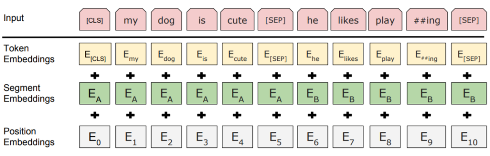
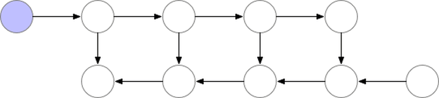

## 前言
本篇章将基于H[HuggingFace/Transformers, 48.9k Star](https://github.com/huggingface/transformers)进行学习。HuggingFace 是一家总部位于纽约的聊天机器人初创服务商，很早就捕捉到 BERT 大潮流的信号并着手实现基于 pytorch 的 BERT 模型。这一项目最初名为 pytorch-pretrained-bert，在复现了原始效果的同时，提供了易用的方法以方便在这一强大模型的基础上进行各种玩耍和研究。

随着使用人数的增加，这一项目也发展成为一个较大的开源社区，合并了各种预训练语言模型以及增加了 Tensorflow 的实现，并且在 2019 年下半年改名为 Transformers。截止写文章时（2021 年 3 月 30 日）这一项目已经拥有 43k+ 的star，可以说 Transformers 已经成为事实上的 NLP 基本工具。

## Pytorch版本BERT学习
本文基于 Transformers 版本 4.4.2（2021 年 3 月 19 日发布）项目中，pytorch 版的 BERT 相关代码，从代码结构、具体实现与原理，以及使用的角度进行分析。
主要包含内容：
1. BERT Tokenization 分词模型（BertTokenizer）
2. BERT Model 本体模型（BertModel）
    - BertEmbeddings
    - BertEncoder
        - BertLayer
            - BertAttention
            - BertIntermediate
            - BertOutput

### 1-Tokenization分词-BertTokenizer
和BERT 有关的 Tokenizer 主要写`models/bert/tokenization_bert.py`和`models/bert/tokenization_bert_fast.py`中。
这两份代码分别对应基本的`BertTokenizer`，以及不进行 token 到 index 映射的`BertTokenizerFast`，这里主要讲解第一个。
```
class BertTokenizer(PreTrainedTokenizer):
    """
    Construct a BERT tokenizer. Based on WordPiece.

    This tokenizer inherits from :class:`~transformers.PreTrainedTokenizer` which contains most of the main methods.
    Users should refer to this superclass for more information regarding those methods.
    ...
    """
```

`BertTokenizer` 是基于`BasicTokenizer`和W`ordPieceTokenizer`的分词器：
- BasicTokenizer负责处理的第一步——按标点、空格等分割句子，并处理是否统一小写，以及清理非法字符。
    - 对于中文字符，通过预处理（加空格）来按字分割；
    - 同时可以通过never_split指定对某些词不进行分割；
    - 这一步是可选的（默认执行）。
- WordPieceTokenizer在词的基础上，进一步将词分解为子词（subword）。
    - subword 介于 char 和 word 之间，既在一定程度保留了词的含义，又能够照顾到英文中单复数、时态导致的词表爆炸和未登录词的 OOV（Out-Of-Vocabulary）问题，将词根与时态词缀等分割出来，从而减小词表，也降低了训练难度；
    - 例如，tokenizer 这个词就可以拆解为“token”和“##izer”两部分，注意后面一个词的“##”表示接在前一个词后面。
BertTokenizer 有以下常用方法：
- from_pretrained：从包含词表文件（vocab.txt）的目录中初始化一个分词器；
- tokenize：将文本（词或者句子）分解为子词列表；
- convert_tokens_to_ids：将子词列表转化为子词对应下标的列表；
- convert_ids_to_tokens ：与上一个相反；
- convert_tokens_to_string：将 subword 列表按“##”拼接回词或者句子；
- encode：对于单个句子输入，分解词并加入特殊词形成“[CLS], x, [SEP]”的结构并转换为词表对应下标的列表；对于两个句子输入（多个句子只取前两个），分解词并加入特殊词形成“[CLS], x1, [SEP], x2, [SEP]”的结构并转换为下标列表；
- decode：可以将 encode 方法的输出变为完整句子。
以及，类自身的方法：
```
from transformers import BertTokenizer
bt = BertTokenizer.from_pretrained('./bert-base-uncased/')
bt('I like natural language progressing!')
{'input_ids': [101, 1045, 2066, 3019, 2653, 27673, 999, 102], 'token_type_ids': [0, 0, 0, 0, 0, 0, 0, 0], 'attention_mask': [1, 1, 1, 1, 1, 1, 1, 1]}
```

### 2-Model-BertModel
和 BERT 模型有关的代码主要写在`/models/bert/modeling_bert.py`中，这一份代码有一千多行，包含 BERT 模型的基本结构和基于它的微调模型等。
下面从 BERT 模型本体入手分析：
```
class BertModel(BertPreTrainedModel):
    """

    The model can behave as an encoder (with only self-attention) as well as a decoder, in which case a layer of
    cross-attention is added between the self-attention layers, following the architecture described in `Attention is
    all you need <https://arxiv.org/abs/1706.03762>`__ by Ashish Vaswani, Noam Shazeer, Niki Parmar, Jakob Uszkoreit,
    Llion Jones, Aidan N. Gomez, Lukasz Kaiser and Illia Polosukhin.

    To behave as an decoder the model needs to be initialized with the :obj:`is_decoder` argument of the configuration
    set to :obj:`True`. To be used in a Seq2Seq model, the model needs to initialized with both :obj:`is_decoder`
    argument and :obj:`add_cross_attention` set to :obj:`True`; an :obj:`encoder_hidden_states` is then expected as an
    input to the forward pass.
    """ 
```
BertModel 主要为 transformer encoder 结构，包含三个部分：
1. embeddings，即BertEmbeddings类的实体，根据单词符号获取对应的向量表示；
2. encoder，即BertEncoder类的实体；
3. pooler，即BertPooler类的实体，这一部分是可选的。

**注意 BertModel 也可以配置为 Decoder，不过下文中不包含对这一部分的讨论。**

下面将介绍 BertModel 的前向传播过程中各个参数的含义以及返回值：
```
def forward(
        self,
        input_ids=None,
        attention_mask=None,
        token_type_ids=None,
        position_ids=None,
        head_mask=None,
        inputs_embeds=None,
        encoder_hidden_states=None,
        encoder_attention_mask=None,
        past_key_values=None,
        use_cache=None,
        output_attentions=None,
        output_hidden_states=None,
        return_dict=None,
    ): ...
```
- input_ids：经过 tokenizer 分词后的 subword 对应的下标列表；
- attention_mask：在 self-attention 过程中，这一块 mask 用于标记 subword 所处句子和 padding 的区别，将 padding 部分填充为 0；
- token_type_ids：标记 subword 当前所处句子（第一句/第二句/ padding）；
- position_ids：标记当前词所在句子的位置下标；
- head_mask：用于将某些层的某些注意力计算无效化；
- inputs_embeds：如果提供了，那就不需要input_ids，跨过 embedding lookup 过程直接作为 Embedding 进入 Encoder 计算；
- encoder_hidden_states：这一部分在 BertModel 配置为 decoder 时起作用，将执行 cross-attention 而不是 self-attention；
- encoder_attention_mask：同上，在 cross-attention 中用于标记 encoder 端输入的 padding；
- past_key_values：这个参数貌似是把预先计算好的 K-V 乘积传入，以降低 cross-attention 的开销（因为原本这部分是重复计算）；
- use_cache：将保存上一个参数并传回，加速 decoding；
- output_attentions：是否返回中间每层的 attention 输出；
- output_hidden_states：是否返回中间每层的输出；
- return_dict：是否按键值对的形式（ModelOutput 类，也可以当作 tuple 用）返回输出，默认为真。

**注意，这里的 head_mask 对注意力计算的无效化，和下文提到的注意力头剪枝不同，而仅仅把某些注意力的计算结果给乘以这一系数。**

输出部分如下：
```
# BertModel的前向传播返回部分
        if not return_dict:
            return (sequence_output, pooled_output) + encoder_outputs[1:]

        return BaseModelOutputWithPoolingAndCrossAttentions(
            last_hidden_state=sequence_output,
            pooler_output=pooled_output,
            past_key_values=encoder_outputs.past_key_values,
            hidden_states=encoder_outputs.hidden_states,
            attentions=encoder_outputs.attentions,
            cross_attentions=encoder_outputs.cross_attentions,
        )
```
可以看出，返回值不但包含了 encoder 和 pooler 的输出，也包含了其他指定输出的部分（hidden_states 和 attention 等，这一部分在encoder_outputs[1:]）方便取用：

```
        # BertEncoder的前向传播返回部分，即上面的encoder_outputs
        if not return_dict:
            return tuple(
                v
                for v in [
                    hidden_states,
                    next_decoder_cache,
                    all_hidden_states,
                    all_self_attentions,
                    all_cross_attentions,
                ]
                if v is not None
            )
        return BaseModelOutputWithPastAndCrossAttentions(
            last_hidden_state=hidden_states,
            past_key_values=next_decoder_cache,
            hidden_states=all_hidden_states,
            attentions=all_self_attentions,
            cross_attentions=all_cross_attentions,
        )
```

此外，BertModel 还有以下的方法，方便 BERT 玩家进行各种操作：

- get_input_embeddings：提取 embedding 中的 word_embeddings 即词向量部分；
- set_input_embeddings：为 embedding 中的 word_embeddings 赋值；
- _prune_heads：提供了将注意力头剪枝的函数，输入为{layer_num: list of heads to prune in this layer}的字典，可以将指定层的某些注意力头剪枝。

** 剪枝是一个复杂的操作，需要将保留的注意力头部分的 Wq、Kq、Vq 和拼接后全连接部分的权重拷贝到一个新的较小的权重矩阵（注意先禁止 grad 再拷贝），并实时记录被剪掉的头以防下标出错。具体参考BertAttention部分的prune_heads方法.**

#### 2.1-BertEmbeddings
包含三个部分求和得到：
 图：Bert-embedding

1. word_embeddings，上文中 subword 对应的嵌入。
2. token_type_embeddings，用于表示当前词所在的句子，辅助区别句子与 padding、句子对间的差异。
3。 position_embeddings，句子中每个词的位置嵌入，用于区别词的顺序。和 transformer 论文中的设计不同，这一块是训练出来的，而不是通过 Sinusoidal 函数计算得到的固定嵌入。一般认为这种实现不利于拓展性（难以直接迁移到更长的句子中）。

三个 embedding 不带权重相加，并通过一层 LayerNorm+dropout 后输出，其大小为(batch_size, sequence_length, hidden_size)。

** [这里为什么要用 LayerNorm+Dropout 呢？为什么要用 LayerNorm 而不是 BatchNorm？可以参考一个不错的回答：transformer 为什么使用 layer normalization，而不是其他的归一化方法？](https://www.zhihu.com/question/395811291/answer/1260290120)**

#### 2.2-BertEncoder

包含多层 BertLayer，这一块本身没有特别需要说明的地方，不过有一个细节值得参考：利用 gradient checkpointing 技术以降低训练时的显存占用。

**gradient checkpointing 即梯度检查点，通过减少保存的计算图节点压缩模型占用空间，但是在计算梯度的时候需要重新计算没有存储的值，参考论文《Training Deep Nets with Sublinear Memory Cost》，过程如下示意图**
 图：gradient-checkpointing

在 BertEncoder 中，gradient checkpoint 是通过 torch.utils.checkpoint.checkpoint 实现的，使用起来比较方便，可以参考文档：torch.utils.checkpoint - PyTorch 1.8.1 documentation，这一机制的具体实现比较复杂，在此不作展开。

再往深一层走，就进入了 Encoder 的某一层：

##### 2.2.1 BertLayer
这一层包装了 BertAttention 和 BertIntermediate+BertOutput（即 Attention 后的 FFN 部分），以及这里直接忽略的 cross-attention 部分（将 BERT 作为 Decoder 时涉及的部分）。

理论上，这里顺序调用三个子模块就可以，没有什么值得说明的地方。

然而这里又出现了一个细节：
```
 # 这是forward的一部分
        self_attention_outputs = self.attention(
            hidden_states,
            attention_mask,
            head_mask,
            output_attentions=output_attentions,
            past_key_value=self_attn_past_key_value,
        )
        outputs = self_attention_outputs[1:]  # add self attentions if we output attention weights

        # 中间省略一部分……

        layer_output = apply_chunking_to_forward(
            self.feed_forward_chunk, self.chunk_size_feed_forward, self.seq_len_dim, attention_output
        )
        outputs = (layer_output,) + outputs

        # 省略一部分……

        return outputs

    # 这是feed_forward_chunk的部分
    def feed_forward_chunk(self, attention_output):
        intermediate_output = self.intermediate(attention_output)
        layer_output = self.output(intermediate_output, attention_output)
        return layer_output
```
看到上面那个`apply_chunking_to_forward`和`feed_forward_chunk`了吗（为什么要整这么复杂，直接调用它不香吗）？
那么这个`apply_chunking_to_forward`到底是啥？深入看看：
```
def apply_chunking_to_forward(
    forward_fn: Callable[..., torch.Tensor], chunk_size: int, chunk_dim: int, *input_tensors
) -> torch.Tensor:
    """
    This function chunks the :obj:`input_tensors` into smaller input tensor parts of size :obj:`chunk_size` over the
    dimension :obj:`chunk_dim`. It then applies a layer :obj:`forward_fn` to each chunk independently to save memory.

    If the :obj:`forward_fn` is independent across the :obj:`chunk_dim` this function will yield the same result as
    directly applying :obj:`forward_fn` to :obj:`input_tensors`.
    ...
    """
```

原来又是一个节约显存的技术——包装了一个切分小 batch 或者低维数操作的功能：这里参数chunk_size其实就是切分的 batch 大小，而chunk_dim就是一次计算维数的大小，最后拼接起来返回。
不过，在默认操作中不会特意设置这两个值（在源代码中默认为 0 和 1），所以会直接等效于正常的 forward 过程。

继续往下深入，就是 Transformer 的核心：BertAttention 部分，以及紧随其后的 FFN 部分。

##### 2.2.1.1 BertAttention

本以为 attention 的实现就在这里，没想到还要再下一层……其中，self 成员就是多头注意力的实现，而 output 成员实现 attention 后的全连接 +dropout+residual+LayerNorm 一系列操作。

```
class BertAttention(nn.Module):
    def __init__(self, config):
        super().__init__()
        self.self = BertSelfAttention(config)
        self.output = BertSelfOutput(config)
        self.pruned_heads = set()
```
首先还是回到这一层。这里出现了上文提到的剪枝操作，即 prune_heads 方法：
```
 def prune_heads(self, heads):
        if len(heads) == 0:
            return
        heads, index = find_pruneable_heads_and_indices(
            heads, self.self.num_attention_heads, self.self.attention_head_size, self.pruned_heads
        )

        # Prune linear layers
        self.self.query = prune_linear_layer(self.self.query, index)
        self.self.key = prune_linear_layer(self.self.key, index)
        self.self.value = prune_linear_layer(self.self.value, index)
        self.output.dense = prune_linear_layer(self.output.dense, index, dim=1)

        # Update hyper params and store pruned heads
        self.self.num_attention_heads = self.self.num_attention_heads - len(heads)
        self.self.all_head_size = self.self.attention_head_size * self.self.num_attention_heads
        self.pruned_heads = self.pruned_heads.union(heads) 
```
这里的具体实现概括如下：
- `find_pruneable_heads_and_indices`是定位需要剪掉的 head，以及需要保留的维度下标 index；

- `prune_linear_layer`则负责将 Wk/Wq/Wv 权重矩阵（连同 bias）中按照 index 保留没有被剪枝的维度后转移到新的矩阵。
接下来就到重头戏——Self-Attention 的具体实现。

##### 2.2.1.1.1 BertSelfAttention

**预警：这一块可以说是模型的核心区域，也是唯一涉及到公式的地方，所以将贴出大量代码。**

初始化部分：
```
class BertSelfAttention(nn.Module):
    def __init__(self, config):
        super().__init__()
        if config.hidden_size % config.num_attention_heads != 0 and not hasattr(config, "embedding_size"):
            raise ValueError(
                "The hidden size (%d) is not a multiple of the number of attention "
                "heads (%d)" % (config.hidden_size, config.num_attention_heads)
            )

        self.num_attention_heads = config.num_attention_heads
        self.attention_head_size = int(config.hidden_size / config.num_attention_heads)
        self.all_head_size = self.num_attention_heads * self.attention_head_size

        self.query = nn.Linear(config.hidden_size, self.all_head_size)
        self.key = nn.Linear(config.hidden_size, self.all_head_size)
        self.value = nn.Linear(config.hidden_size, self.all_head_size)

        self.dropout = nn.Dropout(config.attention_probs_dropout_prob)
        self.position_embedding_type = getattr(config, "position_embedding_type", "absolute")
        if self.position_embedding_type == "relative_key" or self.position_embedding_type == "relative_key_query":
            self.max_position_embeddings = config.max_position_embeddings
            self.distance_embedding = nn.Embedding(2 * config.max_position_embeddings - 1, self.attention_head_size)

        self.is_decoder = config.is_decoder
```

- 除掉熟悉的 query、key、value 三个权重和一个 dropout，这里还有一个谜一样的 position_embedding_type，以及 decoder 标记；
- 注意，hidden_size 和 all_head_size 在一开始是一样的。至于为什么要看起来多此一举地设置这一个变量——显然是因为上面那个剪枝函数，剪掉几个 attention head 以后 all_head_size 自然就小了；

- hidden_size 必须是 num_attention_heads 的整数倍，以 bert-base 为例，每个 attention 包含 12 个 head，hidden_size 是 768，所以每个 head 大小即 attention_head_size=768/12=64；

- position_embedding_type 是什么？继续往下看就知道了.

然后是重点，也就是前向传播过程。

首先回顾一下 multi-head self-attention 的基本公式：

$$MHA(Q, K, V) = Concat(head_1, ..., head_h)W^O$$
$$head_i = SDPA(QW_i^Q, KW_i^K, VW_i^V)$$
$$SDPA(Q, K, V) = softmax(\frac{QK^T}{\sqrt(d_k)})V$$

而这些注意力头，众所周知是并行计算的，所以上面的 query、key、value 三个权重是唯一的——这并不是所有 heads 共享了权重，而是“拼接”起来了。

**[原论文中多头的理由为 Multi-head attention allows the model to jointly attend to information from different representation subspaces at different positions. With a single attention head, averaging inhibits this. 而另一个比较靠谱的分析有：为什么 Transformer 需要进行 Multi-head Attention？](https://www.zhihu.com/question/341222779/answer/814111138)**

看看 forward 方法：
```
def transpose_for_scores(self, x):
        new_x_shape = x.size()[:-1] + (self.num_attention_heads, self.attention_head_size)
        x = x.view(*new_x_shape)
        return x.permute(0, 2, 1, 3)

    def forward(
        self,
        hidden_states,
        attention_mask=None,
        head_mask=None,
        encoder_hidden_states=None,
        encoder_attention_mask=None,
        past_key_value=None,
        output_attentions=False,
    ):
        mixed_query_layer = self.query(hidden_states)

        # 省略一部分cross-attention的计算
        key_layer = self.transpose_for_scores(self.key(hidden_states))
        value_layer = self.transpose_for_scores(self.value(hidden_states))
        query_layer = self.transpose_for_scores(mixed_query_layer)

        # Take the dot product between "query" and "key" to get the raw attention scores.
        attention_scores = torch.matmul(query_layer, key_layer.transpose(-1, -2))
        # ...
```
这里的 `transpose_for_scores` 用来把 `hidden_size` 拆成多个头输出的形状，并且将中间两维转置以进行矩阵相乘；

这里 `key_layer/value_layer/query_laye`r 的形状为：(batch_size, num_attention_heads, sequence_length, attention_head_size)；
这里 `attention_scores` 的形状为：(batch_size, num_attention_heads, sequence_length, sequence_length)，符合多个头单独计算获得的 attention map 形状。

到这里实现了 K 与 Q 相乘，获得 raw attention scores 的部分，按公式接下来应该是按 $d_k$ 进行 scaling 并做 softmax 的操作。然而先出现在眼前的是一个奇怪的positional_embedding，以及一堆爱因斯坦求和：

```
 # ...
        if self.position_embedding_type == "relative_key" or self.position_embedding_type == "relative_key_query":
            seq_length = hidden_states.size()[1]
            position_ids_l = torch.arange(seq_length, dtype=torch.long, device=hidden_states.device).view(-1, 1)
            position_ids_r = torch.arange(seq_length, dtype=torch.long, device=hidden_states.device).view(1, -1)
            distance = position_ids_l - position_ids_r
            positional_embedding = self.distance_embedding(distance + self.max_position_embeddings - 1)
            positional_embedding = positional_embedding.to(dtype=query_layer.dtype)  # fp16 compatibility

            if self.position_embedding_type == "relative_key":
                relative_position_scores = torch.einsum("bhld,lrd->bhlr", query_layer, positional_embedding)
                attention_scores = attention_scores + relative_position_scores
            elif self.position_embedding_type == "relative_key_query":
                relative_position_scores_query = torch.einsum("bhld,lrd->bhlr", query_layer, positional_embedding)
                relative_position_scores_key = torch.einsum("bhrd,lrd->bhlr", key_layer, positional_embedding)
                attention_scores = attention_scores + relative_position_scores_query + relative_position_scores_key
        # ...
```
**[关于爱因斯坦求和约定，参考以下文档：torch.einsum - PyTorch 1.8.1 documentation](https://pytorch.org/docs/stable/generated/torch.einsum.html)**


对于不同的positional_embedding_type，有三种操作：

- absolute：默认值，这部分就不用处理；
- relative_key：对 key_layer 作处理，将其与这里的positional_embedding和 key 矩阵相乘作为 key 相关的位置编码；
- relative_key_query：对 key 和 value 都进行相乘以作为位置编码。

回到正常 attention 的流程：
```
# ...
        attention_scores = attention_scores / math.sqrt(self.attention_head_size)
        if attention_mask is not None:
            # Apply the attention mask is (precomputed for all layers in BertModel forward() function)
            attention_scores = attention_scores + attention_mask  # 这里为什么是+而不是*？

        # Normalize the attention scores to probabilities.
        attention_probs = nn.Softmax(dim=-1)(attention_scores)

        # This is actually dropping out entire tokens to attend to, which might
        # seem a bit unusual, but is taken from the original Transformer paper.
        attention_probs = self.dropout(attention_probs)

        # Mask heads if we want to
        if head_mask is not None:
            attention_probs = attention_probs * head_mask

        context_layer = torch.matmul(attention_probs, value_layer)

        context_layer = context_layer.permute(0, 2, 1, 3).contiguous()
        new_context_layer_shape = context_layer.size()[:-2] + (self.all_head_size,)
        context_layer = context_layer.view(*new_context_layer_shape)

        outputs = (context_layer, attention_probs) if output_attentions else (context_layer,)

        # 省略decoder返回值部分……
        return outputs
```

重大疑问：这里的attention_scores = attention_scores + attention_mask是在做什么？难道不应该是乘 mask 吗？
- 因为这里的 attention_mask 已经【被动过手脚】，将原本为 1 的部分变为 0，而原本为 0 的部分（即 padding）变为一个较大的负数，这样相加就得到了一个较大的负值：
- 至于为什么要用【一个较大的负数】？因为这样一来经过 softmax 操作以后这一项就会变成接近 0 的小数。

```
(Pdb) attention_mask
tensor([[[[    -0.,     -0.,     -0.,  ..., -10000., -10000., -10000.]]],
        [[[    -0.,     -0.,     -0.,  ..., -10000., -10000., -10000.]]],
        [[[    -0.,     -0.,     -0.,  ..., -10000., -10000., -10000.]]],
        ...,
        [[[    -0.,     -0.,     -0.,  ..., -10000., -10000., -10000.]]],
        [[[    -0.,     -0.,     -0.,  ..., -10000., -10000., -10000.]]],
        [[[    -0.,     -0.,     -0.,  ..., -10000., -10000., -10000.]]]],
       device='cuda:0')
```

那么，这一步是在哪里执行的呢？
在modeling_bert.py中没有找到答案，但是在modeling_utils.py中找到了一个特别的类：class ModuleUtilsMixin，在它的get_extended_attention_mask方法中发现了端倪：

```
 def get_extended_attention_mask(self, attention_mask: Tensor, input_shape: Tuple[int], device: device) -> Tensor:
        """
        Makes broadcastable attention and causal masks so that future and masked tokens are ignored.

        Arguments:
            attention_mask (:obj:`torch.Tensor`):
                Mask with ones indicating tokens to attend to, zeros for tokens to ignore.
            input_shape (:obj:`Tuple[int]`):
                The shape of the input to the model.
            device: (:obj:`torch.device`):
                The device of the input to the model.

        Returns:
            :obj:`torch.Tensor` The extended attention mask, with a the same dtype as :obj:`attention_mask.dtype`.
        """
        # 省略一部分……

        # Since attention_mask is 1.0 for positions we want to attend and 0.0 for
        # masked positions, this operation will create a tensor which is 0.0 for
        # positions we want to attend and -10000.0 for masked positions.
        # Since we are adding it to the raw scores before the softmax, this is
        # effectively the same as removing these entirely.
        extended_attention_mask = extended_attention_mask.to(dtype=self.dtype)  # fp16 compatibility
        extended_attention_mask = (1.0 - extended_attention_mask) * -10000.0
        return extended_attention_mask
```

那么，这个函数是在什么时候被调用的呢？和BertModel有什么关系呢？
OK，这里涉及到 `BertModel` 的继承细节了：`BertModel`继承自`BertPreTrainedModel`，后者继承自`PreTrainedModel`，而`PreTrainedModel`继承自[nn.Module, ModuleUtilsMixin, GenerationMixin]三个基类。——好复杂的封装！

这也就是说，BertModel必然在中间的某个步骤对原始的attention_mask调用了get_extended_attention_mask，导致attention_mask从原始的[1, 0]变为[0, -1e4]的取值。

最终在 BertModel 的前向传播过程中找到了这一调用（第 944 行）：

```
  # We can provide a self-attention mask of dimensions [batch_size, from_seq_length, to_seq_length]
        # ourselves in which case we just need to make it broadcastable to all heads.
        extended_attention_mask: torch.Tensor = self.get_extended_attention_mask(attention_mask, input_shape, device)

```
问题解决了：这一方法不但实现了改变 mask 的值，还将其广播（broadcast）为可以直接与 attention map 相加的形状。
不愧是你，HuggingFace。

除此之外，值得注意的细节有：

- 按照每个头的维度进行缩放，对于 bert-base 就是 64 的平方根即 8；
- attention_probs 不但做了 softmax，还用了一次 dropout，这是担心 attention 矩阵太稠密吗…… 这里也提到很不寻常，但是原始 Transformer 论文就是这么做的；
- head_mask 就是之前提到的对多头计算的 mask，如果不设置默认是全 1，在这里就不会起作用；
- context_layer 即 attention 矩阵与 value 矩阵的乘积，原始的大小为：(batch_size, num_attention_heads, sequence_length, attention_head_size) ；
- context_layer 进行转置和 view 操作以后，形状就恢复了(batch_size, sequence_length, hidden_size)。

##### 2.2.1.1.2 BertSelfOutput
```
class BertSelfOutput(nn.Module):
    def __init__(self, config):
        super().__init__()
        self.dense = nn.Linear(config.hidden_size, config.hidden_size)
        self.LayerNorm = nn.LayerNorm(config.hidden_size, eps=config.layer_norm_eps)
        self.dropout = nn.Dropout(config.hidden_dropout_prob)

    def forward(self, hidden_states, input_tensor):
        hidden_states = self.dense(hidden_states)
        hidden_states = self.dropout(hidden_states)
        hidden_states = self.LayerNorm(hidden_states + input_tensor)
        return hidden_states
```

**这里又出现了 LayerNorm 和 Dropout 的组合，只不过这里是先 Dropout，进行残差连接后再进行 LayerNorm。至于为什么要做残差连接，最直接的目的就是降低网络层数过深带来的训练难度，对原始输入更加敏感～**

##### 2.2.1.2 BertIntermediate

看完了 BertAttention，在 Attention 后面还有一个全连接+激活的操作：
```
class BertIntermediate(nn.Module):
    def __init__(self, config):
        super().__init__()
        self.dense = nn.Linear(config.hidden_size, config.intermediate_size)
        if isinstance(config.hidden_act, str):
            self.intermediate_act_fn = ACT2FN[config.hidden_act]
        else:
            self.intermediate_act_fn = config.hidden_act

    def forward(self, hidden_states):
        hidden_states = self.dense(hidden_states)
        hidden_states = self.intermediate_act_fn(hidden_states)
        return hidden_states
```

- 这里的全连接做了一个扩展，以 bert-base 为例，扩展维度为 3072，是原始维度 768 的 4 倍之多；
- 这里的激活函数默认实现为 gelu（Gaussian Error Linerar Units(GELUS）当然，它是无法直接计算的，可以用一个包含tanh的表达式进行近似（略)。

##### 2.2.1.3 BertOutput

在这里又是一个全连接 +dropout+LayerNorm，还有一个残差连接 residual connect：
```
class BertOutput(nn.Module):
    def __init__(self, config):
        super().__init__()
        self.dense = nn.Linear(config.intermediate_size, config.hidden_size)
        self.LayerNorm = nn.LayerNorm(config.hidden_size, eps=config.layer_norm_eps)
        self.dropout = nn.Dropout(config.hidden_dropout_prob)

    def forward(self, hidden_states, input_tensor):
        hidden_states = self.dense(hidden_states)
        hidden_states = self.dropout(hidden_states)
        hidden_states = self.LayerNorm(hidden_states + input_tensor)
        return hidden_states
```

这里的操作和 BertSelfOutput 不能说没有关系，只能说一模一样…… 非常容易混淆的两个组件。
以下内容还包含基于 BERT 的应用模型，以及 BERT 相关的优化器和用法，将在下一篇文章作详细介绍。

##### 2.2.3 BertPooler
这一层只是简单地取出了句子的第一个token，即`[CLS]`对应的向量，然后过一个全连接层和一个激活函数后输出：（这一部分是可选的，因为pooling有很多不同的操作）

```
class BertPooler(nn.Module):
    def __init__(self, config):
        super().__init__()
        self.dense = nn.Linear(config.hidden_size, config.hidden_size)
        self.activation = nn.Tanh()

    def forward(self, hidden_states):
        # We "pool" the model by simply taking the hidden state corresponding
        # to the first token.
        first_token_tensor = hidden_states[:, 0]
        pooled_output = self.dense(first_token_tensor)
        pooled_output = self.activation(pooled_output)
        return pooled_output
```

### 小总结
本小节对Bert模型的实现进行分析了学习，希望读者能对Bert实现有一个更为细致的把握。

值得注意的是，在 HuggingFace 实现的 Bert 模型中，使用了多种节约显存的技术：

- gradient checkpoint，不保留前向传播节点，只在用时计算；apply_chunking_to_forward，按多个小批量和低维度计算 FFN 部
- BertModel 包含复杂的封装和较多的组件。以 bert-base 为例，主要组件如下：
    - 总计Dropout出现了1+(1+1+1)x12=37次；
    - 总计LayerNorm出现了1+(1+1)x12=25次；
    - 总计dense全连接层出现了(1+1+1)x12+1=37次，并不是每个dense都配了激活函数……
BertModel 有极大的参数量。以 bert-base 为例，其参数量为 109M。

## 致谢
本文主要由浙江大学李泺秋撰写，本项目同学负责整理和汇总。
