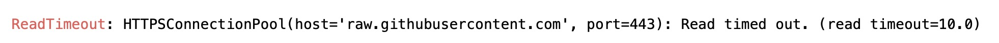

本文涉及的jupter notebook在[篇章4代码库中](https://github.com/datawhalechina/learn-nlp-with-transformers/tree/main/docs/%E7%AF%87%E7%AB%A04-%E4%BD%BF%E7%94%A8Transformers%E8%A7%A3%E5%86%B3NLP%E4%BB%BB%E5%8A%A1)。

建议直接使用google colab notebook打开本教程，可以快速下载相关数据集和模型。
如果您正在google的colab中打开这个notebook，您可能需要安装Transformers和🤗Datasets库。将以下命令取消注释即可安装。


```python
# ! pip install datasets transformers 
# -i https://pypi.tuna.tsinghua.edu.cn/simple
```

如果您是在本地机器上打开这个jupyter笔记本，请确保您的环境安装了上述库的最新版本。

您可以在[这里](https://github.com/huggingface/transformers/tree/master/examples/language-modeling)找到这个jupyter笔记本的具体的python脚本文件，还可以通过分布式的方式使用多个gpu或tpu来微调您的模型。

# 微调语言模型

在当前jupyter笔记本中，我们将说明如何使用语言模型任务微调任意[🤗Transformers](https://github.com/huggingface/transformers) 模型。 

本教程将涵盖两种类型的语言建模任务:

+ 因果语言模型（Causal language modeling，CLM）：模型需要预测句子中的下一位置处的字符（类似BERT类模型的decoder和GPT，从左往右输入字符）。为了确保模型不作弊，模型会使用一个注意掩码防止模型看到之后的字符。例如，当模型试图预测句子中的i+1位置处的字符时，这个掩码将阻止它访问i位置之后的字符。


+ 掩蔽语言建模（Masked language modeling，MLM）：模型需要恢复输入中被"MASK"掉的一些字符（BERT类模型的预训练任务）。这种方式模型可以看到整个句子，因此模型可以根据“\[MASK\]”标记之前和之后的字符来预测该位置被“\[MASK\]”之前的字符。


接下来，我们将说明如何轻松地为每个任务加载和预处理数据集，以及如何使用“Trainer”API对模型进行微调。

当然您也可以直接在分布式环境或TPU上运行该jupyter笔记本的python脚本版本，可以在[examples文件夹](https://github.com/huggingface/transformers/tree/master/examples)中找到。

## 准备数据

在接下来的这些任务中，我们将使用[Wikitext 2](https://huggingface.co/datasets/wikitext#data-instances)数据集作为示例。您可以通过🤗Datasets库加载该数据集：


```python
from datasets import load_dataset
datasets = load_dataset('wikitext', 'wikitext-2-raw-v1')
```

    Reusing dataset wikitext (/Users/niepig/.cache/huggingface/datasets/wikitext/wikitext-2-raw-v1/1.0.0/aa5e094000ec7afeb74c3be92c88313cd6f132d564c7effd961c10fd47c76f20)


如果碰到以下错误：


解决方案:

MAC用户: 在 ```/etc/hosts``` 文件中添加一行 ```199.232.68.133  raw.githubusercontent.com```

Windowso用户: 在 ```C:\Windows\System32\drivers\etc\hosts```  文件中添加一行 ```199.232.68.133  raw.githubusercontent.com```

当然您也可以用公开在[hub](https://huggingface.co/datasets)上的任何数据集替换上面的数据集，或者使用您自己的文件。只需取消注释以下单元格，并将路径替换为将导致您的文件路径：


```python
# datasets = load_dataset("text", data_files={"train": path_to_train.txt, "validation": path_to_validation.txt}
```

您还可以从csv或JSON文件加载数据集，更多信息请参阅[完整文档](https://huggingface.co/docs/datasets/loading_datasets.html#from-local-files)。

要访问一个数据中实际的元素，您需要先选择一个key，然后给出一个索引:


```python
datasets["train"][10]
```


    {'text': ' The game \'s battle system , the BliTZ system , is carried over directly from Valkyira Chronicles . During missions , players select each unit using a top @-@ down perspective of the battlefield map : once a character is selected , the player moves the character around the battlefield in third @-@ person . A character can only act once per @-@ turn , but characters can be granted multiple turns at the expense of other characters \' turns . Each character has a field and distance of movement limited by their Action Gauge . Up to nine characters can be assigned to a single mission . During gameplay , characters will call out if something happens to them , such as their health points ( HP ) getting low or being knocked out by enemy attacks . Each character has specific " Potentials " , skills unique to each character . They are divided into " Personal Potential " , which are innate skills that remain unaltered unless otherwise dictated by the story and can either help or impede a character , and " Battle Potentials " , which are grown throughout the game and always grant boons to a character . To learn Battle Potentials , each character has a unique " Masters Table " , a grid @-@ based skill table that can be used to acquire and link different skills . Characters also have Special Abilities that grant them temporary boosts on the battlefield : Kurt can activate " Direct Command " and move around the battlefield without depleting his Action Point gauge , the character Reila can shift into her " Valkyria Form " and become invincible , while Imca can target multiple enemy units with her heavy weapon . \n'}


为了快速了解数据的结构，下面的函数将显示数据集中随机选取的一些示例。


```python
from datasets import ClassLabel
import random
import pandas as pd
from IPython.display import display, HTML

def show_random_elements(dataset, num_examples=10):
    assert num_examples <= len(dataset), "Can't pick more elements than there are in the dataset."
    picks = []
    for _ in range(num_examples):
        pick = random.randint(0, len(dataset)-1)
        while pick in picks:
            pick = random.randint(0, len(dataset)-1)
        picks.append(pick)
    
    df = pd.DataFrame(dataset[picks])
    for column, typ in dataset.features.items():
        if isinstance(typ, ClassLabel):
            df[column] = df[column].transform(lambda i: typ.names[i])
    display(HTML(df.to_html()))
```


```python
show_random_elements(datasets["train"])
```


<table border="1" class="dataframe">
  <thead>
    <tr style="text-align: right;">
      <th></th>
      <th>text</th>
    </tr>
  </thead>
  <tbody>
    <tr>
      <th>0</th>
      <td>On 3 March 1967 , parliament decided to build four short take @-@ off and landing airports along the Helgeland coast between Trondheim and Bodø . Braathens placed an order for a de Havilland Canada DHC @-@ 6 Twin Otter and planned to start the company Braathens STOL . It applied to operate the route without subsidies , but the concession was rejected and granted with subsidies to Widerøe , which had been operating the routes using seaplanes . \n</td>
    </tr>
    <tr>
      <th>1</th>
      <td></td>
    </tr>
    <tr>
      <th>2</th>
      <td>Rao Ramesh was cast as a tantrik who helps Gill 's character in the present era . Mumaith Khan was selected for another item number , a remix version of the hit song " Bangaru Kodipetta " from Gharana Mogudu ( 1992 ) ; Gharana Mogudu 's music was also composed by M. M. Keeravani . Chiranjeevi made a special appearance after the song , making Magadheera the first film he appeared in after his entry into politics . When Rajamouli suggested the idea of a cameo appearance , Chiranjeevi was initially hesitant till the director narrated the complete sequence and the importance of the song . \n</td>
    </tr>
    <tr>
      <th>3</th>
      <td></td>
    </tr>
    <tr>
      <th>4</th>
      <td></td>
    </tr>
    <tr>
      <th>5</th>
      <td>= = = Total Nonstop Action Wrestling ( 2015 – present ) = = = \n</td>
    </tr>
    <tr>
      <th>6</th>
      <td>The Daily Telegraph gave the visual novel the award for " Best Script " in its video game awards of 2011 , stating that " Love 's layered narrative of a high school teacher embroiled in his student ’ s worries goes places most mainstream video games wouldn 't dare . " \n</td>
    </tr>
    <tr>
      <th>7</th>
      <td></td>
    </tr>
    <tr>
      <th>8</th>
      <td></td>
    </tr>
    <tr>
      <th>9</th>
      <td></td>
    </tr>
  </tbody>
</table>


正如我们所看到的，一些文本是维基百科文章的完整段落，而其他的只是标题或空行。

## 因果语言模型（Causal Language Modeling，CLM）

对于因果语言模型(CLM)，我们首先获取到数据集中的所有文本，并在它们被分词后将它们连接起来。然后，我们将在特定序列长度的例子中拆分它们。通过这种方式，模型将接收如下的连续文本块:

```
文本1
```
或
```
文本1结尾 [BOS_TOKEN] 文本2开头
```

取决于它们是否跨越数据集中的几个原始文本。标签将与输入相同，但向左移动。

在本例中，我们将使用[`distilgpt2`](https://huggingface.co/distilgpt2) 模型。您同样也可以选择[这里](https://huggingface.co/models?filter=causal-lm)列出的任何一个checkpoint:


```python
model_checkpoint = "distilgpt2"
```

为了用训练模型时使用的词汇对所有文本进行标记，我们必须下载一个预先训练过的分词器（Tokenizer）。而这些操作都可以由AutoTokenizer类完成:


```python
from transformers import AutoTokenizer
    
tokenizer = AutoTokenizer.from_pretrained(model_checkpoint, use_fast=True)
```

我们现在可以对所有的文本调用分词器，该操作可以简单地使用来自Datasets库的map方法实现。首先，我们定义一个在文本上调用标记器的函数:


```python
def tokenize_function(examples):
    return tokenizer(examples["text"])
```

然后我们将它应用到datasets对象中的分词，使用```batch=True```和```4```个进程来加速预处理。而之后我们并不需要```text```列，所以将其舍弃。


```python
tokenized_datasets = datasets.map(tokenize_function, batched=True, num_proc=4, remove_columns=["text"])
```

如果我们现在查看数据集的一个元素，我们会看到文本已经被模型所需的input_ids所取代:


```python
tokenized_datasets["train"][1]
```


    {'attention_mask': [1, 1, 1, 1, 1, 1, 1, 1, 1],
     'input_ids': [796, 569, 18354, 7496, 17740, 6711, 796, 220, 198]}


下一步就有点小困难了：我们需要将所有文本连接在一起，然后将结果分割成特定`block_size`的小块。为此，我们将再次使用`map`方法，并使用选项`batch=True`。这个选项允许我们通过返回不同数量的样本来改变数据集中的样本数量。通过这种方式，我们可以从一批示例中创建新的示例。

首先，我们需要获取预训练模型时所使用的最大长度。最大长度在这里设置为128，以防您的显存爆炸💥。


```python
# block_size = tokenizer.model_max_length
block_size = 128
```

然后我们编写预处理函数来对我们的文本进行分组:


```python
def group_texts(examples):
    # 拼接所有文本
    concatenated_examples = {k: sum(examples[k], []) for k in examples.keys()}
    total_length = len(concatenated_examples[list(examples.keys())[0]])
    # 我们将余数对应的部分去掉。但如果模型支持的话，可以添加padding，您可以根据需要定制此部件。
    total_length = (total_length // block_size) * block_size
    # 通过max_len进行分割。
    result = {
        k: [t[i : i + block_size] for i in range(0, total_length, block_size)]
        for k, t in concatenated_examples.items()
    }
    result["labels"] = result["input_ids"].copy()
    return result
```

首先注意，我们复制了标签的输入。

这是因为🤗transformer库的模型默认向右移动，所以我们不需要手动操作。

还要注意，在默认情况下，`map`方法将发送一批1,000个示例，由预处理函数处理。因此，在这里，我们将删除剩余部分，使连接的标记化文本每1000个示例为`block_size`的倍数。您可以通过传递更高的批处理大小来调整此行为(当然这也会被处理得更慢)。你也可以使用`multiprocessing`来加速预处理:


```python
lm_datasets = tokenized_datasets.map(
    group_texts,
    batched=True,
    batch_size=1000,
    num_proc=4,
)
```

现在我们可以检查数据集是否发生了变化：现在样本包含了`block_size`连续字符块，可能跨越了几个原始文本。


```python
tokenizer.decode(lm_datasets["train"][1]["input_ids"])
```


    ' game and follows the " Nameless ", a penal military unit serving the nation of Gallia during the Second Europan War who perform secret black operations and are pitted against the Imperial unit " Calamaty Raven ". \n The game began development in 2010, carrying over a large portion of the work done on Valkyria Chronicles II. While it retained the standard features of the series, it also underwent multiple adjustments, such as making the game more forgiving for series newcomers. Character designer Raita Honjou and composer Hitoshi Sakimoto both returned from previous entries, along with Valkyria Chronicles II director Takeshi Oz'


既然数据已经清理完毕，我们就可以实例化我们的训练器了。我们将建立一个模型:


```python
from transformers import AutoModelForCausalLM
model = AutoModelForCausalLM.from_pretrained(model_checkpoint)
```

检查torch版本


```python

import importlib.util
# import importlib_metadata
a = importlib.util.find_spec("torch") is not None
print(a)
# _torch_version = importlib_metadata.version("torch")
# print(_torch_version)
```

    True


和一些`TrainingArguments`:


```python
from transformers import Trainer, TrainingArguments
```


```python
training_args = TrainingArguments(
    "test-clm",
    evaluation_strategy = "epoch",
    learning_rate=2e-5,
    weight_decay=0.01,
)
```

我们把这些都传递给`Trainer`类:


```python
trainer = Trainer(
    model=model,
    args=training_args,
    train_dataset=lm_datasets["train"],
    eval_dataset=lm_datasets["validation"],
)
```

然后就可以训练我们的模型🌶:


```python
trainer.train()
```

      0%|          | 31/7002 [04:16<14:27:52,  7.47s/it]

一旦训练完成，我们就可以评估我们的模型，得到它在验证集上的perplexity，如下所示:


```python
import math
eval_results = trainer.evaluate()
print(f"Perplexity: {math.exp(eval_results['eval_loss']):.2f}")
```

## 掩蔽语言模型（Mask Language Modeling，MLM）

掩蔽语言模型(MLM)我们将使用相同的数据集预处理和以前一样用一个额外的步骤：

我们将随机"MASK"一些字符(使用"[MASK]"进行替换)以及调整标签为只包含在"[MASK]"位置处的标签(因为我们不需要预测没有被"MASK"的字符)。

在本例中，我们将使用[`distilroberta-base`](https://huggingface.co/distilroberta-base)模型。您同样也可以选择[这里](https://huggingface.co/models?filter=causal-lm)列出的任何一个checkpoint:


```python
model_checkpoint = "distilroberta-base"
```

我们可以像之前一样应用相同的分词器函数，我们只需要更新我们的分词器来使用刚刚选择的checkpoint:


```python
tokenizer = AutoTokenizer.from_pretrained(model_checkpoint, use_fast=True)
tokenized_datasets = datasets.map(tokenize_function, batched=True, num_proc=4, remove_columns=["text"])
```

像之前一样，我们把文本分组在一起，并把它们分成长度为`block_size`的样本。如果您的数据集由单独的句子组成，则可以跳过这一步。


```python
lm_datasets = tokenized_datasets.map(
    group_texts,
    batched=True,
    batch_size=1000,
    num_proc=4,
)
```

剩下的和我们之前的做法非常相似，只有两个例外。首先我们使用一个适合掩蔽语言模型的模型:


```python
from transformers import AutoModelForMaskedLM
model = AutoModelForMaskedLM.from_pretrained(model_checkpoint)
```

其次，我们使用一个特殊的data_collator。data_collator是一个函数，负责获取样本并将它们批处理成张量。

在前面的例子中，我们没有什么特殊的事情要做，所以我们只使用这个参数的默认值。这里我们要做随机"MASK"。

我们可以将其作为预处理步骤(`tokenizer`)进行处理，但在每个阶段，字符总是以相同的方式被掩盖。通过在data_collator中执行这一步，我们可以确保每次检查数据时都以新的方式完成随机掩蔽。

为了实现掩蔽，`Transformers`为掩蔽语言模型提供了一个`DataCollatorForLanguageModeling`。我们可以调整掩蔽的概率:


```python
from transformers import DataCollatorForLanguageModeling
data_collator = DataCollatorForLanguageModeling(tokenizer=tokenizer, mlm_probability=0.15)
```

然后我们要把所有的东西交给trainer，然后开始训练:


```python
trainer = Trainer(
    model=model,
    args=training_args,
    train_dataset=lm_datasets["train"],
    eval_dataset=lm_datasets["validation"],
    data_collator=data_collator,
)
```


```python
trainer.train()
```

像以前一样，我们可以在验证集上评估我们的模型。

与CLM目标相比，困惑度要低得多，因为对于MLM目标，我们只需要对隐藏的令牌(在这里占总数的15%)进行预测，同时可以访问其余的令牌。

因此，对于模型来说，这是一项更容易的任务。


```python
eval_results = trainer.evaluate()
print(f"Perplexity: {math.exp(eval_results['eval_loss']):.2f}")
```


```python
不要忘记将你的模型[上传](https://huggingface.co/transformers/model_sharing.html)到[🤗 模型中心](https://huggingface.co/models)。
```
