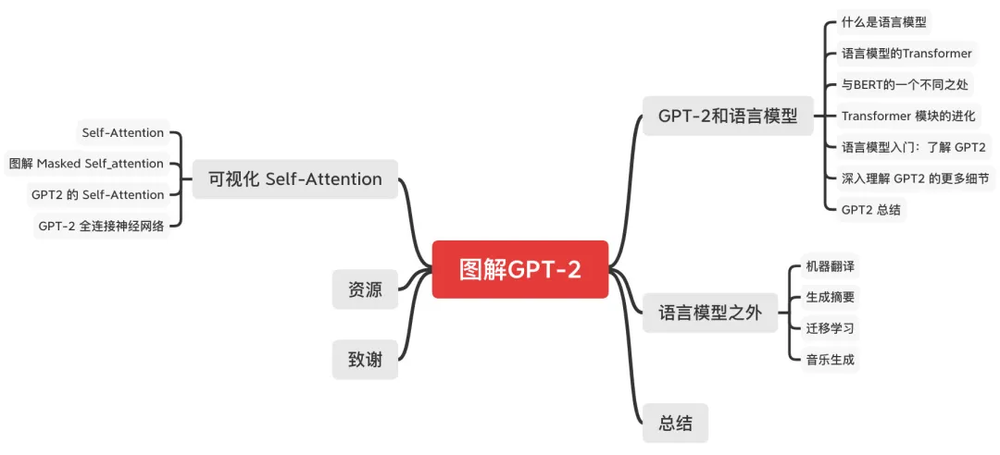
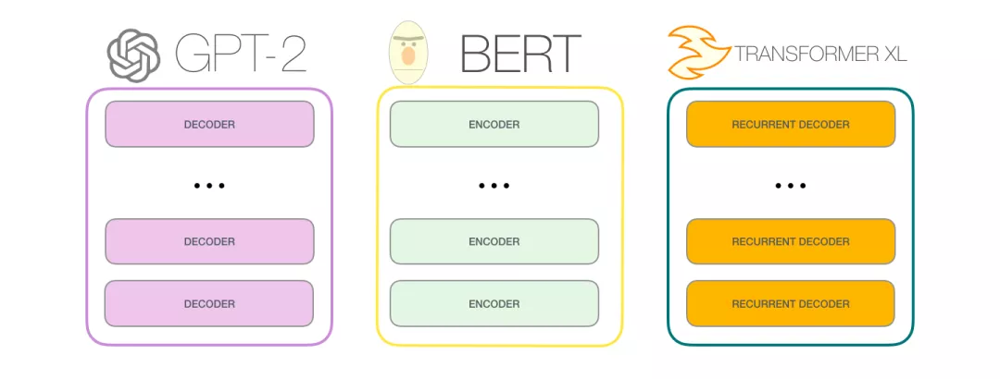
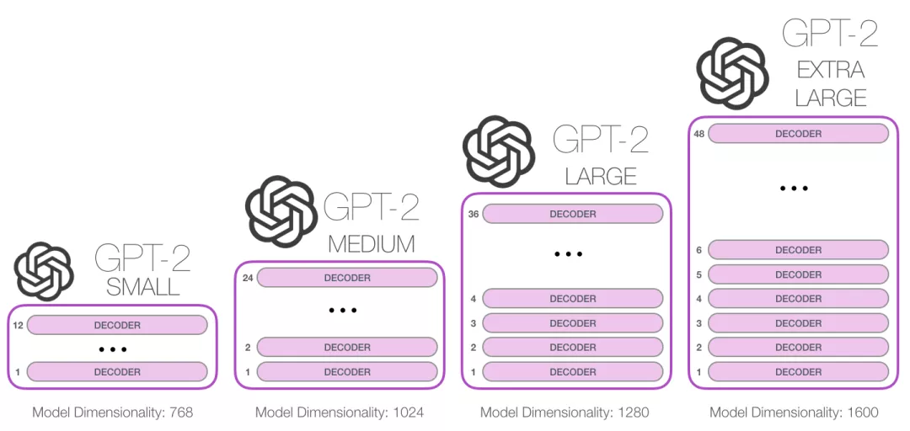
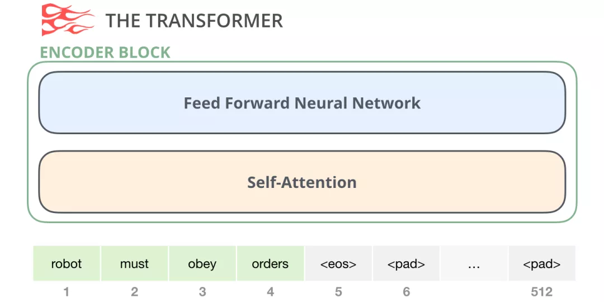
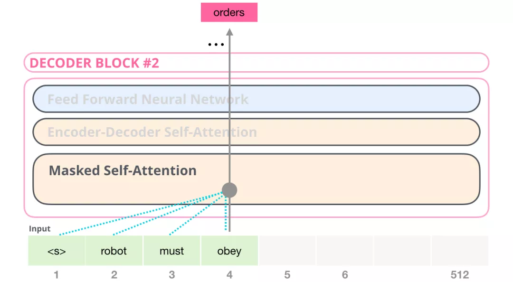
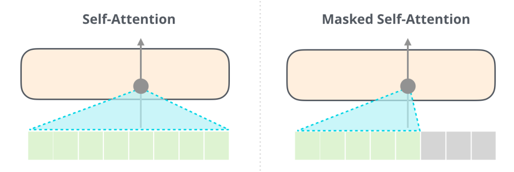
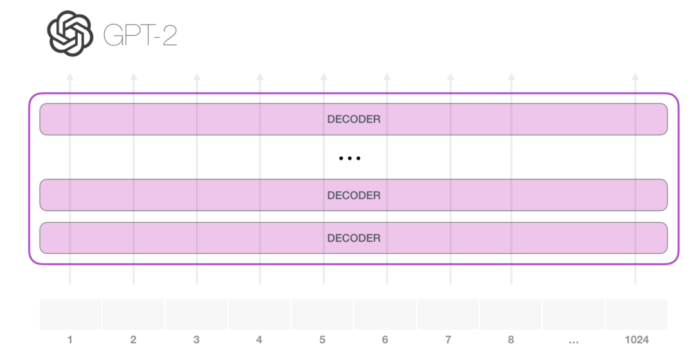
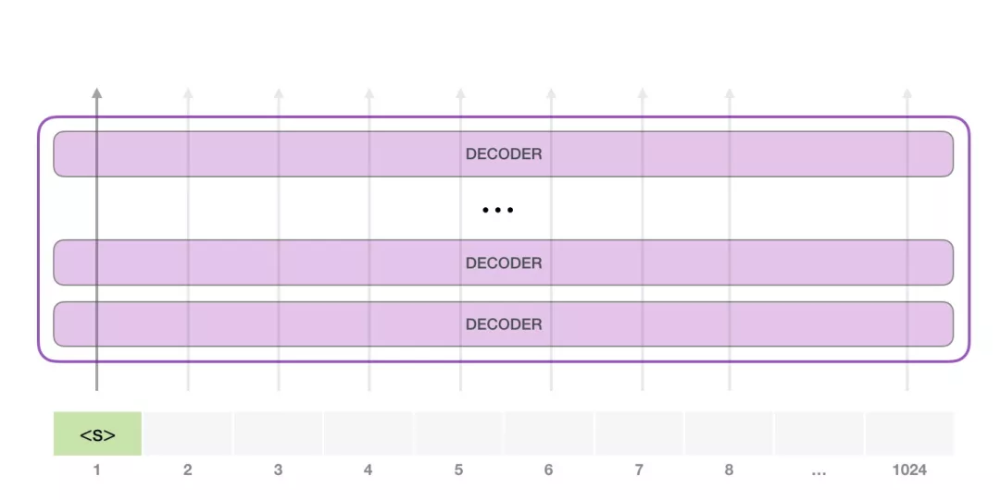
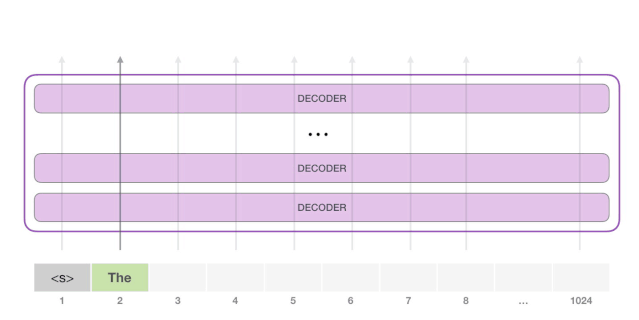

# 图解GPT

<center>
    
    <br>
    <div style="color:orange; border-bottom: 1px solid #d9d9d9;
    display: inline-block;
    color: #999;
    padding: 2px;">结构总览</div>
</center>

## 前言

这篇文章翻译自http://jalammar.github.io/illustrated-gpt2/。多图详细解释当今最为强大的人工智能 GPT-2(截至 2019 年 8 月 12 日)。

今年，我们看到了机器学习在许多场景的广泛应用。OpenAI GPT-2(https://openai.com/blog/better-language-models/)表现出了令人印象深刻的能力，它能够写出连贯而充满激情的文章，这超出了我们当前对语言模型的预期效果。GPT-2 不是一个特别新颖的架构，而是一种与 Transformer 解码器非常类似的架构。不过 GPT-2 是一个巨大的、基于 Transformer 的语言模型，它是在一个巨大的数据集上训练的。在这篇文章，我们会分析它的结构，以及这种结构产生的作用。我们会深入了解 Self Attention 层的细节。然后我们会再了解一下这种只有 Decoder 的 Transformer 在语言建模之外的应用。

这篇文章可以看作是之前文章[《图解Transformer（完整版）！》](https://github.com/datawhalechina/transformers-quick-start-zh/blob/main/transformer%E5%9F%BA%E6%9C%AC%E5%8E%9F%E7%90%86%E8%AE%B2%E8%A7%A3/2-%E5%9B%BE%E8%A7%A3transformer.md)的补充。图解 Transformer 的文章使用了更多的图来解释 Transformer 的内部工作原理，以及它们是如何从原始论文一步一步进化的。我希望这种可视化的方式能够更加容易解释基于 Transformer 的模型内部原理和进化。

## GPT2 和语言模型

首先，我们来看看什么是语言模型。

### 什么是语言模型

在 图解 Word2Vec(https://jalammar.github.io/illustrated-word2vec/) 中，我们了解到语言模型基本上是一个机器学习模型，它可以根据句子的一部分预测下一个词。最著名的语言模型就是手机键盘，它可以根据你输入的内容，提示下一个单词。

<center>
    
    <br>
    <div style="color:orange; border-bottom: 1px solid #d9d9d9;
    display: inline-block;
    color: #999;
    padding: 2px;">词之间的关系</div>
</center>

从这个意义上讲，GPT-2 基本上就是键盘应用程序中预测下一个词的功能，但 GPT-2 比你手机上的键盘 app 更大更复杂。GPT-2 是在一个 40 GB 的名为 WebText 的数据集上训练的，OpenAI 的研究人员从互联网上爬取了这个数据集，作为研究工作的一部分。从存储空间大小方面来比较，我使用的键盘应用程序 SwiftKey，占用了 78 MB 的空间。而最小的 GPT-2 变种，需要 500 MB 的空间来存储它的所有参数。最大的 GPT-2 模型变种是其大小的 13 倍，因此占用的空间可能超过 6.5 GB。
<center>
    
    <br>
    <div style="color:orange; border-bottom: 1px solid #d9d9d9;
    display: inline-block;
    color: #999;
    padding: 2px;">GPT发展</div>
</center>

对 GPT-2 进行实验的一个很好的方法是使用 AllenAI GPT-2 Explorer(https://gpt2.apps.allenai.org/?text=Joel is)。它使用 GPT-2 来显示下一个单词的 10 种预测（包括每种预测的分数）。你可以选择一个单词，然后就能看到下一个单词的预测列表，从而生成一篇文章。

### 语言模型的 Transformer

正如我们在图解 Transformer中看到的，原始的 Transformer 模型是由 Encoder 和 Decoder 组成的，它们都是由 Transformer 堆叠而成的。这种架构是合适的，因为这个模型是用于处理机器翻译的。在机器翻译问题中，Encoder-Decoder 的架构已经在过去成功应用了。

<center>
    
    <br>
    <div style="color:orange; border-bottom: 1px solid #d9d9d9;
    display: inline-block;
    color: #999;
    padding: 2px;">transformer</div>
</center>

在随后的许多研究工作中，只使用 Transformer 中的一部分，要么去掉 Encoder，要么去掉 Decoder，并且将它们堆得尽可能高。使用大量的训练文本，并投入大量的计算（数十万美元用于训练这些模型，在 AlphaStar 的例子中可能是数百万美元）。
<center>
    
    <br>
    <div style="color:orange; border-bottom: 1px solid #d9d9d9;
    display: inline-block;
    color: #999;
    padding: 2px;">gpt-bert</div>
</center>

我们可以将这些模块堆得多高呢？事实证明，这是区分不同的 GPT-2 的主要因素之一。

<center>
    
    <br>
    <div style="color:orange; border-bottom: 1px solid #d9d9d9;
    display: inline-block;
    color: #999;
    padding: 2px;">gpt区分</div>
</center>

### 与 BERT 的一个不同之处

```
机器人第一定律：

机器人不得伤害人类，也不能因不作为而使人类受到伤害。
```

GPT-2 是使用 Transformer 的 Decoder 模块构建的。另一方面，BERT 是使用 Transformer 的 Encoder 模块构建的。我们将在下一节中研究这种差异。但它们之间的一个重要差异是，GPT-2 和传统的语言模型一样，一次输出一个  token。例如，让一个训练好的 GPT-2 背诵机器人第一定律：

<center>
    
    <br>
    <div style="color:orange; border-bottom: 1px solid #d9d9d9;
    display: inline-block;
    color: #999;
    padding: 2px;">gpt2 output</div>
</center>

这些模型的实际工作方式是，在产生每个 token 之后，将这个 token 添加到输入的序列中，形成一个新序列。然后这个新序列成为模型在下一个时间步的输入。这是一种叫“自回归（auto-regression）”的思想。这种做法可以使得 RNN 非常有效。

<center>
    
    <br>
    <div style="color:orange; border-bottom: 1px solid #d9d9d9;
    display: inline-block;
    color: #999;
    padding: 2px;">gpt2 output</div>
</center>

GPT-2，和后来的一些模型如 TransformerXL 和 XLNet，本质上都是自回归的模型。但 BERT 不是自回归模型。这是一种权衡。去掉了自回归后，BERT 能够整合左右两边的上下文，从而获得更好的结果。XLNet 重新使用了 自回归，同时也找到一种方法能够结合两边的上下文。


### Transformer 模块的进化

Transformer 原始论文(https://arxiv.org/abs/1706.03762) 介绍了两种模块：

Encoder 模块

首先是 Encoder 模块。


<center>
    
    <br>
    <div style="color:orange; border-bottom: 1px solid #d9d9d9;
    display: inline-block;
    color: #999;
    padding: 2px;">encoder</div>
</center>

原始的 Transformer 论文中的 Encoder 模块接受特定长度的输入（如 512 个 token）。如果一个输入序列比这个限制短，我们可以填充序列的其余部分。

Decoder 模块

其次是 Decoder。与 Encoder 相比，它在结构上有一个很小的差异：它有一个层，使得它可以关注来自 Encoder 特定的段。

<center>
    
    <br>
    <div style="color:orange; border-bottom: 1px solid #d9d9d9;
    display: inline-block;
    color: #999;
    padding: 2px;">decoder</div>
</center>

这里的 Self Attention 层的一个关注差异是，它会屏蔽未来的 token。具体来说，它不像 BERT 那样将单词改为mask，而是通过改变 Self Attention 的计算，阻止来自被计算位置右边的 token。

例如，我们想要计算位置 4，我们可以看到只允许处理以前和现在的 token。

<center>
    
    <br>
    <div style="color:orange; border-bottom: 1px solid #d9d9d9;
    display: inline-block;
    color: #999;
    padding: 2px;">decoder只能看到以前和现在的token</div>
</center>

很重要的一点是，（BERT 使用的）Self Attention 和 （GPT-2 使用的）masked Self Attention 有明确的区别。一个正常的 Self Attention 模块允许一个位置关注到它右边的部分。而 masked Self Attention 阻止了这种情况的发生：

<center>
    
    <br>
    <div style="color:orange; border-bottom: 1px solid #d9d9d9;
    display: inline-block;
    color: #999;
    padding: 2px;">mask attention</div>
</center>

只有 Decoder 的模块

在 Transformer 原始论文发布之后，Generating Wikipedia by Summarizing Long Sequences(https://arxiv.org/pdf/1801.10198.pdf) 提出了另一种能够进行语言建模的 Transformer 模块的布局。这个模型丢弃了 Transformer 的 Encoder。因此，我们可以把这个模型称为 Transformer-Decoder。这种早期的基于 Transformer 的语言模型由 6 个 Decoder 模块组成。

<center>
    
    <br>
    <div style="color:orange; border-bottom: 1px solid #d9d9d9;
    display: inline-block;
    color: #999;
    padding: 2px;">transformer-decoder</div>
</center>

这些 Decoder 模块都是相同的。我已经展开了第一个 Decoder，因此你可以看到它的 Self Attention 层是 masked 的。注意，现在这个模型可以处理多达 4000 个 token--是对原始论文中 512 个 token 的一个大升级。

这些模块和原始的 Decoder 模块非常类似，只是它们去掉了第二个 Self Attention 层。在 Character-Level Language Modeling with Deeper Self-Attention(https://arxiv.org/pdf/1808.04444.pdf) 中使用了类似的结构，来创建一次一个字母/字符的语言模型。

OpenAI 的 GPT-2 使用了这些 Decoder 模块。

### 语言模型入门：了解 GPT2

让我们拆解一个训练好的 GPT-2，看看它是如何工作的。

<center>
    
    <br>
    <div style="color:orange; border-bottom: 1px solid #d9d9d9;
    display: inline-block;
    color: #999;
    padding: 2px;">拆解GPT2</div>
</center>

GPT-2 能够处理 1024 个 token。每个 token 沿着自己的路径经过所有的 Decoder 模块

运行一个训练好的 GPT-2 模型的最简单的方法是让它自己生成文本（这在技术上称为 生成无条件样本）。或者，我们可以给它一个提示，让它谈论某个主题（即生成交互式条件样本）。在漫无目的情况下，我们可以简单地给它输入初始 token，并让它开始生成单词（训练好的模型使用 <|endoftext|> 作为初始的 token。我们称之为 <s>）。


<center>
    
    <br>
    <div style="color:orange; border-bottom: 1px solid #d9d9d9;
    display: inline-block;
    color: #999;
    padding: 2px;">拆解GPT2初始token</div>
</center>

模型只有一个输入的 token，因此只有一条活跃路径。token 在所有层中依次被处理，然后沿着该路径生成一个向量。这个向量可以根据模型的词汇表计算出一个分数（模型知道所有的 单词，在 GPT-2 中是 5000 个词）。在这个例子中，我们选择了概率最高的 the。但我们可以把事情搞混--你知道如果一直在键盘 app 中选择建议的单词，它有时候会陷入重复的循环中，唯一的出路就是点击第二个或者第三个建议的单词。同样的事情也会发生在这里，GPT-2 有一个 top-k 参数，我们可以使用这个参数，让模型考虑第一个词（top-k =1）之外的其他词。

下一步，我们把第一步的输出添加到我们的输入序列，然后让模型做下一个预测。


<center>
    
    <br>
    <div style="color:orange; border-bottom: 1px solid #d9d9d9;
    display: inline-block;
    color: #999;
    padding: 2px;">拆解GPT2</div>
</center>

请注意，第二条路径是此计算中唯一活动的路径。GPT-2 的每一层都保留了它自己对第一个 token 的解释，而且会在处理第二个 token 时使用它（我们会在接下来关于 Self Attention 的章节中对此进行更详细的介绍）。GPT-2 不会根据第二个 token 重新计算第一个 token。


## 深入理解 GPT2 的更多细节


## 致谢
主要由哈尔滨工业大学张贤同学翻译（经过原作者授权）撰写，由本项目同学组织和整理。